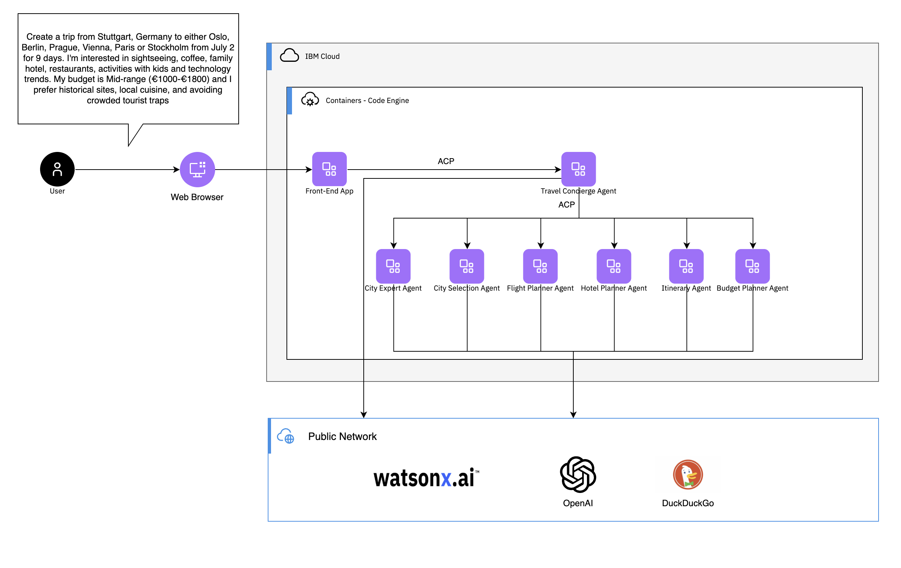

<h1 align="center">
  <picture>
    <source media="(prefers-color-scheme: dark)" srcset="./assets/ACP_CE_dark.svg">
    <source media="(prefers-color-scheme: light)" srcset="./assets/ACP_CE_light.svg">
    
  </picture>
  <br><br>
  Agent Communication Protocol (ACP) + IBM Code Engine
</h1>

<h4 align="center">Multi-Agent Example</h4>

## About this example

As AI agents grow in complexity, the need for interoperable, scalable, and modular communication protocols becomes essential. The Agent Communication Protocol (ACP), a Linux Foundation-backed standard, provides a robust framework for how AI agents, humans, and tools communicate over HTTP. When paired with a cloud-native platform like IBM Cloud Code Engine, ACP enables seamless and scalable deployment of intelligent, multi-agent systems.

In this example, we explore how ACP and IBM Cloud Code Engine work together to unlock the potential of scalable, multi-agent AI applications. ACP streamlines communication between AI agents, making it easy to orchestrate complex workflows. Whether you're building chatbots, automation tools, or sophisticated agent-based applications, this combination simplifies both development and deployment.

As a practical example, we highlight a travel agency system that coordinates with specialized agents—such as those for city recommendations, hotel search, flight planning, and budget management. The ACP framework ensures each agent communicates effectively, while IBM Cloud Code Engine handles the deployment of the entire system, including the front-end interface and backend services. With just a few commands, developers can launch a fully operational application without worrying about infrastructure.

Ultimately, the real power of ACP and IBM Cloud Code Engine lies in their general applicability. From intelligent assistants to enterprise automation, this stack provides a scalable, modular, and developer-friendly foundation for the future of agent-based AI systems.

## Architecture

#### Meet the Agents

The system is built around six specialized agents, plus a concierge agent that orchestrates the flow:

- City Selection Agent – Picks the best destination cities based on preferences.
- City Expert Agent – Fetches local insights: attractions, restaurants, hidden gems.
- Budget Planner Agent – Ensures the plan stays within the traveler’s budget.
- Flight Planner Agent – Suggests and organizes flight options.
- Hotel Planner Agent – Recommends accommodations.
- Itinerary Planner Agent – Combines everything into a day-by-day schedule.
- Travel Concierge Agent – Acts as the conductor, calling each agent in sequence and compiling the final result.

#### How It Works

The Travel Concierge Agent coordinates all agents using sequential chaining:

- Receives user input (destination type, budget, duration, preferences).
- Calls the City Selection Agent to determine where to go.
- Passes the city choice to the City Expert, Flight Planner, Hotel Planner, and Budget Planner agents in sequence.
- Finally, sends all results to the Itinerary Planner Agent to build the final day-by-day travel plan.
- Returns the full plan to the user.

#### Deployment



You can deploy the agents [locally](#deploy-on-local-machine) or on [Code Engine](#deploy-to-code-engine)

## Deploy on local machine

### Mac Silicon

Download image with AMD64 architecture

```sh
podman pull --platform linux/amd64 registry.access.redhat.com/ubi9/python-312:9.6-1752571600
```

Verify architecture

```sh
podman run --platform linux/amd64 -it registry.access.redhat.com/ubi9/python-312:9.6-1752571600 arch
```

### Ollama

Install:

```sh
curl -fsSL https://ollama.com/install.sh | sh
```

```sh
OLLAMA_HOST=192.168.178.26:11434 ollama serve
```

```sh
ollama pull qwen3:8b
```

### Podman

Install:

```sh
brew install podman
brew install podman-compose
```

### Environment variables

```sh
vim .env
```

#### Ollama inference server

What's my machine ip?

`ipconfig getifaddr en0`

```sh
INFERENCE_BASE_URL=http://<YOUR-MACHINE-IP>:11434/v1
INFERENCE_API_KEY=<YOUR-API-KEY>
INFERENCE_MODEL_NAME=openai/qwen3:8b
```

#### watsonx.ai

```sh
INFERENCE_BASE_URL=https://us-south.ml.cloud.ibm.com
INFERENCE_API_KEY=<YOUR-API-KEY>
INFERENCE_MODEL_NAME=watsonx/meta-llama/llama-3-3-70b-instruct
INFERENCE_PROJECT_ID=<YOUR-PROJECT-ID>
```

### Start container

```sh
make start-podman
```

```sh
podman ps
```

### Plan your first trip

```sh
open http://localhost:5555
```

Use ACP client example

```sh
uv run clients/travel-concierge-agent.py
```

### Example requests

**Unspecific request**

```sh
Plan a trip from Stuttgart to Oslo
```

**Detailed request with one destinations**

```sh
Plan a trip from Stuttgart to Oslo from October 10 for 6 days. I'm interested in sightseeing, coffee, family hotel, restaurants, activities with kids and technology trends. My budget is Mid-range (€1000-€1800) and I prefer historical sites, local cuisine, and avoiding crowded tourist traps
```

**Detailed request with multiple possible destinations**

```sh
Plan a trip from Stuttgart to either Paris or Rome from October 10 for 6 days. I'm interested in sightseeing, coffee, family hotel, restaurants, activities with kids and technology trends. My budget is Mid-range (€1000-€1800) and I prefer historical sites, local cuisine, and avoiding crowded tourist traps
```

### Stop container

```sh
make stop-podman
```

## Deploy to Code Engine

### Prerequisits

Let's deploy the ACP agents on IBM Cloud Code Engine. You need to [Login into your IBM Cloud account using the IBM Cloud CLI](https://cloud.ibm.com/docs/codeengine?topic=codeengine-install-cli).

As the inferencing service you either need a [watsonx.ai](watsonx.ai) project or an [Open AI](openai.com) api-key:

Based on your choice, create the `.env` file with the following variables:

```sh
INFERENCE_BASE_URL=https://us-south.ml.cloud.ibm.com
INFERENCE_API_KEY=<YOUR-API-KEY>
INFERENCE_MODEL_NAME=watsonx/meta-llama/llama-3-3-70b-instruct
INFERENCE_PROJECT_ID=<YOUR-PROJECT-ID>

# Alternative for Open AI
#INFERENCE_BASE_URL=https://api.openai.com/v1
#INFERENCE_API_KEY=<YOUR-API-KEY>
#INFERENCE_MODEL_NAME=openai/gpt-4o
#INFERENCE_PROJECT_ID=""
```

### Deploy the agents to Code Engine

Login to the target region

```sh
REGION=eu-es
ibmcloud login -r $REGION --sso
```

Run the following command to create a Code Engine project and deploy the agents as Code Engine applications

```sh
make deploy-codeengine
```

The script will create a new Code Engine project in the selected region and deploy the the agent and chat applications. You can see the applications being deployed in the [Code Engine User Interface](https://cloud.ibm.com/containers/serverless/projects)

Use the following command to determine the chat applications URL

```
ibmcloud ce app get --name travel-concierge-chat -o json | jq -r '.status.url'
```

Open the URL in the browser and start chatting with the Travel Concierge agent

### Un-deploy the agents from Code Engine

Run the following command to teardown the deployment and delete the Code Engine project.

```sh
make undeploy-codeengine
```
