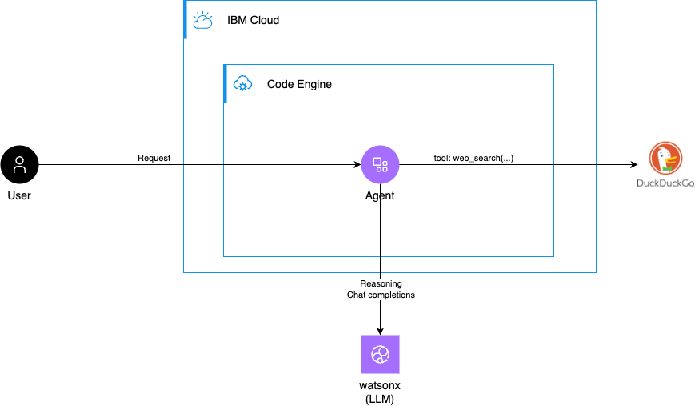
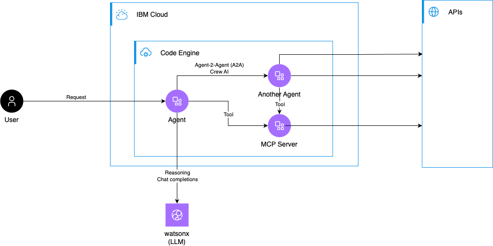

Agent Overview
--------------

An agent is a small, purpose-built service that performs autonomous tasks by combining conversational logic, tool wrappers, and connectors to external services. Agents typically:

- **Purpose**: Automate workflows and respond to user inputs or events.
- **Components**: Orchestration logic, task definitions, tool adapters (APIs, search, databases), and an optional lightweight UI.



Why IBM Cloud Code Engine
--------------

[IBM Cloud Code Engine](https://www.ibm.com/products/code-engine) is a great fit for containerized agents because it provides:

- **Serverless containers**: Deploy container images without managing infrastructure.
- **Automatic scaling**: Scale to zero when idle and scale up on demand.
- **Pay-per-use pricing**: Cost-efficient for intermittent workloads common to agents.
- **Simple deployment**: Integrates with container registries and CI/CD pipelines.
- **Managed endpoint**: Provides a secure http endpoint with a managed certificate.

A very simple Agent
--------------


The agent implementation in this folder demonstrates a compact, production-minded agent pattern. It contains orchestration, task definitions, and tool wrappers that together implement a conversational assistant with tooling capabilities (search, task execution, and basic web UI).

- **Agent entrypoint**: [./src/main.py](./src/main.py) — starts the agent process and HTTP endpoints.
- **Agent orchestration**: [./src/agents.py](./src/agents.py) — coordinates agent behavior and message routing.
- **Tasks**: [./src/tasks.py](./src/tasks.py) — concrete task implementations the agent can run.
- **Tools / adapters**: [./src/tools.py](./src/tools.py) — wrappers for external APIs or search capabilities.
- **Utilities**: [./src/utils.py](./src/utils.py) — helpers and common utilities.
- **Frontend**: [./src/frontend/landing_page.py](./src/frontend/landing_page.py) — lightweight landing page for human interaction (optional).
- **Example payload**: [./payload/payload.json](./agent/payload/payload.json) — sample input the agent can accept.

Conceptually this agent acts like a Crew AI / ACP-style assistant: it receives a payload, enriches context (via tools/search), executes defined tasks, and returns results. The implementation is intentionally modular so you can swap tool implementations or extend task behaviors.


Deploy the Agent to IBM Cloud Code Engine
--------------

**Prerequisites**

The Agent requires an nferencing backend (an LLM or similar service) to operate. Configure the backend endpoint and credentials via environment variables. Configure any OpenAI compatible API endpoint such as [OpenAI](https://platform.openai.com/) or [IBM watsonx.ai](https://www.ibm.com/products/watsonx-ai)

Copy the template
```bash
# If you have a .env.template
cp .env.template .env
```
Edit the parameter
```bash
INFERENCE_BASE_URL=https://eu-de.ml.cloud.ibm.com
INFERENCE_API_KEY="<YOUR API KEY>"
INFERENCE_MODEL_NAME="watsonx/meta-llama/llama-3-3-70b-instruct"
INFERENCE_PROJECT_ID="<YOUR PROJECT>"
```

**Deploy**

1. Log in to IBM Cloud (choose the method that fits your account):

```bash
# Single-sign-on login (interactive)
ibmcloud login --sso

# Or with API key (non-interactive):
ibmcloud login --apikey "$IBMCLOUD_APIKEY" -r REGION -g RESOURCE_GROUP
```

2. Change into the agent folder and run the provided deploy script:

```bash
NAME_PREFIX=ce-agent REGION=eu-de ./deploy.sh
```

3. The [deploy script](./agent/deploy.sh) builds and/or pushes the container and deploys it to IBM Cloud Code Engine. 


4. Follow the script output for the agents URL and an example http request.


What's next 
---------

- Modify the tasks in [./src/tasks.py](./src/tasks.py) and register them with the orchestration logic in [./src/agents.py](./src/agents.py).
- Add your own tools by editing [./src/tools.py](./src/tools.py).
- Deploy another agent and add it to the Crew [./src/main.py](./src/main.py)
- [Deploy a MCP Server](../mcp_server_fastmcp/README.md) and make it accessible to your agent(s)

Follow the [IBM Cloud Code Engine documentation](https://cloud.ibm.com/docs/codeengine?topic=codeengine-getting-started) to learn about more features and functions.


