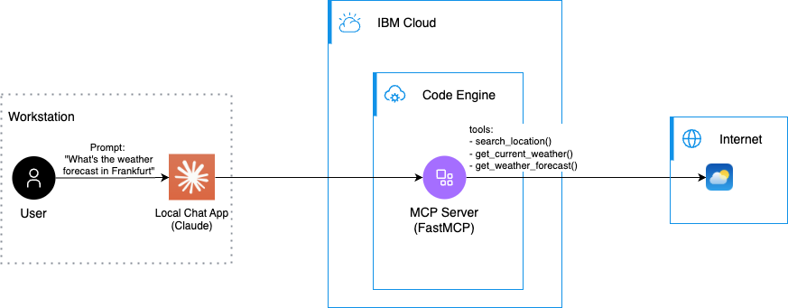
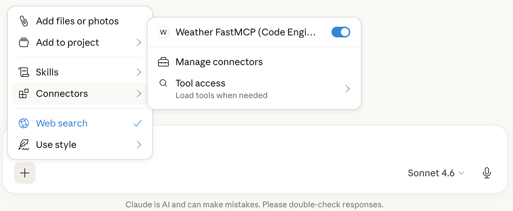
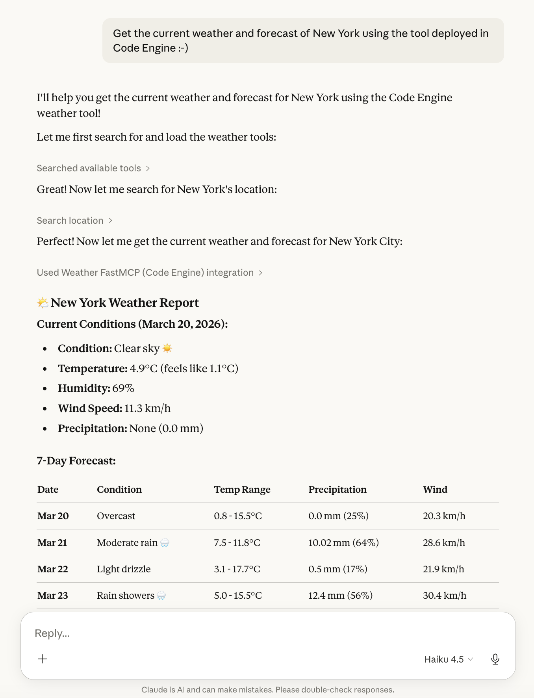

FastMCP — Weather MCP Server
============================

Overview
--------
This directory contains a FastMCP weather server example and a companion client. The server provides real-time weather information and forecasts using the free Open-Meteo API. It demonstrates a practical implementation of an MCP-compatible service (Model Context Protocol) for weather data, intended for local testing and quick deployment to [IBM Cloud Code Engine](https://www.ibm.com/products/code-engine).



About MCP and FastMCP
---------------------

MCP (Model Context Protocol) is a lightweight, transport-agnostic convention for exchanging model prompts, context, and responses between clients and model-serving services. It emphasizes:

- **Transport flexibility**: works over HTTP, SSE, WebSocket, stdio and other streamable transports.
- **Streaming-first behavior**: supports incremental/streaming responses for low-latency UX.
- **Simple JSON semantics**: easy to implement and interoperate between services.

**[FastMCP](https://gofastmcp.com/getting-started/welcome) is the standard framework for building MCP applications.** 

The [Direct Http Server](https://gofastmcp.com/deployment/http#direct-http-server) example provides a minimal reference implementation meant for experimentation and quick deployments. It focuses on a very small API surface and fast startup so you can iterate locally or run tiny instances in cloud platforms like Code Engine.


Why Code Engine?
-----------------

[IBM Cloud Code Engine](https://www.ibm.com/products/code-engine) is a great fit for containerized MCP Servers because it provides:

- **Serverless containers**: Deploy container images without managing infrastructure.
- **Automatic scaling**: Scale to zero when idle and scale up on demand.
- **Pay-per-use pricing**: Cost-efficient for intermittent workloads common to agents.
- **Simple deployment**: Integrates with container registries and CI/CD pipelines.
- **Managed endpoint**: Provides a secure http endpoint with a managed certificate.

Weather MCP Server Features
---------------------------

The server provides three weather-related tools:

1. **search_location**: Search for locations by name to get coordinates
2. **get_current_weather**: Get current weather conditions for specific coordinates
3. **get_weather_forecast**: Get weather forecast for 1-16 days

The Python source code for the MCP server is located in [./server/main.py](./server/main.py):

```python
from typing import Any
from fastmcp import FastMCP
import weather_api

mcp = FastMCP("Weather MCP Server on Code Engine")

@mcp.tool
async def search_location(query: str) -> str:
    """
    Search for a location by name to get coordinates for weather queries.
    
    Args:
        query: The location name to search for (e.g., "London", "New York", "Tokyo")
        
    Returns:
        A formatted string with matching locations and their coordinates
    """
    try:
        data = await weather_api.search_location(query)
        return weather_api.format_location_results(data)
    except Exception as e:
        return f"Error searching for location: {str(e)}"

@mcp.tool
async def get_current_weather(latitude: float, longitude: float) -> str:
    """
    Get the current weather conditions for a specific location.
    
    Args:
        latitude: The latitude of the location (e.g., 51.5074 for London)
        longitude: The longitude of the location (e.g., -0.1278 for London)
        
    Returns:
        A formatted string with current weather information
    """
    try:
        data = await weather_api.get_current_weather(latitude, longitude)
        return weather_api.format_current_weather(data)
    except Exception as e:
        return f"Error getting current weather: {str(e)}"

@mcp.tool
async def get_weather_forecast(latitude: float, longitude: float, days: int = 7) -> str:
    """
    Get the weather forecast for a specific location.
    
    Args:
        latitude: The latitude of the location
        longitude: The longitude of the location
        days: Number of days to forecast (1-16, default: 7)
        
    Returns:
        A formatted string with daily weather forecast
    """
    try:
        data = await weather_api.get_weather_forecast(latitude, longitude, days)
        return weather_api.format_weather_forecast(data)
    except Exception as e:
        return f"Error getting weather forecast: {str(e)}"

if __name__ == "__main__":
    mcp.run(transport="http", host="0.0.0.0", port=8080)
```

The weather API functions are separated in [./server/weather_api.py](./server/weather_api.py) and use the free Open-Meteo API (no API key required).

Deploying the server to Code Engine
----------------------------------

**Prerequisites**
Create an IBM Cloud account and [login into your IBM Cloud account using the IBM Cloud CLI](https://cloud.ibm.com/docs/codeengine?topic=codeengine-install-cli).

**Deploy**

1. Authenticate and login to IBM Cloud:

```bash
ibmcloud login --sso
ibmcloud login --apikey "$IBMCLOUD_APIKEY" -r us-south

```

2. Run the included deploy script from this folder. The script creates a new Code Engine project in the specified region and automates build/push/deploy steps to create a new application in Code Engine. 

```bash
NAME_PREFIX=ce-fastmcp REGION=eu-de ./deploy.sh
```

3. The deploy script will print the URL under which the MCP Server is publicly accessible

```
FastMCP application is reachable under the following url:
https://fastmcp.26n4g2nfyw7s.eu-de.codeengine.appdomain.cloud/mcp
```

🚀 The example was successful and you can now use the MCP server in your chat application 🚀

Testing the deployed server with call_tool.sh
---------------------------------------------
The `call_tool.sh` script provides a quick way to test your deployed MCP server directly from the command line. It demonstrates the complete MCP protocol flow with weather data for Stuttgart:

1. Initializes an MCP session with the server
2. Lists all available tools
3. Searches for Stuttgart location
4. Gets current weather for Stuttgart (coordinates: 48.7758, 9.1829)
5. Gets 7-day weather forecast for Stuttgart

Run the script from the `mcp_server_fastmcp` directory:

```bash
./call_tool.sh
```

The script will automatically connect to your deployed FastMCP application and execute weather queries for Stuttgart. You should see output similar to:

```
FastMCP application is reachable under the following url:
https://fastmcp.26n4g2nfyw7s.eu-de.codeengine.appdomain.cloud/mcp

initialize session
Session initialized: <session-id>

List tools

==========================================
WEATHER TOOLS DEMONSTRATION FOR STUTTGART
==========================================

1. Search for 'Stuttgart' location
Stuttgart, Baden-Württemberg, Germany (lat: 48.7758, lon: 9.1829)

2. Get current weather for Stuttgart
Current Weather:
Condition: Partly cloudy
Temperature: 15.2°C
Feels like: 14.8°C
Humidity: 65%
Wind Speed: 12.5 km/h
Precipitation: 0.0 mm

3. Get 7-day weather forecast for Stuttgart
Weather Forecast:

2026-03-20:
  Condition: Partly cloudy
  Temperature: 8.5°C - 16.2°C
  Precipitation: 0.2 mm (probability: 20%)
  Max Wind Speed: 18.5 km/h
...

SUCCESS
```


Using this example with Claude Desktop
-------------------------------------
Claude Desktop can connect to local or remote MCP servers by registering them in its `claude_desktop_config.json` (Claude -> Settings -> Developer -> Edit Config). 


Example `claude_desktop_config.json` entry that point to your deployed application URL:

```json
{
  "mcpServer": {
    "Weather FastMCP (Code Engine)": {
      "command": "npx",
      "args": [
        "mcp-remote",
        "https://fastmcp.26n4g2nfyw7s.eu-de.codeengine.appdomain.cloud/mcp"
      ]
    }
  }
}
```

Save settings and restart Claude Desktop; the remote MCP server should appear as a selectable tool in Claude Desktop.



You can now chat with the MCP Server, e.g.

**_"Get the current weather and forecast of New York using the tool deployed in Code Engine :-)"_**

Claude will detect the appropriate weather tools and call them to provide current weather conditions or forecasts for the requested locations.



Building and using the Python client
-----------------------------
The `client` directory contains a small Python client to exercise the weather server.

1. Create a virtual environment and install dependencies:

```bash
cd client
python3 -m venv .venv
source .venv/bin/activate
pip install -r requirements.txt
```

2. Run the client

Start the client by replacing the application URL from above as the `MCP_SERVER_URL` environment variable, e.g.

```bash
MCP_SERVER_URL="https://fastmcp.26n4g2nfyw7s.eu-de.codeengine.appdomain.cloud/mcp" python client.py
```

The client will demonstrate all three weather tools using Stuttgart as an example location:
- Search for Stuttgart location
- Get current weather for Stuttgart
- Get 7-day weather forecast for Stuttgart

3. Inspect and adapt
- Open `client.py` to find example calls. The client demonstrates how to use all weather tools and can be adapted to query different locations or forecast periods.


What's next?
------------

You now have a very simple reference architecture to deploy any MCP server of your choice. 