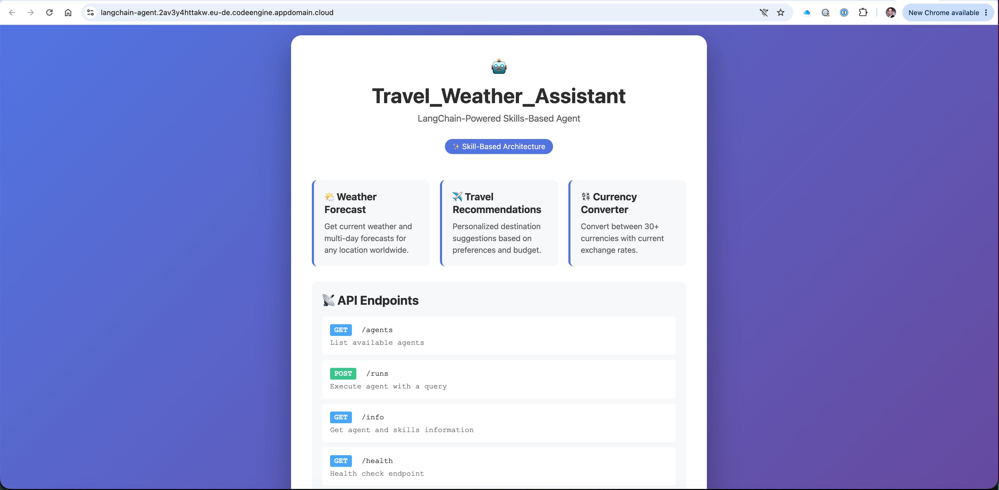
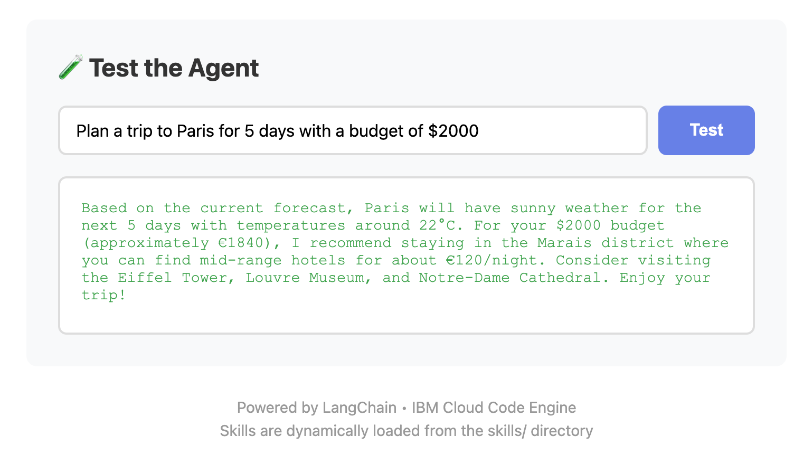

# LangChain Skills Agent on Code Engine

A modular, skill-based agent built with LangChain that demonstrates a clean architecture for organizing agent capabilities. This agent runs a **full agentic loop**, autonomously calling tools and processing results until it can provide a complete answer. It provides weather forecasting, travel recommendations, and currency conversion through a dynamic skill loading system.

## Why IBM Cloud Code Engine

[IBM Cloud Code Engine](https://www.ibm.com/products/code-engine) is a great fit for containerized agents because it provides:

- **Serverless containers**: Deploy container images without managing infrastructure.
- **Automatic scaling**: Scale to zero when idle and scale up on demand.
- **Pay-per-use pricing**: Cost-efficient for intermittent workloads common to agents.
- **Simple deployment**: Integrates with container registries and CI/CD pipelines.
- **Managed endpoint**: Provides a secure http endpoint with a managed certificate.

## Why RedHat AI Inference Service

This agent uses the [RedHat AI Inference Service](https://cloud.ibm.com/inference/overview) for its LLM capabilities, offering:

- **Production-ready frontier AI models**: Access to state-of-the-art models like Llama 3.3 70B
- **No operational overhead**: Fully managed service with no infrastructure to maintain
- **Built-in enterprise security**: Enterprise-grade security and compliance out of the box
- **Cost controls**: Token-based consumption pricing with no standing costs - you only pay for what you use
- **Zero infrastructure management**: No servers to provision, scale, or maintain

The token-based consumption model means you're never paying for idle capacity, making it perfect for agent workloads that scale dynamically.

## The architecture


## 🎯 Overview

This agent showcases a **skill-based setup** where each capability is:
- Self-contained in its own directory
- Documented with metadata in a `skill.md` file
- Implemented as a LangChain tool
- Dynamically discovered and loaded at runtime



### Agentic Loop

The agent runs a **full agentic loop** that autonomously:
1. Receives a user query
2. Analyzes what information is needed
3. Calls appropriate tools (weather, travel, currency conversion)
4. Processes tool results
5. Decides if more information is needed
6. Repeats steps 3-5 until it has everything needed
7. Synthesizes a comprehensive response

This means the agent can handle complex, multi-step queries without requiring step-by-step user guidance.

**Example Agentic Loop Output:**

```
User Query: "Plan a trip to Paris for 5 days with a budget of $2000"

🔄 AGENT ITERATION 1/10
🤖 CALLING INFERENCE SERVICE
✅ INFERENCE SERVICE RESPONSE RECEIVED
🔧 EXECUTING 2 TOOL CALL(S)
  📌 Tool Call 1/2
     Name: weather_forecast
     Arguments: {'location': 'Paris', 'days': 5}
     ✅ Success: Paris will have partly cloudy weather for the next 5 days...
  📌 Tool Call 2/2
     Name: currency_converter
     Arguments: {'amount': 2000, 'from_currency': 'USD', 'to_currency': 'EUR'}
     ✅ Success: 2000 USD = 1850.00 EUR

🔄 AGENT ITERATION 2/10
🤖 CALLING INFERENCE SERVICE
✅ INFERENCE SERVICE RESPONSE RECEIVED
🔧 EXECUTING 1 TOOL CALL(S)
  📌 Tool Call 1/1
     Name: travel_recommendations
     Arguments: {'destination_type': 'city', 'budget': 'moderate', 'season': 'current'}
     ✅ Success: For Paris with a moderate budget, consider staying in the Marais...

🔄 AGENT ITERATION 3/10
🤖 CALLING INFERENCE SERVICE
✅ INFERENCE SERVICE RESPONSE RECEIVED
✅ AGENT LOOP COMPLETE
Total iterations: 3
📤 FINAL OUTPUT: Based on the current forecast, Paris will have partly cloudy weather
for the next 5 days with temperatures around 18-22°C. Perfect for sightseeing!

For your $2,000 budget (approximately €1,850), here's a suggested plan:
- Accommodation: Stay in the Marais district (€120/night = €600 total)
- Daily expenses: €150/day for meals and activities (€750 total)
- Transportation: Paris Visite pass for 5 days (€65)
- Remaining budget: €435 for shopping and extras

Must-see attractions: Eiffel Tower, Louvre Museum, Notre-Dame, and Montmartre...
```

### Key Features

- **🔧 Modular Skills**: Each skill is independent and easy to add/remove
- **📝 Metadata-Driven**: Skills include YAML frontmatter with configuration
- **🔄 Dynamic Loading**: Skills are automatically discovered from the `skills/` directory
- **🤖 Full Agentic Loop**: Autonomous tool calling and result processing
- **🚀 Production Ready**: Containerized and deployable to IBM Cloud Code Engine
- **🎨 Clean Architecture**: Clear separation of concerns and easy to extend

## 📦 Included Skills

### 1. Weather Forecast 🌤️
Get current weather and multi-day forecasts for any location worldwide.

**Example:**
```
"What's the weather in Tokyo for the next 5 days?"
```

### 2. Travel Recommendations ✈️
Personalized destination suggestions based on preferences, budget, and season.

**Example:**
```
"Recommend beach destinations for a moderate budget in summer"
```

### 3. Currency Converter 💱
Convert between 30+ currencies with exchange rates.

**Example:**
```
"Convert 1000 USD to EUR"
```

## 🏗️ Architecture

```
langchain-skills-agent/
├── src/
│   ├── main.py              # FastAPI app & agent entrypoint
│   ├── agents.py            # LangChain agent configuration
│   ├── skill_loader.py      # Dynamic skill discovery & loading
│   ├── skills/              # Skill directory
│   │   ├── weather_forecast/
│   │   │   ├── skill.md     # Metadata & documentation
│   │   │   └── __init__.py  # Tool implementation
│   │   ├── travel_recommendations/
│   │   │   ├── skill.md
│   │   │   └── __init__.py
│   │   └── currency_converter/
│   │       ├── skill.md
│   │       └── __init__.py
│   └── frontend/
│       └── landing_page.py  # Web UI
├── deploy.sh                # IBM Cloud deployment script
├── .env.sample              # Environment configuration template
└── payload/
    └── payload.json         # Example request payload
```

## 🚀 Quick Start

### Prerequisites

1. **RedHat AI Inference Service**: Get your API key from [IBM Cloud Inference](https://cloud.ibm.com/inference/overview)
   - Token-based consumption with no standing costs
   - Access to production-ready frontier AI models
   - Built-in enterprise security and compliance

2. **IBM Cloud CLI** (for deployment):
   ```bash
   curl -fsSL https://clis.cloud.ibm.com/install/linux | sh
   ```


### Run locally

1. Copy the sample environment file and add your credentials:
   ```bash
   cp .env.sample .env
   ```

2. Start the app locally from the `src` directory:
   ```bash
   cd src
   uv run uvicorn main:app --host 0.0.0.0 --port 8080
   ```

3. Open the dashboard in your browser:
   ```text
   http://localhost:8080/
   ```

## ☁️ Deploy to IBM Cloud Code Engine

1. Authenticate with IBM Cloud:
   ```bash
   ibmcloud login --sso
   ```
   Or use an API key:
   ```bash
   ibmcloud login --apikey YOUR_IBM_CLOUD_API_KEY
   ```

2. Deploy the application:
   ```bash
   ./deploy.sh
   ```

3. Access the app using the URL printed by the script, for example:
   ```text
   https://langchain-agent.xxx.codeengine.appdomain.cloud
   ```

For the full deployment walkthrough, see [DEPLOYMENT.md](DEPLOYMENT.md).




## 📚 Next steps

- Add and deploy more agents to the same Code Engine project
- Add and deploy [MCP Servers](../mcp-server/README.md)
- Secure the agent endpoint with [OIDC-based authentication](../../auth-oidc-proxy/README.md)


## 📚 Learn More

- [RedHat AI Inference Service](https://cloud.ibm.com/inference/overview) - Production-ready frontier AI models with no operational overhead
- [IBM Cloud Code Engine](https://cloud.ibm.com/docs/codeengine) - Serverless container platform
- [LangChain Documentation](https://python.langchain.com/) - LangChain framework
- [Agent Communication Protocol](https://github.com/IBM/agent-communication-protocol) - Standard agent protocol


---

**Built with ❤️ using LangChain and IBM Cloud Code Engine**