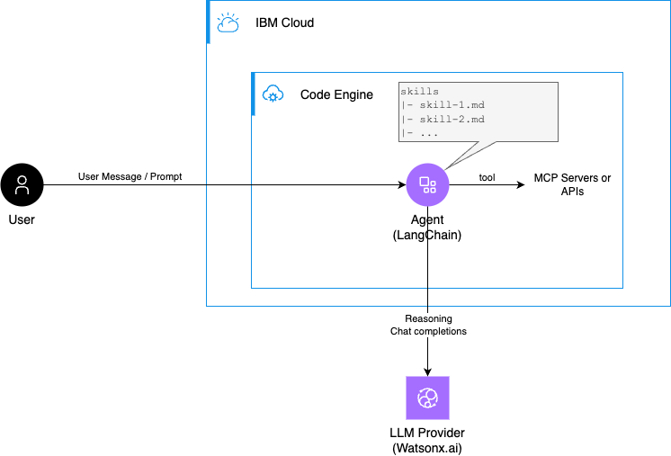

# LangChain Skills Agent on Code Engine

A modular, skill-based agent built with LangChain that demonstrates a clean architecture for organizing agent capabilities. This agent provides weather forecasting, travel recommendations, and currency conversion through a dynamic skill loading system.

## Why IBM Cloud Code Engine

[IBM Cloud Code Engine](https://www.ibm.com/products/code-engine) is a great fit for containerized agents because it provides:

- **Serverless containers**: Deploy container images without managing infrastructure.
- **Automatic scaling**: Scale to zero when idle and scale up on demand.
- **Pay-per-use pricing**: Cost-efficient for intermittent workloads common to agents.
- **Simple deployment**: Integrates with container registries and CI/CD pipelines.
- **Managed endpoint**: Provides a secure http endpoint with a managed certificate.

## The architecture



## 🎯 Overview

This agent showcases a **skill-based setup** where each capability is:
- Self-contained in its own directory
- Documented with metadata in a `skill.md` file
- Implemented as a LangChain tool
- Dynamically discovered and loaded at runtime


### Key Features

- **🔧 Modular Skills**: Each skill is independent and easy to add/remove
- **📝 Metadata-Driven**: Skills include YAML frontmatter with configuration
- **🔄 Dynamic Loading**: Skills are automatically discovered from the `skills/` directory
- **🚀 Production Ready**: Containerized and deployable to IBM Cloud Code Engine
- **🎨 Clean Architecture**: Clear separation of concerns and easy to extend

## 📦 Included Skills

### 1. Weather Forecast 🌤️
Get current weather and multi-day forecasts for any location worldwide.

**Example:**
```
"What's the weather in Tokyo for the next 5 days?"
```

### 2. Travel Recommendations ✈️
Personalized destination suggestions based on preferences, budget, and season.

**Example:**
```
"Recommend beach destinations for a moderate budget in summer"
```

### 3. Currency Converter 💱
Convert between 30+ currencies with exchange rates.

**Example:**
```
"Convert 1000 USD to EUR"
```

## 🏗️ Architecture

```
langchain-skills-agent/
├── src/
│   ├── main.py              # FastAPI app & agent entrypoint
│   ├── agents.py            # LangChain agent configuration
│   ├── skill_loader.py      # Dynamic skill discovery & loading
│   ├── skills/              # Skill directory
│   │   ├── weather_forecast/
│   │   │   ├── skill.md     # Metadata & documentation
│   │   │   └── __init__.py  # Tool implementation
│   │   ├── travel_recommendations/
│   │   │   ├── skill.md
│   │   │   └── __init__.py
│   │   └── currency_converter/
│   │       ├── skill.md
│   │       └── __init__.py
│   └── frontend/
│       └── landing_page.py  # Web UI
├── deploy.sh                # IBM Cloud deployment script
├── .env.sample              # Environment configuration template
└── payload/
    └── payload.json         # Example request payload
```

## 🚀 Quick Start

### Prerequisites

1. **LLM Backend**: Configure an OpenAI-compatible API endpoint
   - [IBM watsonx.ai](https://www.ibm.com/products/watsonx-ai) (recommended)

2. **IBM Cloud CLI** (for deployment):
   ```bash
   curl -fsSL https://clis.cloud.ibm.com/install/linux | sh
   ```

## ☁️ Deploy to IBM Cloud Code Engine

### Configuration

1. **Copy and configure environment**:
   ```bash
   cp .env.sample .env
   ```

2. **Edit `.env`** with your credentials:
   ```bash
   INFERENCE_BASE_URL=https://eu-de.ml.cloud.ibm.com
   INFERENCE_API_KEY="YOUR_API_KEY"
   INFERENCE_MODEL_NAME="meta-llama/llama-3-2-11b-vision-instruct"
   INFERENCE_PROJECT_ID="YOUR_PROJECT_ID"
   ```

### Deploy

1. **Login to IBM Cloud**:
   ```bash
   ibmcloud login --sso
   # or with API key:
   ibmcloud login --apikey "$IBMCLOUD_APIKEY"
   ```

2. **Run deployment**:
   ```bash
   ./deploy.sh
   ```

3. **The script will**:
   - Create a Code Engine project
   - Build and deploy the containerized agent
   - Configure secrets from your `.env` file
   - Provide the agent URL

### Cleanup

Remove all created resources:
```bash
./deploy.sh clean
```

### Local Development

1. **Clone and setup**:
   ```bash
   cd langchain-skills-agent
   cp .env.sample .env
   # Edit .env with your API credentials
   ```

2. **Install dependencies**:
   ```bash
   cd src
   pip install -e .
   # or with uv:
   uv sync
   ```

3. **Run locally**:
   ```bash
   python main.py
   ```

4. **Test the agent**:
   ```bash
   # Visit the landing page
   open http://localhost:8080

   # Or use the API
   curl -X POST http://localhost:8080/runs \
     -H "Content-Type: application/json" \
     -d @payload/payload.json
   ```

## 🔌 API Endpoints

### `GET /`
Landing page with agent information and documentation

### `GET /agents`
List available agents

### `POST /runs`
Execute the agent with a query

**Request:**
```json
{
  "messages": [
    {
      "role": "user",
      "content": "What's the weather in Paris?"
    }
  ]
}
```

### `GET /info`
Get agent information and loaded skills

### `GET /health`
Health check endpoint

## 🛠️ Adding New Skills

1. **Create skill directory**:
   ```bash
   mkdir -p src/skills/my_new_skill
   ```

2. **Create `skill.md`** with metadata:
   ```markdown
   ---
   name: "My New Skill"
   description: "What this skill does"
   version: "1.0.0"
   category: "utility"
   parameters:
     - name: input
       type: string
       required: true
       description: "Input parameter"
   ---

   # My New Skill

   Detailed documentation here...
   ```

3. **Create `__init__.py`** with implementation:
   ```python
   from langchain.tools import tool

   @tool
   def my_new_skill(input: str) -> str:
       """Tool description for the LLM."""
       # Implementation here
       return result
   ```

4. **Restart the agent** - the skill will be automatically discovered!

## 📊 Skill Metadata Format

Each `skill.md` file uses YAML frontmatter:

```yaml
---
name: "Skill Name"
description: "Brief description"
version: "1.0.0"
category: "category_name"
parameters:
  - name: param_name
    type: string|integer|float|boolean
    required: true|false
    default: default_value
    description: "Parameter description"
---
```

## 🔧 Configuration

### Environment Variables

| Variable | Description | Example |
|----------|-------------|---------|
| `INFERENCE_BASE_URL` | LLM API endpoint | `https://eu-de.ml.cloud.ibm.com` |
| `INFERENCE_API_KEY` | API key for LLM | `your-api-key` |
| `INFERENCE_MODEL_NAME` | Model identifier | `watsonx/meta-llama/llama-3-3-70b-instruct` |
| `INFERENCE_PROJECT_ID` | Project ID (watsonx.ai) | `your-project-id` |
| `OPENWEATHER_API_KEY` | Weather API key (optional) | `your-key` |
| `EXCHANGE_RATE_API_KEY` | Exchange rate API key (optional) | `your-key` |

## 🎨 Architecture Highlights

### Dynamic Skill Loading

The `skill_loader.py` module:
1. Scans the `skills/` directory
2. Parses `skill.md` metadata
3. Imports Python modules
4. Registers tools with LangChain
5. Makes them available to the agent

### LangChain Integration

- Uses `ChatWatxonx` for Watsonx-compatible APIs
- Implements `create_tool_calling_agent` for tool use
- Provides `AgentExecutor` for orchestration
- Supports async operations

### ACP SDK Integration

- Compatible with Agent Communication Protocol
- Provides standard agent endpoints
- Supports message-based interaction
- Easy integration with agent platforms

## 📚 Learn More

- [IBM Cloud Code Engine](https://cloud.ibm.com/docs/codeengine)
- [LangChain Documentation](https://python.langchain.com/)
- [IBM watsonx.ai](https://www.ibm.com/products/watsonx-ai)
- [Agent Communication Protocol](https://github.com/IBM/agent-communication-protocol)


---

**Built with ❤️ using LangChain and IBM Cloud Code Engine**