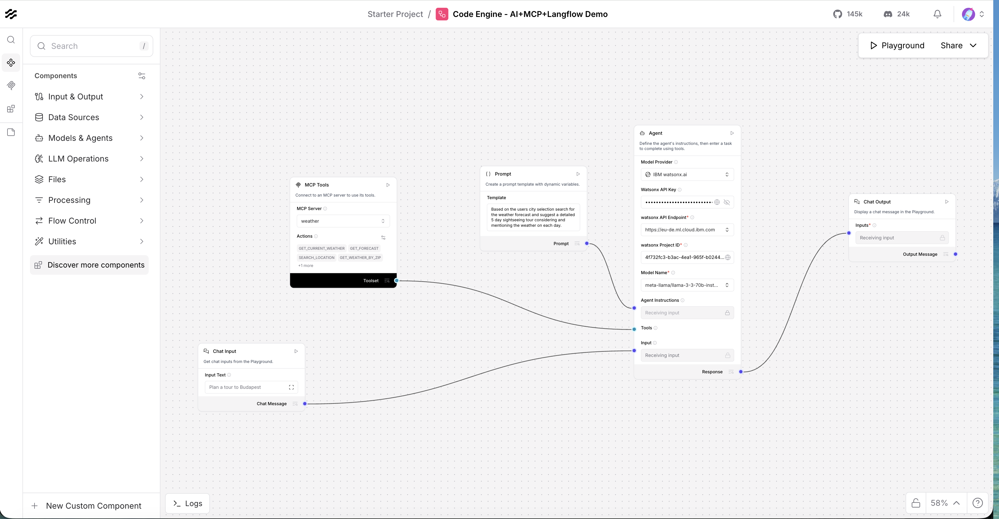
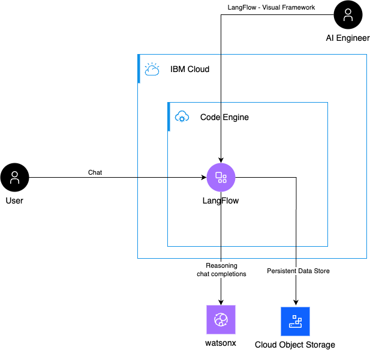

# LangFlow on IBM Code Engine

## What is LangFlow

- [LangFlow](https://www.langflow.org/) is an open-source, Python-based **low-code visual framework** designed for rapid prototyping and deployment of **LLM-powered applications**.
- It allows you to **visually define pipelines** that connect **Agents**, **Tools** and **LLMs** so you can build, test, and iterate on behaviors without writing glue code.
- It comes with batteries included and supports all major LLMs, vector databases and a **growing library of AI tools**.



## Why Code Engine is a great fit




Using **[IBM Cloud Code Engine](https://www.ibm.com/products/code-engine)** you can expose both the developer visual editor and the end-user interface via an out-of-the-box system domain, making it easy to share and host LangFlow apps.

- **Managed runtime:** Code Engine runs containers without managing servers, lowering operational overhead.
- **Public endpoints:** Apps get a reachable URL out of the box, simplifying access for developers and end users.
- **Scalability & cost control:** Configure CPU/memory and min/max scale for predictable resource use and autoscaling when needed.
- **Integrates with COS:** Object storage (IBM Cloud Object Storage) can be mounted as a persistent data store for flows, state and uploads.
- **Secure secrets & PDS:** Use Code Engine secrets and Persistent Data Stores (PDS) to store credentials and mount COS buckets securely.

Note: For production use it's recommended to use [IBM Cloud Databases for PostgreSQL](https://www.ibm.com/products/databases-for-postgresql) for the [external persistence layer](https://docs.langflow.org/memory#configure-external-memory).

## Deploy 

This repository includes a convenience script `deploy.sh` that automates the common steps (creating a Code Engine project, creating a COS instance and bucket, creating a service key, creating a CE secret and PDS, and deploying the image).

**Prerequisites**

Create an IBM Cloud account and [login into your IBM Cloud account using the IBM Cloud CLI](https://cloud.ibm.com/docs/codeengine?topic=codeengine-install-cli).


**Deploy** 
Run the bundled script from this folder which automates the steps above and configures COS/PDS integration:

```bash
./deploy.sh
```

The script accepts optional environment variables to customize region and naming, e.g.:

```bash
REGION=eu-de NAME_PREFIX=ce-langflow ./deploy.sh
```

Notes on persistence

- The deployment mounts an IBM Cloud Object Storage bucket as a Persistent Data Store so LangFlow can persist flows and state across restarts.
- The script creates a secret (`langflow-cos-secret`) containing HMAC credentials and a PDS (`langflow-store`) that points the app at the bucket.

## Access the environment

After deployment, retrieve the app URL with:

```bash
ibmcloud ce app get --name langflow -o json | jq -r '.status.url'
```

The script also prints the reachable URL, for example:

```
https://langflow.26pr644bfbfc.eu-de.codeengine.appdomain.cloud
```

## Use LangFlow

Open the URL in a browser window to access the visual editor of [LangFlow](https://www.langflow.org/) and start desiging you first flow. If you already have a flow, you can import it as well.


