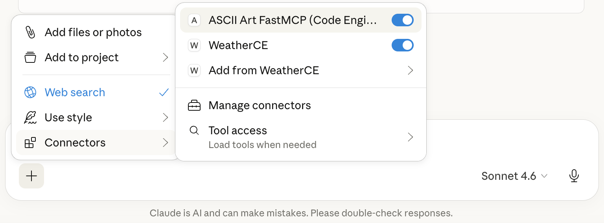
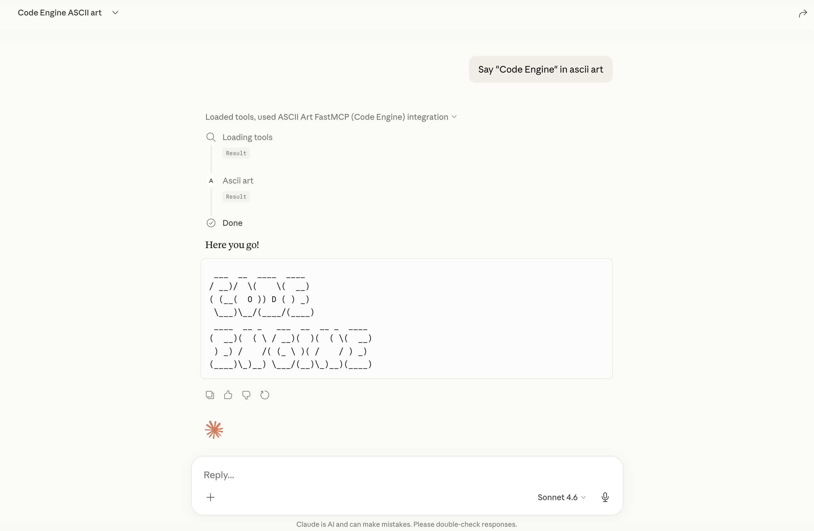

FastMCP — Fast, tiny MCP server example
======================================

Overview
--------
This directory contains a minimal FastMCP server example and a companion client. FastMCP demonstrates a tiny, runnable implementation of an MCP-compatible service (Model Context Protocol) intended for local testing and quick deployment to cloud platforms.


About MCP and FastMCP
---------------------

MCP (Model Context Protocol) is a lightweight, transport-agnostic convention for exchanging model prompts, context, and responses between clients and model-serving services. It emphasizes:

- **Transport flexibility**: works over HTTP, SSE, WebSocket, stdio and other streamable transports.
- **Streaming-first behavior**: supports incremental/streaming responses for low-latency UX.
- **Simple JSON semantics**: easy to implement and interoperate between services.

**[FastMCP](https://gofastmcp.com/getting-started/welcome) is the standard framework for building MCP applications.** 

The [Direct Http Server](https://gofastmcp.com/deployment/http#direct-http-server) example provides a minimal reference implementation meant for experimentation and quick deployments. It focuses on a very small API surface and fast startup so you can iterate locally or run tiny instances in cloud platforms like Code Engine.


Why Code Engine?
-----------------

[IBM Cloud Code Engine](https://www.ibm.com/products/code-engine) is a great fit for containerized MCP Servers because it provides:

- **Serverless containers**: Deploy container images without managing infrastructure.
- **Automatic scaling**: Scale to zero when idle and scale up on demand.
- **Pay-per-use pricing**: Cost-efficient for intermittent workloads common to agents.
- **Simple deployment**: Integrates with container registries and CI/CD pipelines.
- **Managed endpoint**: Provides a secure http endpoint with a managed certificate.

A very tiny MCP Server
----------------------

The Python source code for the MCP server is located in [./server/main.py](./server/main.py):

```python
from typing import Any
from fastmcp import FastMCP
from art import text2art

mcp = FastMCP("My FastMCP Server on Code Engine")

@mcp.tool
def ascii_art(input: str) -> str:
    """Take an arbitraty input and return it as an ASCII art banner"""

    if input == "Code Engine":
        response = ". ___  __  ____  ____\n"
        response += "./ __)/  \\(    \\(  __)\n"
        response += "( (__(  O )) D ( ) _)\n"
        response += ".\\___)\\__/(____/(____)\n"
        response += ".____  __ _   ___  __  __ _  ____\n"
        response += "(  __)(  ( \\ / __)(  )(  ( \\(  __)\n"
        response += ".) _) /    /( (_ \\ )( /    / ) _)\n"
        response += "(____)\\_)__) \\___/(__)\\_)__)(____)\n"
    else:
        response: str = text2art(input)

    return response

if __name__ == "__main__":
    mcp.run(transport="http", host="0.0.0.0", port=8080)
```

Deploying the server to Code Engine
----------------------------------

**Prerequisites**
Create an IBM Cloud account and [login into your IBM Cloud account using the IBM Cloud CLI](https://cloud.ibm.com/docs/codeengine?topic=codeengine-install-cli).

**Deploy**

1. Authenticate and login to IBM Cloud:

```bash
ibmcloud login --sso
ibmcloud login --apikey "$IBMCLOUD_APIKEY" -r us-south

```

2. Run the included deploy script from this folder. The script creates a new Code Engine project in the specified region and automates build/push/deploy steps to create a new application in Code Engine. 

```bash
NAME_PREFIX=ce-fastmcp REGION=eu-de ./deploy.sh
```

3. The deploy script will print the URL under which the MCP Server is publicly accessible

```
FastMCP application is reachable under the following url:
https://fastmcp.26n4g2nfyw7s.eu-de.codeengine.appdomain.cloud/mcp
```

🚀 The example was successful and you can now use the MCP server in your chat application 🚀

Testing the deployed server with call_tool.sh
---------------------------------------------
The `call_tool.sh` script provides a quick way to test your deployed MCP server directly from the command line. It demonstrates the complete MCP protocol flow:

1. Initializes an MCP session with the server
2. Lists all available tools
3. Calls the `ascii_art` tool with "Code Engine" as input
4. Displays the ASCII art output

Run the script from the `mcp_server_fastmcp` directory:

```bash
./call_tool.sh
```

The script will automatically connect to your deployed FastMCP application and execute a test call. You should see output similar to:

```
FastMCP application is reachable under the following url:
https://fastmcp.26n4g2nfyw7s.eu-de.codeengine.appdomain.cloud/mcp

initialize session
Session initialized: <session-id>

List tools
Call tool 'ascii_art' with input 'Code Engine'

. ___  __  ____  ____
./ __)/  \(    \(  __)
.( (__(  O )) D ( ) _)
.\___)\\__/(____/(____)
.____  __ _   ___  __  __ _  ____
.(  __)(  ( \ / __)(  )(  ( \(  __)
..) _) /    /( (_ \ )( /    / ) _)
.(____)\\_)__) \\___/(__)\\_)__)(____)

SUCCESS
```


Using this example with Claude Desktop
-------------------------------------
Claude Desktop can connect to local or remote MCP servers by registering them in its `claude_desktop_config.json` (Claude -> Settings -> Developer -> Edit Config). 


Example `claude_desktop_config.json` entry that point to your deployed application URL:

```json
{
  "mcpServer": {
    "ASCII Art FastMCP (Code Engine)": {
      "command": "npx",
      "args": [
        "mcp-remote",
        "https://fastmcp.26n4g2nfyw7s.eu-de.codeengine.appdomain.cloud/mcp"
      ]
    }
  }
}
```

Save settings and restart Claude Desktop; the remote MCP server should appear as a selectable tool in Claude Desktop.



You can now chat with the MCP Server, e.g.

**_"Create ASCII art for: Hello, World!"_**

Claude will detect the tool and call the `ascii_art` function, responding with ASCII art output for your input text.



Note, the LLM even detected the simplicity of our MCP Server.

Building and using the Python client
-----------------------------
The `client` directory contains a small Python client to exercise the server.

1. Create a virtual environment and install dependencies:

```bash
python3 -m venv .venv
source .venv/bin/activate
pip install -r requirements.txt
```

2. Run the client

Start the client by replacing the application URL from above as the `MCP_SERVER_URL` environment variable, e.g.

```bash
MCP_SERVER_URL="https://fastmcp.26n4g2nfyw7s.eu-de.codeengine.appdomain.cloud/mcp" python client.py
```

3. Inspect and adapt
- Open `client.py` to find example calls. The client is intentionally minimal so you can adapt it to your tooling or CI.


What's next?
------------

You now have a very simple reference architecture to deploy any MCP server of your choice. 