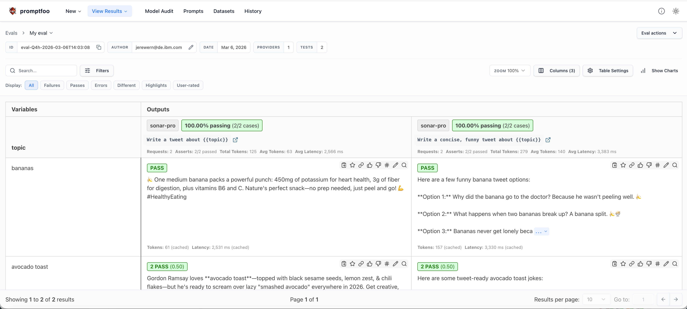

# promptfoo on IBM Cloud Code Engine


## What is promptfoo

- [promptfoo](https://www.promptfoo.dev/) is an open-source **LLM testing, evaluation, and red-teaming framework** that helps you build reliable LLM applications.
- It enables you to **systematically test and compare** prompts, models, and RAG pipelines across providers, ensuring quality and safety before production.
- Key capabilities include:
  - **Testing & Evaluation:** Run automated tests with assertions, compare outputs across models, and track performance metrics
  - **Red-teaming:** Identify vulnerabilities, jailbreaks, and harmful outputs with built-in security testing
  - **Prompt Engineering:** Iterate on prompts with side-by-side comparisons and regression testing
  - **CI/CD Integration:** Integrate into your development workflow to catch issues early
  - **Web UI:** Visualize results, share findings with stakeholders, and collaborate on improvements
- Supports all major LLM providers (OpenAI, Anthropic, Google, Azure, AWS, and more), local models, and custom providers.

## Why Code Engine is a great fit

Using **[IBM Cloud Code Engine](https://www.ibm.com/products/code-engine)** you can run promptfoo evaluations in parallel & scale and host promptfoo's web UI to create a centralized hub for your team's LLM testing and evaluation workflows.

- **Managed runtime:** Code Engine runs containers without managing servers, lowering operational overhead.
- **Public endpoints:** Apps get a reachable URL out of the box, making it easy to share test results, red-team findings, and evaluation reports with your team.
- **Scalability & cost control:** Configure CPU/memory and min/max scale for predictable resource use and autoscaling when needed.
- **Integrates with COS:** Object storage (IBM Cloud Object Storage) can be mounted as a persistent data store for test results, configurations, datasets, and historical comparisons.
- **Secure secrets & PDS:** Use Code Engine secrets and Persistent Data Stores (PDS) to store credentials and mount COS buckets securely.
- **Team collaboration:** Centralized deployment enables teams to share test suites, compare results, and maintain a single source of truth for LLM quality metrics.
- **Batch Jobs:** Use Code Engine jobs to run evaluations and tests asynchronously and in parallel
- **Cron Trigger:** Schedule jobs based on a timer to run tests, collect data, and generate reports

## Deploy 

This repository includes a convenience script `deploy.sh` that automates the common steps (creating a Code Engine project, creating a COS instance and bucket, creating a service key, creating a CE secret and PDS, and deploying the image).

**Prerequisites**

Create an IBM Cloud account and [login into your IBM Cloud account using the IBM Cloud CLI](https://cloud.ibm.com/docs/codeengine?topic=codeengine-install-cli).


**Deploy** 
Run the bundled script from this folder which automates the steps above and configures COS/PDS integration:

```bash
./deploy.sh
```

The script accepts optional environment variables to customize region and naming, e.g.:

```bash
REGION=eu-de NAME_PREFIX=ce-promptfoo ./deploy.sh
```

Notes on persistence

- The deployment mounts an IBM Cloud Object Storage bucket as a Persistent Data Store so promptfoo can persist evaluation results and configurations across restarts.
- The script creates a secret (`promptfoo-cos-secret`) containing HMAC credentials and a PDS (`promptfoo-store`) that points the app at the bucket.

## Access the environment

After deployment, retrieve the app URL with:

```bash
ibmcloud ce app get --name promptfoo -o json | jq -r '.status.url'
```

The script also prints the reachable URL, for example:

```
https://promptfoo.26pr644bfbfc.eu-de.codeengine.appdomain.cloud
```

## Use promptfoo

Open the URL in a browser window to access the web UI of [promptfoo](https://www.promptfoo.dev/) and view your evaluation results.

## Use promptfoo CLI locally and share with the deployed application

You can run promptfoo evaluations locally and share the results with your deployed Code Engine application. This allows you to:

- Run evaluations on your local machine with your preferred configuration
- View and share results through the hosted web UI
- Collaborate with team members by pointing them to the shared URL


### Setup

1. Install promptfoo locally:

```bash
npm install -g promptfoo
```

2. Get your deployed application URL:

```bash
ibmcloud ce app get --name promptfoo -o json | jq -r '.status.url'
```

3. Configure your `promptfooconfig.yaml` to use the deployed application as the sharing endpoint:

```yaml
# yaml-language-server: $schema=https://promptfoo.dev/config-schema.json

description: "My eval"

sharing:
  apiBaseUrl: https://promptfoo.26pr644bfbfc.eu-de.codeengine.appdomain.cloud

prompts:
  - "Write a tweet about {{topic}}"
  - "Write a concise, funny tweet about {{topic}}"

providers:
  - id: "openai:gpt-4"
    config:
      apiKey: ${OPENAI_API_KEY}

tests:
  - vars:
      topic: bananas

  - vars:
      topic: avocado toast
    assert:
      - type: icontains
        value: avocado
      - type: javascript
        value: 1 / (output.length + 1)
```

4. Run your evaluation locally:

```bash
promptfoo eval
```

5. Share results in the deployed application:

```bash
promptfoo share
```

### Running evaluations asynchronously

If you need to run many evaluations you can run them as [Code Engine jobs](https://cloud.ibm.com/docs/codeengine?topic=codeengine-cebatchjobs) asynchronously and in parallel within the same project. 

```bash
# create a config map from the promptfooconfig.yaml file
ibmcloud ce configmap create -n promptfooconfig --from-file promptfooconfig.yaml

# submit the job
ibmcloud ce jobrun submit -n promptfoo-eval-1 --mount-configmap /app/config=promptfooconfig --image ghcr.io/promptfoo/promptfoo:latest --command promptfoo --arg eval --arg "-c" --arg "/app/config/promptfooconfig.yaml" 

# view logs of the job run
ibmcloud ce jobrun logs -n promptfoo-eval-1
```

The results will look as follows:

```
promptfoo-eval-1-0-0/promptfoo-eval-1:
Starting evaluation eval-LcA-2026-03-18T16:09:03
Running 4 test cases (up to 4 at a time)...
Creating cache folder at /home/promptfoo/.promptfoo/cache.

┌────────────────────────────────────────┬────────────────────────────────────────┬────────────────────────────────────────┐
│ topic                                  │ [sonar-pro] Write a tweet about        │ [sonar-pro] Write a concise, funny     │
│                                        │ {{topic}}                              │ tweet about {{topic}}                  │
├────────────────────────────────────────┼────────────────────────────────────────┼────────────────────────────────────────┤
│ bananas                                │ [PASS] Bananas are booming! 🌍 Global  │ [PASS] "Why did the banana go to       │
│                                        │ market hitting $147.82B in 2026, up    │ therapy? It had too many emotional     │
│                                        │ 3.1% YoY, fueled by health perks like  │ **peelings** and couldn't find its     │
│                                        │ potassium & fiber. Rwanda leads per    │ a-peel!"[1][2]                         │
│                                        │ capita at 116kg/year—who's stocking    │                                        │
│                                        │ up? 🍌📈[1][4]                         │                                        │
├────────────────────────────────────────┼────────────────────────────────────────┼────────────────────────────────────────┤
│ avocado toast                          │ [PASS] Gordon Ramsay loves **avocado   │ [PASS] Here are some tweet-ready       │
│                                        │ toast** done right—with black sesame   │ avocado toast jokes you can use:       │
│                                        │ seeds, lemon zest, chili flakes,       │ **"Toast got real. That's avo toast to │
│                                        │ chorizo & tomatoes—but he's ready to   │ perfection."**[1]                      │
│                                        │ scream over lazy "smashed avocado"     │ **"I came for toast but stayed for the │
│                                        │ everywhere in 2026! Elevate it, chefs! │ avo vibes."**[1]                       │
│                                        │ 🍞🥑🔥[1]                              │ **"Brunch without avocado is toast     │
│                                        │                                        │ without purpose."**[1]                 │
│                                        │                                        │ **"You're the...                       │
└────────────────────────────────────────┴────────────────────────────────────────┴────────────────────────────────────────┘
✓ Eval complete

Total Tokens: 334
  Eval: 334 (32 prompt, 302 completion)

Results: ✓ 4 passed, 0 failed, 0 errors (100%)
Duration: 5s (concurrency: 4)

Progress: 4/4 results shared (100%)
» ✓ https://promptfoo.app/eval/eval-gsm-2026-03-18T16:09:03
```

### Sharing results

When you run `promptfoo eval` with the `sharing.apiBaseUrl` configured, your evaluation results are automatically uploaded to the deployed application. Team members can then access these results by visiting the Code Engine URL.



**Benefits:**
- **Centralized results:** All team members can view evaluation results in one place
- **No local setup required:** Stakeholders can review results without installing promptfoo
- **Persistent storage:** Results are stored in COS and persist across application restarts
- **Collaboration:** Share specific evaluation URLs with team members for review and discussion

