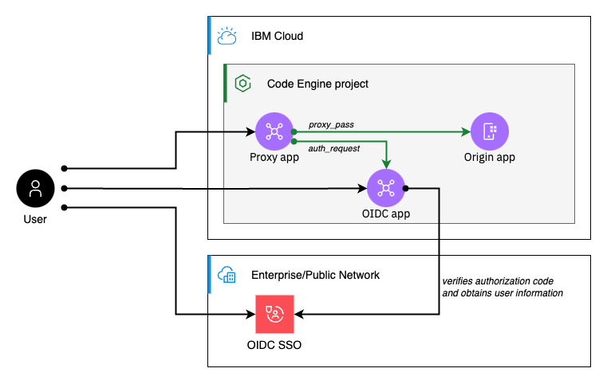

# OIDC Proxy sample

This sample demonstrates how to configure an authentication/authorization layer that fronts any arbitrary Code Engine application. In principal, this pattern is pretty generic. To demonstrate it, we chose to implement it with OpenID Connect (OIDC), an authentication framework that is built on top of the OAuth 2.0 protocol.

The following diagram depicts the components that are involved:


**Note:** The origin app is not exposed to the public or private network and can only be accessed through the authentication proxy that does an auth check towards an oidc app that got installed into the same project.


## Setting up an OIDC SSO configuration

In order to be able to authenticate using OIDC SSO, you'll need to choose and configure a suitable OIDC provider. For this sample we demonstrate how this can be achieved by either using GitHub, or an IBM-internal provider. While many other OIDC providers will also work out-of-the-box, some may require few adjustments in the implementation of the `auth` app that we provide in this sample.

### Github.com OIDC SSO

Github.com provides a publicly available OIDC provider, that can be used to point to Code Engine applications, which you deployed in your IBM Cloud account. Use the following steps to configure an SSO app:

* Create Github OIDC app through https://github.com/settings/developers
    ```
    name: oidc-sample
    homepage: https://oidc-sample-auth.<CE_SUBDOMAIN>.<REGION>.codeengine.appdomain.cloud
    callback URL: https://oidc-sample-auth.<CE_SUBDOMAIN>.<REGION>.codeengine.appdomain.cloud/auth/callback
    ```
* Store the client id and the secret in local file called `oidc.properties`
    ```
    echo "OIDC_CLIENT_ID=<CLIENT_ID>" > oidc.properties
    echo "OIDC_CLIENT_SECRET=<CLIENT_SECRET>" >> oidc.properties
    ```
* Generate a random cookie secret that is used to encrypt the auth cookie value and add it to the `oidc.properties` file
    ```
    echo "COOKIE_SIGNING_ENCRYPTION_KEY=$(openssl rand -base64 32)" >> oidc.properties
    ```
* From your OIDC provider obtain the following values and add them to the `oidc.properties` file
    ```
    echo "OIDC_PROVIDER_AUTHORIZATION_ENDPOINT=https://github.com/login/oauth/authorize" >> oidc.properties
    echo "OIDC_PROVIDER_TOKEN_ENDPOINT=https://github.com/login/oauth/access_token" >> oidc.properties
    echo "OIDC_PROVIDER_USERINFO_ENDPOINT=https://api.github.com/user" >> oidc.properties
    ```
* To add authorization checks one can check for a specific user property
    ```
    echo "AUTHZ_USER_PROPERTY=login" >> oidc.properties
    echo "AUTHZ_ALLOWED_USERS=<<comma-separated-list-of-github-users>" >> oidc.properties
    ```

### IBMers-only: w3Id OIDC SSO

To protect IBM's workforce, the SSO Provisioner provides the ability to configure an w3Id SSO. Note: This SSO provider can only be used by IBMers

* Create w3Id OIDC configuration through https://w3.ibm.com/security/sso-provisioner
    ```
    name: oidc-sample
    homepage: https://oidc-sample-auth.<CE_SUBDOMAIN>.<REGION>.codeengine.appdomain.cloud
    callback URL: https://oidc-sample-auth.<CE_SUBDOMAIN>.<REGION>.codeengine.appdomain.cloud/auth/callback
    ```
* Store the client id and the secret in local file called `oidc.properties`
    ```
    echo "OIDC_CLIENT_ID=<CLIENT_ID>" > oidc.properties
    echo "OIDC_CLIENT_SECRET=<CLIENT_SECRET>" >> oidc.properties
    ```
* Generate a random cookie secret that is used to encrypt the auth cookie value and add it to the `oidc.properties` file
    ```
    echo "COOKIE_SIGNING_ENCRYPTION_KEY=$(openssl rand -base64 32)" >> oidc.properties
    ```
* From your OIDC provider obtain the following values and add them to the `oidc.properties` file
    ```
    echo "OIDC_PROVIDER_AUTHORIZATION_ENDPOINT=" >> oidc.properties
    echo "OIDC_PROVIDER_TOKEN_ENDPOINT=" >> oidc.properties
    echo "OIDC_PROVIDER_USERINFO_ENDPOINT=" >> oidc.properties
    ```
* To add authorization checks one can either check for a specific user property, for a group property match
    ```
    echo "AUTHZ_USER_PROPERTY=preferred_username" >> oidc.properties
    echo "AUTHZ_ALLOWED_USERS=<comma-separated-list-of-usernames>" >> oidc.properties
    ```
* Or for a group property match
    ```
    echo "AUTHZ_USER_PROPERTY=blueGroups" >> oidc.properties
    echo "AUTHZ_ALLOWED_USERS=<comma-separated-list-of-groups>" >> oidc.properties
    ```

## Installing the sample

* Install the Code Engine projects and all required components
    ```
    ./run
    ```

* Tear down the example: 
    ```
    ./run clean
    ```

* Install the example and make sure it does not get deleted right-away
    ```
    CLEANUP_ON_SUCCESS=false ./run
    ```

* Following environment variables can be used to tweak the run script

| Name | Description | Default value |
|:----|:---|:---|
| REGION | Region of the Code Engine project | `eu-es` |
| NAME_PREFIX | Naming prefix used for all components (e.g. resource group, Code Engine project, apps)  | `oidc-sample` |
| CLEANUP_ON_SUCCESS | Determines whether the setup should be deleted, right after its successful creation  | `true` |
| CLEANUP_ON_ERROR | Determines whether the setup should be deleted, if the setup procedure failed  | `true` |
