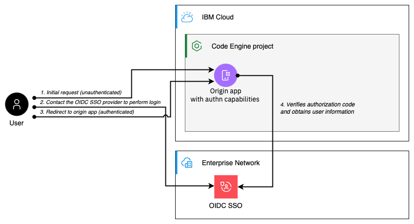

# OIDC sample

This example demonstrates how to OIDC authentication can be added to protect an IBM Cloud Code Engine app.



## Setting up an OIDC SSO configuration

In order to be able to authenticate using OIDC SSO, you'll need to choose and configure a suitable OIDC provider. For this sample we demonstrate how this can be achieved by either using GitHub, or an IBM-internal provider. While many other OIDC providers will also work out-of-the-box, some may require few adjustments in the implementation of the auth app that we provide in this sample.

### Github.com OIDC SSO

GitHub.com provides a publicly available OIDC provider, that can be used to point to Code Engine applications, which you deployed in your IBM Cloud account. Use the following steps to configure an SSO app:

* Create Github OIDC app through https://github.com/settings/developers
    ```
    name: oidc-sample
    homepage: https://oidc-sample.<CE_SUBDOMAIN>.<REGION>.codeengine.appdomain.cloud
    callback URL: https://oidc-sample.<CE_SUBDOMAIN>.<REGION>.codeengine.appdomain.cloud/auth/callback
    ```
* Store the client id and the secret in local file called `oidc.properties`
    ```
    echo "OIDC_CLIENT_ID=<CLIENT_ID>" > oidc.properties
    echo "OIDC_CLIENT_SECRET=<CLIENT_SECRET>" >> oidc.properties
    ```
* Generate a random cookie secret that is used to encrypt the auth cookie value and add it to the `oidc.properties` file
    ```
    echo "COOKIE_ENCRYPTION_KEY=$(openssl rand -base64 32)" >> oidc.properties
    ```
* From your OIDC provider obtain the following values and add them to the `oidc.properties` file
    ```
    echo "OIDC_PROVIDER_AUTHORIZATION_ENDPOINT=https://github.com/login/oauth/authorize" >> oidc.properties
    echo "OIDC_PROVIDER_TOKEN_ENDPOINT=https://github.com/login/oauth/access_token" >> oidc.properties
    echo "OIDC_PROVIDER_USERINFO_ENDPOINT=https://api.github.com/user" >> oidc.properties
    ```

### IBMers-only: w3Id OIDC SSO

To protect IBM's workforce, the SSO Provisioner provides the ability to configure an w3Id SSO. Note: This SSO provider can only be used by IBMers

* Create w3Id OIDC configuration through https://w3.ibm.com/security/sso-provisioner
    ```
    name: oidc-sample
    homepage: https://oidc-sample.<CE_SUBDOMAIN>.<REGION>.codeengine.appdomain.cloud
    callback URL: https://oidc-sample.<CE_SUBDOMAIN>.<REGION>.codeengine.appdomain.cloud/auth/callback
    ```
* Store the client id and the secret in local file called `oidc.properties`
    ```
    echo "OIDC_CLIENT_ID=<CLIENT_ID>" > oidc.properties
    echo "OIDC_CLIENT_SECRET=<CLIENT_SECRET>" >> oidc.properties
    ```
* Generate a random cookie secret that is used to encrypt the auth cookie value and add it to the `oidc.properties` file
    ```
    echo "COOKIE_ENCRYPTION_KEY=$(openssl rand -base64 32)" >> oidc.properties
    ```
* From your OIDC provider obtain the following values and add them to the `oidc.properties` file
    ```
    echo "OIDC_PROVIDER_AUTHORIZATION_ENDPOINT=" >> oidc.properties
    echo "OIDC_PROVIDER_TOKEN_ENDPOINT=" >> oidc.properties
    echo "OIDC_PROVIDER_USERINFO_ENDPOINT=" >> oidc.properties
    ```

## Setup and Configuration

Make sure the file `oidc.properties` contains the following properties are defined and contain meaningful values 
```
OIDC_CLIENT_ID
OIDC_CLIENT_SECRET
COOKIE_ENCRYPTION_KEY
OIDC_PROVIDER_AUTHORIZATION_ENDPOINT
OIDC_PROVIDER_TOKEN_ENDPOINT
OIDC_PROVIDER_USERINFO_ENDPOINT
```

* Create the secret
```
ibmcloud ce secret create --name oidc-credentials --from-env-file oidc.properties
```

* Create the application
```
ENCRYPTION_KEY=$(openssl rand -base64 32)
LANGUAGE=node
CE_SUBDOMAIN=$(ibmcloud ce proj current -o json |jq -r '.kube_config_context')
REGION=$(ibmcloud ce proj current -o json |jq -r '.region_id')
ibmcloud ce app create --name oidc-sample \
    --src "." \
    --build-context-dir "$LANGUAGE" \
    --cpu 0.125 \
    --memory 0.25G \
    --env-from-secret oidc-credentials \
    --env OIDC_REDIRECT_URL=https://oidc-sample.$CE_SUBDOMAIN.$REGION.codeengine.appdomain.cloud/auth/callback
```
