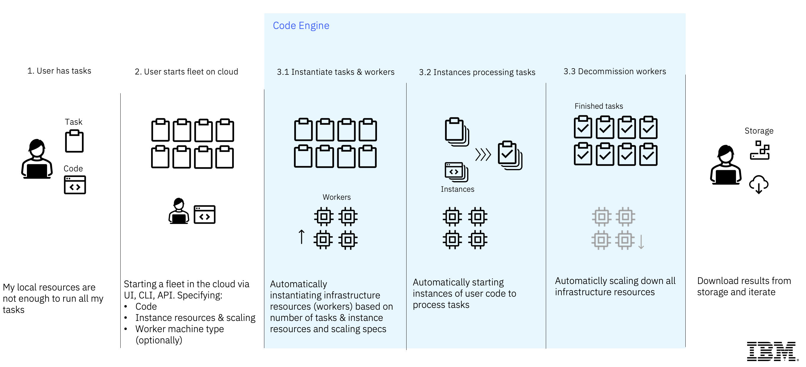
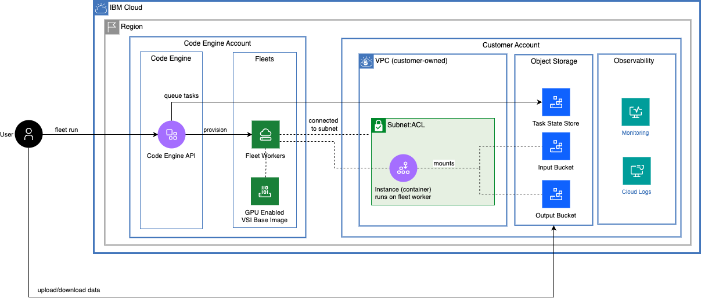
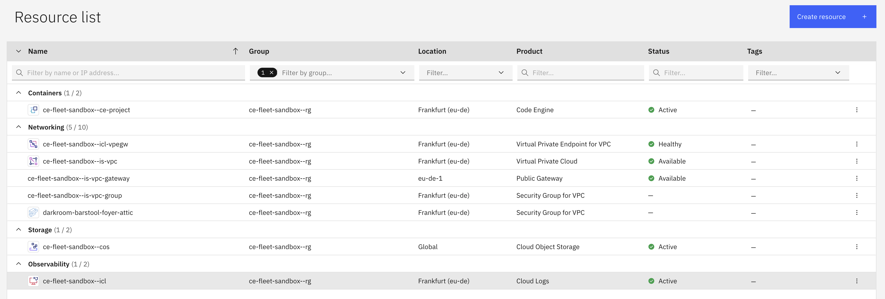
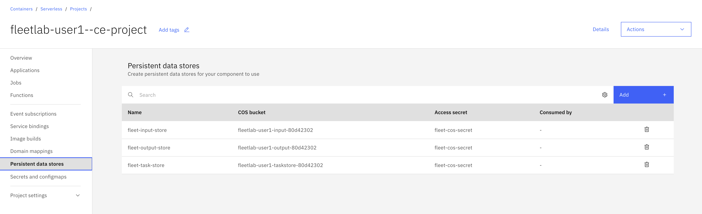
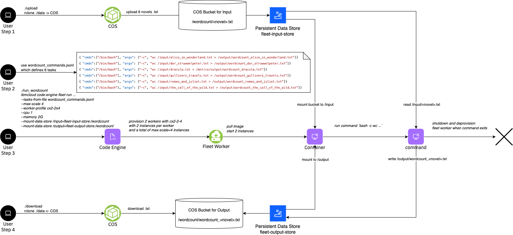
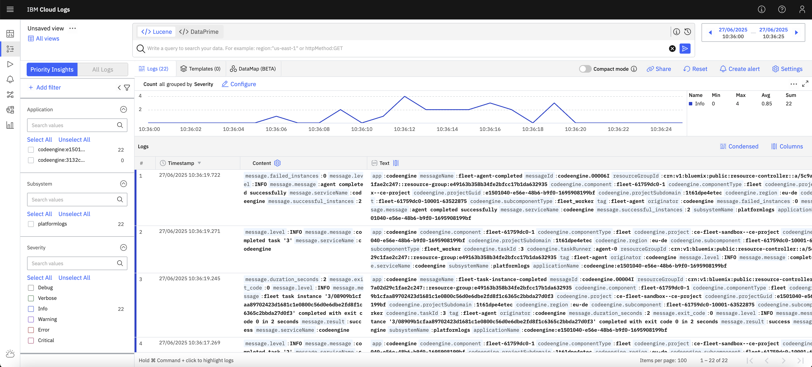

# Serverless Fleets (beta)

Serverless Fleets is an new feature of IBM Cloud Code Engine.

**Table of Contents:**
- [What is a fleets](#what-is-a-fleet)
- [Why using a fleets](#why-using-a-fleet)
- [The fleet concept](#the-fleet-concept)
- [Fleet specification](#fleet-specification)
- [Architecture](#architecture)
- [One Time Setup](#one-time-setup)
- [Launch a Fleet](#launch-a-fleet)
- [Launch a Fleet with GPUs](#launch-a-fleet-with-gpus)
- [Launch a fleet with parallel tasks](#launch-a-fleet-with-parallel-tasks)
- [Launch a fleet to count words of novels](#launch-a-fleet-to-count-words-of-novels)
- [Tutorials](#tutorials)
- [HowTo](#howto)
- [Troubleshooting](#troubleshooting)

## What is a fleet

A fleet, also serverless fleet, is a Code Engine compute component that runs one or more instances of user code in order to complete its tasks. Instances run on workers which are automatically provisioned and de-provisioned based on the number and resource requirements of the instances. Fleets can provision any machine type which connect to Virtual Private Clouds (VPCs) and securely interoperate with user data and services there.

## Why using a fleet

Fleets provide the following main key differentiators:
1. Any machine type including GPUs
2. Connected to the customers VPC network
3. Large scale parallel computing without limits on vCPU, Memory and duration
4. Dynamic task queuing to millions of tasks

## The fleet concept

Fleets have three principal elements: tasks, instances and workers.



### Tasks

The tasks of a fleet represent the work that the fleet is intended to perform and are specified as part of the fleet specification at creation time.

To perform that work, the fleet starts instances of user code on behalf of the tasks and maintains a representation of the current task statuses as instances are started and ending. Tasks change their initial “pending” status to “running” as soon as an instance is started on their behalf. The task status changes to “succeeded” if its instance process ends with a successful return code. If the instance ends unsuccessfully the associated task changes to status “failed” unless its maximum number of retries is not yet exhausted. In that case the task status is set back to “pending” so that a new instance can be started on behalf of the task. A special task status is “cancelled” which applies if the fleet is cancelled by user action.

Once all tasks of a fleet have reached a final status, the fleet status also changes to a final status. The final fleet status is “succeeded” if all tasks have finished successfully, “failed” if at least one task failed and “cancelled” if the user has cancelled the fleet. Once a fleet has reached a final status, all instances have ended and all worker nodes are (being) de-provisioned - unless specific configuration settings change this behavior for debugging purposes.

Through the tasks specification users can control the number of tasks, the order in which instances are started and which specific command and arguments are used to start an instance for a task.

### Instances

Instances of user code are started for the fleet’s tasks on top of worker nodes. Each instance is started on behalf of exactly one task, its associated task. Different instances always have different associated tasks.

Fleets can work on many tasks in parallel by starting multiple instances concurrently. The maximum number of concurrent instances (max_scale) is part of the fleet’s specification. All instances are created with the same amount of vCPU and memory as per the fleet’s specification.

Instances run user code as per the fleet’s code specification in combination with task parameters that allow for task-specific start commands and arguments.

Instances terminate when the user code exits the instance process. The return code provided at that point signals whether the associated task was successfully completed (exit 0) or failed. The status of the associated task is updated accordingly and retries might be attempted as described in the preceding section on tasks.

Instances might also be stopped if the fleet is cancelled with the “hard stop” option by user action or by exceeding the maximum execution time.

### Workers

Worker nodes are virtual machines automatically provisioned and de-provisioned based on the number and amount of resources required to run the fleet’s instances.

Worker nodes are the basis for charging fleet resource consumption in terms of vCPU consumption, memory consumption and potential GPU uplifts.

Users can influence the selection of worker node machine profiles by defining minimum requirements for eligible machine profiles or even specifying a certain one.

## Fleet specification

Fleets run as soon as they are created so that “running a fleet” is the same operation as “creating a fleet”. Therefore the CLI provides `fleet run` and `fleet create` as synonyms. When creating a fleet the following aspects are specified - either explicitly or by default:
- name
- code
- tasks
- instance resources and scaling
- worker nodes
- connectivity
- environment variables (opt.)
- data store mounts (opt.)

The default values are suitable in many cases so that running a fleet can be very easy and quick as shown in the examples section.

### Name specification

The fleet name identifies the fleet entity within the Code Engine project. It has to be a unique within fleets of the same Code Engine project, i.e. it might be the same as an app’s or job’s name in the same Code Engine project. 

### Tasks specification

Fleets require at least one task and are designed to handle large number of tasks. There are two options to specify tasks:
- number of tasks: N
- tasks from file: <file>

Each tasks gets an index assigned from 0..N. The tasks index is provided as an environment variable `CE_TASK_INDEX` into the instance.

In order to specify tasks in a file create a text file with line-wise definition of parameters in JSON syntax (according to JSONL standard). The task parameters "command" and "args" can be used to override of the command and arguments when starting an instance of user code on behalf of the task. If one or both of these parameters are specified their values are used instead of the respective definitions in the container image or in the fleet's code specification. For example, see [wordcount_commands.jsonl](./wordcount_commands.jsonl)

### Code specification

The fleet’s code determines what is run in one or more instances in order to work on tasks. The specification has two parts: the base specification defines a container image reference and optional command and arguments overrides. (This is the same for Code Engine apps and jobs.). In addition, fleets can override command and arguments in a task-specific way as described in the “Task specification” section.

### Instance resources and scaling specifications

vCPU and memory required by each instance can be specified and determines how many instances can fit/run on a fleet worker. In addition, the maximum number of concurrent instances (max_scale) can be specified.

For example, if an instance requires 2 vCPU and 8 GB memory and a total of 100 instances should run concurrently, the fleet will provision a total of 200 vCPU and 800 GB memory.

### Worker specifications

Users can influence what machine profiles are used as worker nodes to different degrees.

In the example above, if the user selects a bx2-8x32 worker profile, each worker can run 4 instances. Therefore a total of 25 workers will be provisioned.

### Environment variables

The instance will get the following environment provided by the system:
```
CE_FLEET_VERSION=v1
CE_REQUEST_ID=33af980d-8175-4925-85d0-0f0cf8812cb5
CE_PROJECT_ID=e1501040-e56e-48b6-b9f0-1695908199bf
CE_FLEET_CONCURRENCY=1
CE_TASK_ID=0
CE_USER_MOUNT_POINT=/mnt/ce/data
CE_FLEET_KEEP_WORKER=false
CE_FLEET_ID=33af980d-8175-4925-85d0-0f0cf8812cb5
CE_FLEET_IS_GPU=false
```

## Architecture 

The architecture used in this tutorial looks as follows.



Key aspects of the architecture:
1. Code Engine is running the fleet and provisions fleet workers
2. Fleet workers are VPC VSIs running in the Code Engine managed accounts
3. Fleet workers are provisioned based on an VSI image provided and managed by Code Engine
4. Fleet workers are connected to the VPC subnet owned by the customer
5. Tasks and data are stored in a Task State Store which is a COS bucket owned by the customer
6. Logs are ingested to an IBM Cloud Logs instances owned by the customer

In terms of roles and responsibilities it's important to understand that:
- The user is responsible to manage the VPC, Subnet, COS Bucket, Containers and ICL instance
- Code Engine is responsible to manage the life-cycle of Fleets, Tasks, Instances and Workers.

The One-time-setup procedure will help to automatically provision / de-provision all required resources, but NOT manage their life-cycle.

## One Time Setup

The tutorial has been tested on a MacOS and Ubuntu24 client machine with the following tools pre-installed:
- `ibmcloud` - IBM Cloud CLI
- `jq` - for parsing JSON response
- `rclone` - for syncing local directory with COS bucket

Clone this repository
```
git clone https://github.com/IBM/CodeEngine.git 
```

Switch to the `beta/serverless-fleets` directory, which will be the root directory for all steps of this tutorial

To run this end-to-end sample, open a terminal, [login into your IBM Cloud account using the IBM Cloud CLI](https://cloud.ibm.com/docs/codeengine?topic=codeengine-install-cli).

Install the Code Engine CLI with the latest version and enable fleets:
```
CE_EXPERIMENTAL_FLEET=true ibmcloud plugin install code-engine -f --quiet
```

If you don't have a fleet sandbox, choose one of the two methods to create one.

<a name="Fully automated creation of cloud resources (recommended)"></a>
<details>
  <summary>Fully automated creation of cloud resources</summary>

Run the following command, which will create all required cloud resources for you.
```
NAME_PREFIX=ce-fleet-sandbox REGION=eu-de ./init-fleet-sandbox
```


> Note: Your account need wide permissions to create all the resources mentioned above. If you don't have persmission, ask you Administrator or follow the steps for the [custom configuration](#custom-configuration)

The following resources will be created in the resource group `ce-fleet-sandbox--rg` in `eu-de`.



The tutorial configures three COS buckets and corresponding Code Engine [Persistent Data Stores](https://cloud.ibm.com/docs/codeengine?topic=codeengine-persistent-data-store) for different purposes:
1. `fleet-task-store` - used by Code Engine to queue and persist tasks and their state
2. `fleet-input-store` - used to read data for processing like PDFs, or txt files
3. `fleet-outout-store` - used to write results as the output of processing



In addition, the `init-fleet-sandbox` script configures a local rclone environment including the `.rclone-config` as well as the `upload` and `download` script. Use `./upload` to load data from your local `./data/input` directory to the `fleet-input-store` bucket and `./download` to download from the `fleet-output-store` bucket to the `./data/output` directory. This allows you to share files easily with your container instance.

You can later clean-up all resources by running `NAME_PREFIX=ce-fleet-sandbox REGION=eu-de ./init-fleet-sandbox clean`.
</details>

<a name="Bring your own cloud resources"></a>
<details>
  <summary>Bring your own cloud resources</summary>

If you already have a VPC, subnets, COS bucket and credentials you can just create the code engine project and related artefacts, follow the instructions in the official documentation

</details>
</br>

## Launch a Fleet

Run a serverless fleet that runs 1 single task and instance with 2 CPUs and 4 GB of memory that sleeps for 2 minutes
```
./run
```

<a name="output"></a>
<details>
  <summary>Output</summary>

```
➜  serverless-fleets ./run
ibmcloud code-engine beta fleet create
   --name fleet-b4bd2a33-1
   --tasks-state-store fleet-task-store
   --image registry.access.redhat.com/ubi8/ubi-minimal:latest
   --command=sleep
   --arg 60
   --tasks 1
   --cpu 2
   --memory 4G
   --max-scale 1
Successfully created fleet with name 'fleet-b4bd2a33-1' and ID 'e3caac88-cfc2-4602-8684-b527a6811716'
Run 'ibmcloud ce beta fleet get --id e3caac88-cfc2-4602-8684-b527a6811716' to check the fleet status.
Run 'ibmcloud ce beta fleet worker list --fleet-id e3caac88-cfc2-4602-8684-b527a6811716' to retrieve a list of provisioned workers.
OK
```
</details>
<br>

To observe the fleet and its progress, run a combination of the following commands. The fleet summarizes the number of workers, tasks and instances. A single worker will be provisioned. The worker will process a single task, which will move from *Pending* to *Running* to *Succeeded*. Afterwards the worker will be deprovisioned.

### Get the details of the fleet

```
ibmcloud ce beta fleet get --id <id>
```
<a name="output"></a>
<details>
  <summary>Output</summary>

```
➜  serverless-fleets ibmcloud ce beta fleet get --id e3caac88-cfc2-4602-8684-b527a6811716
Getting fleet 'e3caac88-cfc2-4602-8684-b527a6811716'...
OK

Name:            fleet-b4bd2a33-1
ID:              e3caac88-cfc2-4602-8684-b527a6811716
Status:          pending
Created:         44s
Project region:  br-sao
Project name:    fleetlab-user1--ce-project

Tasks status:
  Failed:     0
  Cancelled:  0
  Succeeded:  0
  Running:    0
  Pending:    1
  Total:      1

Code:
  Container image reference:  registry.access.redhat.com/ubi8/ubi-minimal:latest
  Registry access secret:     fleet-registry-secret
  Command 0:                  sleep
  Argument 0:                 60

Tasks specification:
  Task state store:  fleet-task-store
  Indexes:           0-0

Resources and scaling:
  CPU per instance:          2
  Memory per instance:       4G
  Preferred worker profile:  cx2-2x4
  Max number of instances:   1
  Max execution time:
  Max retries per task:      3

Network placement:
  Network reference 0:  996b1f58-61d1-401c-9b53-312253de7f2c
```
</details>
<br>

### List the tasks of the fleet

```
ibmcloud ce beta fleet task list --fleet-id <id>
```
<a name="output"></a>
<details>
  <summary>Output</summary>

```
➜  serverless-fleets ibmcloud ce beta fleet task list --fleet-id e3caac88-cfc2-4602-8684-b527a6811716
Listing serverless fleet tasks...
OK

Index        ID                                    Status   Result code  Worker ID
000-00000-0  b3c7c020-5e4c-50fb-ac7d-513b2fb95b5c  running  -            000-00000-0
```
</details>
<br>

### List the workers running in the fleet

```
ibmcloud ce beta fleet worker list --fleet-id <id>
```
<a name="output"></a>
<details>
  <summary>Output</summary>

```
➜  serverless-fleets ibmcloud ce beta fleet worker list --fleet-id e3caac88-cfc2-4602-8684-b527a6811716
Listing serverless fleet workers...
OK

ID                                    Status        Profile  IP           Zone      Age
5b99e38f-f239-4340-a0c6-d70432c21730  initializing  cx2-2x4  10.250.0.15  br-sao-1  71s
```
</details>
<br>

🚀 You just launched a fleet with a single task 🚀


## Launch a Fleet with GPUs

Run a fleet that runs a single task on a *Serverless GPU* using a Nvidia L40s for 2 minutes:
```
./run_gpu
```

The GPUs are defined by setting the family and the number of GPUs per task, e.g. `--gpu GPU_FAMILY:NUMBER_OF_GPUS`, where the number of GPUs can be fractional for GPU families that support MIG. In our case we configure `--gpu l40s:1` with a `--max-scale 1` to get exactly one `gx3-24x120x1l40s`.

Observe the progress of the fleet with the same commands as above.

🚀 You just launched a fleet with a Serverless GPU 🚀

## Launch a fleet with parallel tasks

Run a serverless fleet to process 100 tasks where each tasks gets 1 CPU and 2 GB memory. Run 10 tasks in parallel and use a worker profile of cx2-2x4:

```
./run_parallel_tasks
```

<a name="output"></a>
<details>
  <summary>Output</summary>

```
➜  serverless-fleets ibmcloud code-engine beta fleet create
  --name fleet-847292b7-1
  --image registry.access.redhat.com/ubi8/ubi-minimal:latest
  --tasks-state-store fleet-task-store
  --command=sleep
  --arg 2
  --tasks 100
  --cpu 1
  --memory 2G
  --max-scale 10
```
</details>
<br>

In the fleet details you will see 5 workers being provisined. The number of workers is determined by the profile, cpu/memory and number of parallel tasks. 

```
ibmcloud ce beta fleet get --id <id>
```

<a name="output"></a>
<details>
  <summary>Output</summary>

```
➜  serverless-fleets ibmcloud ce beta fleet get --id 08a05e59-0a35-4da0-885f-5eb3f6f589d4
Getting fleet '08a05e59-0a35-4da0-885f-5eb3f6f589d4'...
OK

Name:            fleet-847292b7-1
ID:              08a05e59-0a35-4da0-885f-5eb3f6f589d4
Status:          pending
Created:         23s
Project region:  br-sao
Project name:    fleetlab-user1--ce-project

Tasks status:
  Failed:     0
  Cancelled:  0
  Succeeded:  0
  Running:    0
  Pending:    100
  Total:      100

Code:
  Container image reference:  registry.access.redhat.com/ubi8/ubi-minimal:latest
  Registry access secret:     fleet-registry-secret
  Command 0:                  sleep
  Argument 0:                 2

Tasks specification:
  Task state store:  fleet-task-store
  Indexes:           0-99

Resources and scaling:
  CPU per instance:         1
  Memory per instance:      2G
  Max number of instances:  10
  Max execution time:
  Max retries per task:     3

Network placement:
  Network reference 0:  daf4f3a0-00a6-46c3-b5cf-cbcbdba049fc
```
</details>
<br>


In our case, a cx2-2x4 has two CPUs and can run 2 instances on a single worker. Since we want to process 10 tasks in parallel, Code Engine provisioned 5 workers.

Repeat the following command until you see the Fleet worker to appear, which takes about 30s:

```
ibmcloud ce beta fleet worker list --fleet-id <id>
```

<a name="output"></a>
<details>
  <summary>Output</summary>

```
➜  serverless-fleets ibmcloud ce beta fleet worker list --fleet-id 08a05e59-0a35-4da0-885f-5eb3f6f589d4
Listing serverless fleet workers...
OK

ID                                    Status        Profile   IP           Zone      Age
273d3d7c-cdb2-4ed9-ac97-bafe76f4f59f  initializing  cx2-8x16  10.250.0.16  br-sao-1  55s
99e535e2-acd0-4b9e-97a2-4e245402c13c  initializing  cx2-2x4   10.250.0.17  br-sao-1  55s

```
</details>
<br>

Observe the progress of the task execution by repeatingly running the following command:

```
ibmcloud ce beta fleet task list --fleet-id <id>
```

Altneratively, you can filter by status `--status <pending | running | successful | failed>`

<a name="output"></a>
<details>
  <summary>Output</summary>

```
➜  serverless-fleets ibmcloud ce beta fleet task list --fleet-id 08a05e59-0a35-4da0-885f-5eb3f6f589d4
Listing serverless fleet tasks...
OK

Index         ID                                    Status   Result code  Worker ID
000-00000-65  00eef277-6973-56a7-9c7a-1cf1b4d1f945  pending  -            -
000-00000-80  020fa8bd-d30f-583d-acfa-84253bb2f399  pending  -            -
000-00000-72  06e4ef8f-1b8f-58b0-95cc-e8191d71403c  pending  -            -
000-00000-82  08aca6c5-c787-589f-8c9a-4f35483ec1ac  pending  -            -
000-00000-77  126be911-8238-5bf6-a5c6-a18991c60377  pending  -            -
...
```
</details>
<br>

Repeat the steps to observe the fleet.

:rocket: You just launched your first Serverless Fleet which run 100 tasks in parallel and scaled down after all tasks completed :rocket:

## Launch a fleet to count words of novels

This example will run a simple `wc` (word count) on a list of [novels](./data/input/wordcount) stored as objects in .txt format in Cloud Object Storage.
The 6 tasks are submitted using the `tasks-from-local-file` option using the [wordcount_commands.jsonl](./wordcount_commands.jsonl) as input.



The example mounts the [Persistant Data Stores](https://cloud.ibm.com/docs/codeengine?topic=codeengine-persistent-data-store) (PDS) to the container using the `--mount-data-store MOUNT_DIRECTORY=STORAGE_NAME:[SUBPATH]`, where 
- `MOUNT_DIRECTORY` - is the directory within the container
- `STORAGE_NAME` - is the name of the PDS
- `SUBPATH` - is the prefix within the COS bucket to mount.

It mounts the `fleet-input-store:/wordcount` to `/input` and `fleet-output-store:/wordcount` to `/output`.

> Note, this example assumes that the automated One-Time-Setup has been performed. Otherwise, the upload and download would need to be done manually.


Four steps are required to run the example:

#### Step 1 - Upload files

Upload the .txt files from the local data directory to Cloud Object Storage
```
./upload
```

#### Step 2 - Run the fleet

Launch the fleet to perform `wc` on each of the novels which defines the tasks from [wordcount_commands.jsonl](./wordcount_commands.jsonl) and mounts the input and output data stores. 
```
./run_wordcount
``` 

Confirm that you uploaded the files with `#? 1`

<a name="output"></a>
<details>
  <summary>Output</summary>

```
➜  serverless-fleets ./run_wordcount
Did you upload the .txt files to COS?
1) Yes
2) No
#? 1
ibmcloud code-engine beta fleet run
  --name fleet-7e818989-1
  --image registry.access.redhat.com/ubi9/ubi-minimal:latest
  --tasks-from-local-file wordcount_commands.jsonl
  --cpu 1
  --memory 2G
  --max-scale 4
  --mount-data-store /input=fleet-input-store:/wordcount
  --mount-data-store /output=fleet-output-store:/wordcount
Successfully created fleet with name 'fleet-7e818989-1' and ID '3f7a1c2a-6d85-4b27-bc4f-7e519645e23b'
Run 'ibmcloud ce beta fleet get --id 3f7a1c2a-6d85-4b27-bc4f-7e519645e23b' to check the fleet status.
Run 'ibmcloud ce beta fleet worker list --fleet-id 3f7a1c2a-6d85-4b27-bc4f-7e519645e23b' to retrieve a list of provisioned workers.
Run 'ibmcloud ce beta fleet task list --fleet-id 3f7a1c2a-6d85-4b27-bc4f-7e519645e23b' to retrieve a list of tasks.
OK
```

</details>
<br>

#### Step 3 - Watch results

You can run the following command to watch the COS bucket for the results, press ctrl-c if all 6 results are present
```
./watch_result wordcount
```

<a name="output"></a>
<details>
  <summary>Output</summary>

```
Every 2.0s: ibmcloud cos list-objects-v2 --bucket fleetlab-dev-output-91b55a45 --prefix wordcount Jeremiass-MacBook-Pro.local: 13:48:47

OK
Name                                           Last Modified (UTC)        Object Size
wordcount/.keep                                Aug 29, 2025 at 12:05:04   0 B
wordcount/wordcount_alice_in_wonderland.txt    Sep 01, 2025 at 11:51:16   52 B
wordcount/wordcount_der_struwwelpeter.txt      Sep 01, 2025 at 11:51:14   47 B
wordcount/wordcount_dracula.txt                Sep 01, 2025 at 11:51:16   40 B
wordcount/wordcount_gullivers_travels.txt      Sep 01, 2025 at 11:51:14   50 B
wordcount/wordcount_romeo_and_juliet.txt       Sep 01, 2025 at 11:51:30   49 B
wordcount/wordcount_the_call_of_the_wild.txt   Sep 01, 2025 at 11:51:31   53 B

Found 7 objects in bucket 'fleetlab-dev-output-91b55a45'
```

</details>
<br>

#### Step 4 - Download the results

Download the results from the output COS bucket to `./data/output`

```
./download
```` 


🚀 The example was successful, if you can tell the number of words of the "Alice in Wonderland" novel 🚀


## Tutorials

- [Tutorial: Docling](./tutorials/docling/README.md)


## HowTo

### How to use your own container and image

In order to use your own container image, you would need to build and push the image to an ICR namespace within the cloud account.

Build:
```
podman build --platform linux/amd64,linux/amd64 . -t <region>.icr.io/<namespace>/<image>:<tag>
```

Push:
```
ic cr login --client podman
podman push <region>.icr.io/<namespace>/<image>:<tag>
```

Update the Code Engine registry secret to use the same registry endpoint:
```
ibmcloud ce secret update --name fleet-registry-secret --server <region>.icr.io
```

Once the push is complete, you can run the fleet by modifying `./run` and replace
- the image, e.g. `--image <region>.icr.io/<namespace>/<image>:<tag>`
- the command, e.g. `--command "/bin/bash"`
- the arguments, e.g. `--arg "-c" --arg "sleep 120"`
- the environment variables, e.g. `--env foo=bar`


### How to access logs

An IBM Cloud Logs instance is being setup and enabled by default during the automated One Time Setup. Each fleet worker will ingest logs to the IBM Cloud Logs instance by default. [Navigating to the UI](https://cloud.ibm.com/docs/cloud-logs?topic=cloud-logs-instance-launch) and use [Using Livetail](https://cloud.ibm.com/docs/cloud-logs?topic=cloud-logs-livetail) or [Filtering log data](https://cloud.ibm.com/docs/cloud-logs?topic=cloud-logs-query-data-filter) to view the logs.



### Cleanup the Environment

To clean up all IBM Cloud resources, that have been created as part of the provided script, run:

```
./init-fleet-sandbox clean
```

## Troubleshooting

### How to delete workers manually?

If you need to end your fleet's processing before it ran to completion, or to get rid of workers that are kept alive for troubleshooting (see above), you can delete the workers.

Run the following command to delete a single worker:

```
ibmcloud ce exp fleet worker delete -n <worker-name>
```

Run the following command to delete all workers in your project:
```
ibmcloud ce exp fleet worker list | grep "fleet-" | awk '{print $1}' | xargs -L1 -I {} ibmcloud ce exp fleet worker delete --name {} -f
```
