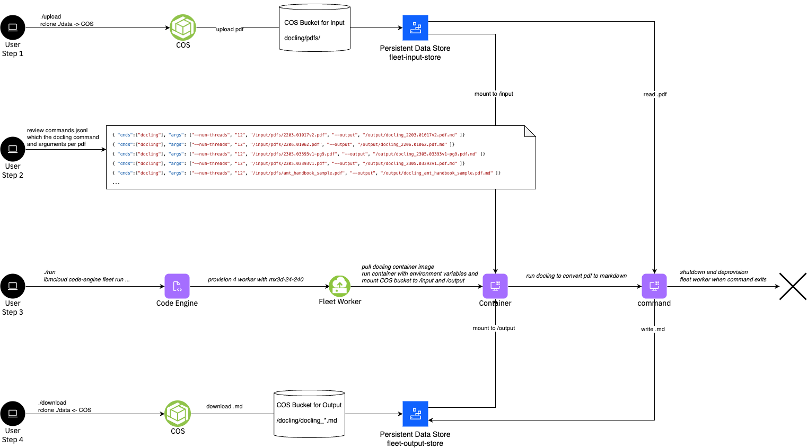

# Tutorial: Docling

This tutorial provides a comprehensive guide on using Docling to convert PDFs into Markdown format using serverless fleets. It leverages cloud object storage for managing both the input PDFs and the resulting Markdown files. The process is streamlined using IBM’s Code Engine to build the Docling container, which is then pushed to a container registry. Users can run a serverless fleet, which autonomously spawns workers to run the Docling container for efficient, scalable conversion tasks.

Key steps covered in the Tutorial:
1. Upload the examples PDFs to COS
2. Run a fleet of workers that automatically runs the official docling container, ensuring scalability and efficiency.
4. Download the resulting markdown files from COS

This setup is ideal for automating document conversion workflows in a cost-effective, serverless environment.




> Note: The tutorial assumes that you have created the fleet sandbox using the fully automated approach which creates the rclone environment as well as the upload/download scripts. If that's not the case, you would need to upload the PDFs and download the results using the COS CLI or other means.

## Steps


### Step 1 - Upload

The 11 example PDFs are located in the `data/tutorials/docling/pdfs` directory. Run the following commands in the root directory to list and upload the example PDFs to COS.
```
ls data/tutorials/docling/pdfs
./upload
```

### Step 2 - Review the commands

Review the `commands.jsonl` which defines the tasks to run the docling command and arguments for each of the pdfs.
```
cd tutorials/docling
cat commands.jsonl
```

<a name="Output"></a>
<details>
  <summary>Output</summary>

```
➜  cat commands.jsonl

{ "command":"docling", "args": ["--num-threads", "24", "/mnt/ce/data/tutorials/docling/pdfs/2203.01017v2.pdf", "--output", "/mnt/ce/data/result/docling_2203.01017v2.pdf.md" ]}
{ "command":"docling", "args": ["--num-threads", "24", "/mnt/ce/data/tutorials/docling/pdfs/2206.01062.pdf", "--output", "/mnt/ce/data/result/docling_2206.01062.pdf.md" ]}
{ "command":"docling", "args": ["--num-threads", "24", "/mnt/ce/data/tutorials/docling/pdfs/2305.03393v1-pg9.pdf", "--output", "/mnt/ce/data/result/docling_2305.03393v1-pg9.pdf.md" ]}
{ "command":"docling", "args": ["--num-threads", "24", "/mnt/ce/data/tutorials/docling/pdfs/2305.03393v1.pdf", "--output", "/mnt/ce/data/result/docling_2305.03393v1.pdf.md" ]}
{ "command":"docling", "args": ["--num-threads", "24", "/mnt/ce/data/tutorials/docling/pdfs/amt_handbook_sample.pdf", "--output", "/mnt/ce/data/result/docling_amt_handbook_sample.pdf.md" ]}
{ "command":"docling", "args": ["--num-threads", "24", "/mnt/ce/data/tutorials/docling/pdfs/code_and_formula.pdf", "--output", "/mnt/ce/data/result/docling_code_and_formula.pdf.md" ]}
{ "command":"docling", "args": ["--num-threads", "24", "/mnt/ce/data/tutorials/docling/pdfs/picture_classification.pdf", "--output", "/mnt/ce/data/result/docling_picture_classification.pdf.md" ]}
{ "command":"docling", "args": ["--num-threads", "24", "/mnt/ce/data/tutorials/docling/pdfs/redp5110_sampled.pdf", "--output", "/mnt/ce/data/result/docling_redp5110_sampled.pdf.md" ]}
{ "command":"docling", "args": ["--num-threads", "24", "/mnt/ce/data/tutorials/docling/pdfs/right_to_left_01.pdf", "--output", "/mnt/ce/data/result/docling_right_to_left_01.pdf.md" ]}
{ "command":"docling", "args": ["--num-threads", "24", "/mnt/ce/data/tutorials/docling/pdfs/right_to_left_02.pdf", "--output", "/mnt/ce/data/result/docling_right_to_left_02.pdf.md" ]}
{ "command":"docling", "args": ["--num-threads", "24", "/mnt/ce/data/tutorials/docling/pdfs/right_to_left_03.pdf", "--output", "/mnt/ce/data/result/docling_right_to_left_03.pdf.md" ]}
```
</details>
<br/>

### Step 3 - Run the Fleet

Now run the fleet to process the PDFs. In this tutorial we use the static array index with `--tasks-from-file commands.jsonl` to specify the tasks for the 11 pdfs. We give each task 24 vCPU, run docling with `--num-threads 24` and choose a mx3d-24x240 worker profile with 24 vCPU. Therefore we run only 1 docling command per worker at a time and utilize the full worker per pdf processing. We run `--max-scale 4` instances and workers in parallel. 

Launch the fleet with the following command in the `tutorials/docling` directory.
```
./run
```

<a name="Output"></a>
<details>
  <summary>Output</summary>

```
➜  docling ./run
using image: de.icr.io/ce--fleet-docling/docling
ibmcloud code-engine experimental fleet run --name fleet-0eb02f2f-1
  --image de.icr.io/ce--fleet-docling/docling
  --registry-secret fleet-registry-secret
  --worker-profile mx3d-24x240
  --max-scale 4
  --tasks-from-file commands.jsonl
  --cpu 24
  --memory 240G
Preparing your tasks: ⠼ Please wait...took 11.233582 seconds.
Preparing your tasks: ⠴ Please wait...
COS Bucket used 'ce-fleet-sandbox-data-fbfdde1d'...
Launching fleet 'fleet-0eb02f2f-1'...
Current fleet status 'Launching'...
OK
Getting Fleet 'fleet-0eb02f2f-1'...
OK

Name:          fleet-0eb02f2f-1
Status:        provisioning
Age:           0s
Created:       2025-04-30T08:56:58+02:00
Project Name:  ce-fleet-sandbox--ce-project
ID:            a73a8ed0-fe7d-4335-971d-f9932516b4d3

Task Summary:
  Tasks:                 11
  Instances:             4
  Workers:               4
  Instances per Worker:  1
```
</details>
<br/>


Verify that the machines are starting
```
ibmcloud code-engine experimental fleet worker list
```
<a name="Output"></a>
<details>
  <summary>Output</summary>

```
➜  serverless-fleets ibmcloud ce exp fleet worker list
Listing serverless fleet workers...
OK

Name                           Status   IP            Zone     Age  Profile      Fleet Name
fleet-0eb02f2f-10000-80223816  running  10.243.0.116  eu-de-1  78s  mx3d-24x240  fleet-0eb02f2f-1
fleet-0eb02f2f-10001-07b9f1c9  running  10.243.0.117  eu-de-1  78s  mx3d-24x240  fleet-0eb02f2f-1
fleet-0eb02f2f-10002-33e72f0f  running  10.243.0.115  eu-de-1  78s  mx3d-24x240  fleet-0eb02f2f-1
fleet-0eb02f2f-10003-1a2cc4c0  running  10.243.0.118  eu-de-1  78s  mx3d-24x240  fleet-0eb02f2f-1
```
</details>
<br/>

Observe the tasks:

```
ibmcloud code-engine experimental fleet task list --fleet-name <fleet-name>
```
<a name="Output"></a>
<details>
  <summary>Output</summary>

```
➜  serverless-fleets ibmcloud ce exp fleet task list --fleet-name fleet-0eb02f2f-1
Getting your tasks: ⠸ Please wait...Duration of list in seconds '0.262680'...
Project Name:  ce-fleet-sandbox--ce-project
Project ID:    e1501040-e56e-48b6-b9f0-1695908199bf
Fleet Name:    fleet-0eb02f2f-1
ID:            a73a8ed0-fe7d-4335-971d-f9932516b4d3


COS Task Store:
Bucket Name:  ce-fleet-sandbox-data-fbfdde1d
Prefix:       e1501040-e56e-48b6-b9f0-1695908199bf/a73a8ed0-fe7d-4335-971d-f9932516b4d3/v1/queue/

Task Summary:
Pending Tasks:    7
Running Tasks:    4
Failed Tasks:     0
Succeeded Tasks:  0
```
</details>
<br/>

(optional) If you like you can jump to the machine and see docling processing by running the following command in the root directory:
```
./jump <IP>
```

You can use `htop` to see that docling is processing the PDFs


#### Playing with more parallism

If you want to modify the tutorial to add some more parallism, e.g. to run 4 docling commands per worker, you could change the arguments and run script as follows: 
1. the arguments in commands.jsonl to `--num-threads 6`
2. the cpu per task to `--cpu 6`
Now, with `--max-scale 4` you would only get a single worker. Modify `--max-scale 8` to get 2 workers, each processing 4 docling commands.

#### Run with a Serverless GPU

Run `./run_gpu` to launch the docling commands on a GPU. This example, is bringing up a single `gx3-24x120x1l40s` and runs the 11 pdfs sequentially.


### Step 4 - Download results

Download the results from the COS by running the following command in the root directory:
```
./download
```

You can find the results under
```
ls -l data/result/docling_*
```


