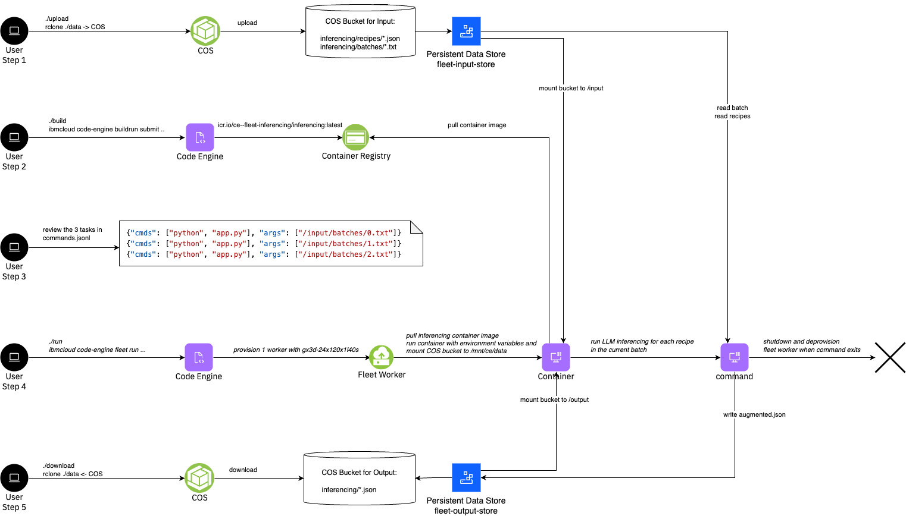

# Tutorial: Batch Inferencing

This tutorial provides a comprehensive guide on using Serverless GPUs to perform batch inferencing which illustrates a generally applicable pattern where AI helps to extract information out of a set of unstructed data. 


The concrete example extracts temperature and duration of a set of cookbook recipes (from [recipebook](https://github.com/dpapathanasiou/recipebook)) by using a LLM. Such a cookbook recipe looks like:
```
{
    "title": "A-1 Chicken Soup",
    "directions": [
        "In a large pot over medium heat, cook chicken pieces in oil until browned on both sides.  Stir in onion and cook 2 minutes more.  Pour in water and chicken bouillon and bring to a boil.  Reduce heat and simmer 45 minutes.",
        "Stir in celery, carrots, garlic, salt and pepper.  Simmer until carrots are just tender.  Remove chicken pieces and pull the meat from the bone.  Stir the noodles into the pot and cook until tender, 10 minutes.  Return chicken meat to pot just before serving."
    ],
    "ingredients": [
        "2 tablespoons vegetable oil",
        "2 skinless chicken leg quarters",
        "1/2 cup chopped onion",
        "2 quarts water",
        "3 cubes  chicken bouillon, crumbled",
        "1 stalk celery, chopped",
        "3 carrots, chopped",
        "1 clove roasted garlic, minced",
        "salt and pepper to taste",
        "1 (12 ounce) package thin egg noodles"
    ],
    "language": "en-US",
    "source": "allrecipes.com",
    "tags": [],
    "url": "http://allrecipes.com/recipe/25651/a-1-chicken-soup/"
}
```

The example uses three different prompts for performing the inferencing task which are formulated as follows (see [src/app.py](./src/app.py))
```
1. extract temperature and duration values for each step of the following recipe. Use the following format for each sentence of the recipe: temperature=..., duration=....
2. from the following recipe, list temperature and time like: temperature=..., duration=...
3. summarize temperature and time values for this recipe, where applicable in the following format: step1: temperature=..., time=...; step2: etc.
```

As a result it generates an augmented .json file which is including the quantitivate meassures
```
Temperature: 375 degrees F (190 degrees C)
Duration: 1 hour
```

In another example, the result might look like:
```
step1: temperature=medium
step2: temperature=medium, duration=2 minutes
step3: temperature=boil
step4: temperature=simmer, duration=45 minutes
step7: duration=10 minutes
```

The tutorial consists of 30 recipes which are devided into 3 batches each containing 10 recipes. Defining the tasks as batches of 10 recipes is improving the efficiency by reducing overhead of loading the LLM into the GPU. The Serverless Fleet is launched with 3 tasks to process the 3 batches on a single GPU. However, the 3 tasks could simply distributed across 3 different GPUs in order to accelerate the computation. Of-course the batch size, number of batches and the number of GPUs is only limited by actual available capacity.

Key steps covered in the tutorial:
1. Upload the recipes and batches to COS
2. Build the container image
2. Run a fleet with Serverless GPUs
4. Download the resulting augmented json files from COS




> Note: The tutorial assumes that you have created the fleet sandbox using the fully automated method which creates the rclone environment for the upload/download scripts. If that's not the case, you would need to upload the recipes and batches, and download the results using the COS CLI or other means. In addition, the sandbox created a Code Engine managed registry secret for the private IBM Cloud Registry endpoint.

## Steps


### Step 1 - Upload

The 30 example recipes and 3 batches are located in the `data/input/inferencing/` directory. Run the following commands in the root directory to list and upload the example PDFs to COS.

```
ls data/input/inferencing/recipes
```

```
ls data/input/inferencing/batches
```

```
./upload
```

### Step 2 - Build the container image

If you're interested review the code by looking at [src/app.py](./src/app.py), which downloads the LLM and generates the responses for the prompts on each line in the batch file.

Now, run the build script to run a Code Engine build to build a container image using and push it to the container registry of the current region. It uses the registry secret created by the sandbox script. The build process takes about 5-10 minutes.

```
cd tutorials/inferencing
```

```
./build
```


### Step 3 - Review the commands

Review the `commands.jsonl` which defines the tasks to run the docling command and arguments for each of the pdfs. The commands assume that the `/input` directory is mounted from the `inferencing` folder of the input COS bucket.

```
cd tutorials/inferencing
```

```
cat commands.jsonl
```

<a name="Output"></a>
<details>
  <summary>Output</summary>

```
➜  cat commands.jsonl

{"cmds": ["python", "app.py"], "args": ["/input/batches/0.txt"]}
{"cmds": ["python", "app.py"], "args": ["/input/batches/1.txt"]}
{"cmds": ["python", "app.py"], "args": ["/input/batches/2.txt"]}

```
</details>
<br/>

### Step 3 - Run the Fleet

The fleet is created with `--tasks-from-file commands.jsonl` which will queue 3 tasks for the 3 batches. The example specifies `--gpu l40s:1` where each task requires a full Nvidia L40s GPU. The total number of concurrent tasks is limited to `--max-scale 1` so that only a single GPU is being provisioned. Code Engine will automatically detect the best matching worker profile `gx3-24x120x1l40s`. Launch the fleet with the following command in the `tutorials/inferencing` directory.
```
./run
```

<a name="Output"></a>
<details>
  <summary>Output</summary>

```
➜  inferencing ./run
ibmcloud code-engine beta fleet create --name fleet-6d2924fc-1
  --image private.br.icr.io/ce--fleet-inferencing-be1899e3/inferencing
  --registry-secret ce-auto-icr-private-br-sao
  --max-scale 1
  --tasks-from-local-file commands.jsonl
  --gpu l40s:1
  --cpu 24
  --memory 120G
  --mount-data-store /input=fleet-input-store:/inferencing
  --mount-data-store /output=fleet-output-store:/inferencing
Successfully created fleet with name 'fleet-6d2924fc-1' and ID '98b63936-c7b6-4034-ab30-d6aa4da4af8d'
Run 'ibmcloud ce beta fleet get --id 98b63936-c7b6-4034-ab30-d6aa4da4af8d' to check the fleet status.
Run 'ibmcloud ce beta fleet worker list --fleet-id 98b63936-c7b6-4034-ab30-d6aa4da4af8d' to retrieve a list of provisioned workers.
Run 'ibmcloud ce beta fleet task list --fleet-id 98b63936-c7b6-4034-ab30-d6aa4da4af8d' to retrieve a list of tasks.
OK
```
</details>
<br/>

Show the fleet details
```
ibmcloud ce beta fleet get --id <fleet-id>
```

<a name="Output"></a>
<details>
  <summary>Output</summary>

```
ibmcloud ce beta fleet get --id 98b63936-c7b6-4034-ab30-d6aa4da4af8d
Getting fleet '98b63936-c7b6-4034-ab30-d6aa4da4af8d'...
OK

Name:            fleet-6d2924fc-1
ID:              98b63936-c7b6-4034-ab30-d6aa4da4af8d
Status:          pending
Created:         23s
Project region:  br-sao
Project name:    fleetlab-dev--ce-project

Tasks status:
  Failed:      0
  Canceled:    0
  Successful:  0
  Running:     0
  Pending:     3
  Total:       3

Code:
  Container image reference:  private.br.icr.io/ce--fleet-inferencing-be1899e3/inferencing
  Registry access secret:     ce-auto-icr-private-br-sao

Tasks specification:
  Task state store:           fleet-task-store
  Data store JSON reference:  fleet-task-store
  Data store object path:     /ce/2c76a9f0-507e-472b-84be-81efe50403f8/fleet-input/20f03e6e-10ee-4a4e-adbe-3f46652caacc.jsonl

Resources and scaling:
  CPU per instance:         24
  Memory per instance:      120G
  Max number of instances:  1
  Max retries per task:     3

Network placement:
  Subnet CRN 0:  crn:v1:bluemix:public:is:br-sao-1:a/327016f62a9544c18e7efdd4213297dd::subnet:02t7-61ad2d36-695c-41b2-8bd1-38ee926cb94a
```
</details>
<br/>


Verify that the machines are starting
```
ibmcloud ce beta fleet worker list --fleet-id <fleet-id>
```
<a name="Output"></a>
<details>
  <summary>Output</summary>

```
➜  inferencing ibmcloud ce beta fleet worker list --fleet-id 98b63936-c7b6-4034-ab30-d6aa4da4af8d
Listing serverless fleet workers...
OK

Name  ID                                    Status   Profile           IP           Zone      Version
      1bae3702-ad79-491d-9d8f-aa61efc8ed96  running  gx3-24x120x1l40s  10.250.0.11  br-sao-1  v0.0.71
```
</details>
<br/>

Observe the tasks:

```
ibmcloud code-engine beta fleet task list --fleet-id <fleet-id>
```
<a name="Output"></a>
<details>
  <summary>Output</summary>

```
Listing serverless fleet tasks...
OK

Index                           ID                                    Status   Result code  Worker name
000-00000-00000000000000000000  d9d6a23b-f183-5b83-80cd-7628b0a3008c  pending
000-00000-00000000000000000001  3c82d446-ff52-5d1b-9a99-635d6ab80edc  pending
000-00000-00000000000000000002  81587d53-44e0-51c3-9916-e3f007188032  pending
```
</details>
<br/>


#### Playing with more parallism

If you want to modify the tutorial to add some more parallism, e.g. to run each batch on it's own GPU, you can change `--max-scale 3` in the run script.


### Step 4 - Download results

Download the results from the COS by running the following command in the root directory:
```
./download
```

You can find the results under
```
ls -l data/output/inferencing/inferencing_*
```


