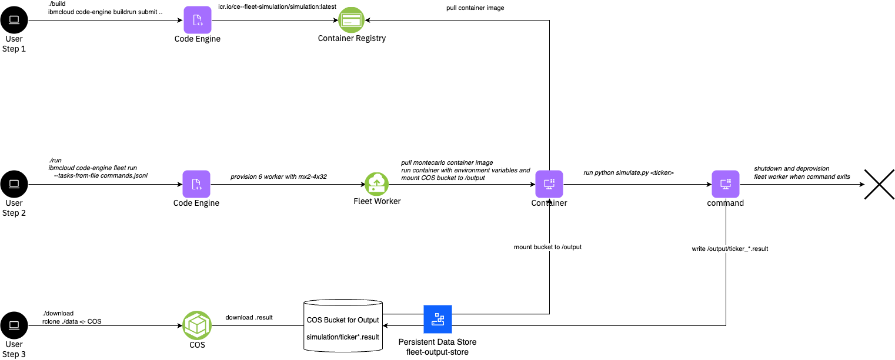

# Tutorial: Monte Carlo Simulation

This tutorial provides a comprehensive guide of running a simple monte carlo simulation to calculate the VaR of 24 stock tickers using serverless fleets. It leverages Cloud Object Storage to store the results. The process is streamlined using IBM’s Code Engine to build the container image, which is then pushed to a container registry. Users can run a serverless fleet, which autonomously spawns workers to run the simulation container for efficient, scalable conversion tasks.

Key steps covered in the Tutorial:
1. Containerization with Code Engine: Build the Docling container and push it to a registry for deployment.
3. Run a fleet of workers that automatically runs the container, ensuring scalability and efficiency.
4. Download the results from COS




> Note: The tutorial assumes that you have created the fleet sandbox using the fully automated approach which creates the rclone environment as well as the upload/download scripts. If that's not the case, you would need to upload the PDFs and download the results using the COS CLI or other means.

## Steps


### Step 1 - Build and Push the container registry

Build the container image using Code Engine's build capabilities by running the following command in the `tutorials/simulation` directory.

If you're interested review the code, by looking at the `simulate.py`, which contains a simple method that downloads the last year stock prices of a stock ticker, performs 100k simulations and writes the VaR at a csv file. It receives the stock ticker and output directory as arguments. 
```
cat simulate.py
```

Now, run the build script to run a Code Engine build to build a container image using and push it to the container registry

```
cd tutorials/simulation
./build
```

### Step 2 - Prepare the tasks

In this tutorial we use the `--tasks-from-file commands.jsonl` option to submit the tasks. Therefore we have prepared a file in [jsonfiles](https://jsonlines.org/) format which contains 1 task per line. Each line specifies command and arguments for this task. Let's review the file in the `tutorials/simulation` directory:

```
cat commands.jsonl
```

<a name="Output"></a>
<details>
  <summary>Output</summary>

```
➜  simulation cat commands.jsonl
 { "command":"python3", "args": ["simulate.py", "AKAM", "/mnt/ce/data/result"]}
 { "command":"python3", "args": ["simulate.py", "AA", "/mnt/ce/data/result"]}
 { "command":"python3", "args": ["simulate.py", "MO", "/mnt/ce/data/result"]}
 { "command":"python3", "args": ["simulate.py", "AMZN", "/mnt/ce/data/result"]}
 { "command":"python3", "args": ["simulate.py", "AMGN", "/mnt/ce/data/result"]}
 { "command":"python3", "args": ["simulate.py", "AAPL", "/mnt/ce/data/result"]}
 { "command":"python3", "args": ["simulate.py", "T", "/mnt/ce/data/result"]}
 { "command":"python3", "args": ["simulate.py", "BA", "/mnt/ce/data/result"]}
 { "command":"python3", "args": ["simulate.py", "CAT", "/mnt/ce/data/result"]}
 { "command":"python3", "args": ["simulate.py", "CVX", "/mnt/ce/data/result"]}
 { "command":"python3", "args": ["simulate.py", "DIS", "/mnt/ce/data/result"]}
 { "command":"python3", "args": ["simulate.py", "KO", "/mnt/ce/data/result"]}
 { "command":"python3", "args": ["simulate.py", "DELL", "/mnt/ce/data/result"]}
 { "command":"python3", "args": ["simulate.py", "F", "/mnt/ce/data/result"]}
 { "command":"python3", "args": ["simulate.py", "INTC", "/mnt/ce/data/result"]}
 { "command":"python3", "args": ["simulate.py", "IBM", "/mnt/ce/data/result"]}
 { "command":"python3", "args": ["simulate.py", "MSFT", "/mnt/ce/data/result"]}
 { "command":"python3", "args": ["simulate.py", "NFLX", "/mnt/ce/data/result"]}
 { "command":"python3", "args": ["simulate.py", "NVDA", "/mnt/ce/data/result"]}
 { "command":"python3", "args": ["simulate.py", "ORCL", "/mnt/ce/data/result"]}
 { "command":"python3", "args": ["simulate.py", "QCOM", "/mnt/ce/data/result"]}
 { "command":"python3", "args": ["simulate.py", "X", "/mnt/ce/data/result"]}
 { "command":"python3", "args": ["simulate.py", "VZ", "/mnt/ce/data/result"]}
 { "command":"python3", "args": ["simulate.py", "V", "/mnt/ce/data/result"]}
```

</details>
<br/>


### Step 3 - Run the Fleet

Now run the fleet to process the 24 stock tickers. In this tutorial we use the `--tasks-from-file <commands.jsonl>` to specify the tasks. Each task will get 1 CPU and 4 GB memory. We choose the mx2-4x32 profile and want to run a total of 24 simulations in parallel. Therefore, the system is deploying 6 workers, each running 4 instances concurrently, e.g. each worker is running 4 simulations at a point in time.
```
./run
```

<a name="Output"></a>
<details>
  <summary>Output</summary>

```
➜  simulation ./run
ibmcloud code-engine experimental fleet run
  --name fleet-78748303-1
  --image de.icr.io/ce--fleet-montecarlo/montecarlo
  --tasks-from-file commands.jsonl
  --cpu 1
  --memory 8G
  --max-scale 24
Preparing your tasks: ⠸ Please wait...took 0.465460 seconds.
Preparing your tasks: ⠴ Please wait...
COS Bucket used 'ce-fleet-sandbox-data-fbfdde1d'...
Launching fleet 'fleet-78748303-1'...
Current fleet status 'Launching'...
OK
```
</details>
<br/>

Review the fleet
```
ibmcloud code-engine experimental fleet get -n <fleet-name>
```
<a name="Output"></a>
<details>
  <summary>Output</summary>

```
➜  simulation ibmcloud ce exp fleet get -n fleet-78748303-1
Getting Fleet 'fleet-78748303-1'...
OK

Name:          fleet-78748303-1
Status:        provisioning
Age:           16s
Created:       2025-04-30T09:46:33+02:00
Project Name:  ce-fleet-sandbox--ce-project
ID:            bf4c38ca-b6b2-455a-8891-81cda506b39e

Task Summary:
  Tasks:                 24
  Instances:             24
  Workers:               6
  Instances per Worker:  4
```
</details>
<br/>


Verify that the machines are starting
```
ibmcloud code-engine experimental fleet worker list
```
<a name="Output"></a>
<details>
  <summary>Output</summary>

```
➜  serverless-fleets ibmcloud ce exp fleet worker list
Listing serverless fleet workers...
OK

Name                           Status   IP            Zone     Age  Profile   Fleet Name
fleet-78748303-10000-55f78ac1  running  10.243.0.122  eu-de-1  43s  mx2-4x32  fleet-78748303-1
fleet-78748303-10001-e43a0490  running  10.243.0.124  eu-de-1  43s  mx2-4x32  fleet-78748303-1
fleet-78748303-10002-b93ebfbc  running  10.243.0.120  eu-de-1  43s  mx2-4x32  fleet-78748303-1
fleet-78748303-10003-8312ed29  running  10.243.0.119  eu-de-1  43s  mx2-4x32  fleet-78748303-1
fleet-78748303-10004-be7bdb8d  running  10.243.0.121  eu-de-1  43s  mx2-4x32  fleet-78748303-1
fleet-78748303-10005-3b758798  running  10.243.0.123  eu-de-1  43s  mx2-4x32  fleet-78748303-1
```
</details>
<br/>

Observe the tasks:

```
ibmcloud code-engine experimental fleet task list --fleet-name <fleet-name>
```
<a name="Output"></a>
<details>
  <summary>Output</summary>

```
➜  serverless-fleets ibmcloud ce exp fleet task list --fleet-name fleet-78748303-1
Getting your tasks: ⠼ Please wait...Duration of list in seconds '0.313647'...
Project Name:  ce-fleet-sandbox--ce-project
Project ID:    e1501040-e56e-48b6-b9f0-1695908199bf
Fleet Name:    fleet-78748303-1
ID:            bf4c38ca-b6b2-455a-8891-81cda506b39e


COS Task Store:
Bucket Name:  ce-fleet-sandbox-data-fbfdde1d
Prefix:       e1501040-e56e-48b6-b9f0-1695908199bf/bf4c38ca-b6b2-455a-8891-81cda506b39e/v1/queue/

Task Summary:
Pending Tasks:    24
Running Tasks:    0
Failed Tasks:     0
Succeeded Tasks:  0
```
</details>
<br/>

### Step 4 - Download results

Download the results from the COS by running the following command in the root directory:
```
./download
```

You can find the results under
```
ls -l data/result/ticker_*
```

<a name="Output"></a>
<details>
  <summary>Output</summary>

```
➜  serverless-fleets ls -l data/result/ticker_*
-rw-r--r--  1 jeremiaswerner  staff  31 Apr 30 09:48 data/result/ticker_AA.result
-rw-r--r--  1 jeremiaswerner  staff  33 Apr 30 09:47 data/result/ticker_AAPL.result
-rw-r--r--  1 jeremiaswerner  staff  33 Apr 30 09:47 data/result/ticker_AKAM.result
-rw-r--r--  1 jeremiaswerner  staff  33 Apr 30 09:48 data/result/ticker_AMGN.result
-rw-r--r--  1 jeremiaswerner  staff  33 Apr 30 09:48 data/result/ticker_AMZN.result
-rw-r--r--  1 jeremiaswerner  staff  31 Apr 30 09:47 data/result/ticker_BA.result
-rw-r--r--  1 jeremiaswerner  staff  32 Apr 30 09:47 data/result/ticker_CAT.result
-rw-r--r--  1 jeremiaswerner  staff  32 Apr 30 09:48 data/result/ticker_CVX.result
-rw-r--r--  1 jeremiaswerner  staff  33 Apr 30 09:48 data/result/ticker_DELL.result
-rw-r--r--  1 jeremiaswerner  staff  32 Apr 30 09:47 data/result/ticker_DIS.result
-rw-r--r--  1 jeremiaswerner  staff  30 Apr 30 09:47 data/result/ticker_F.result
-rw-r--r--  1 jeremiaswerner  staff  32 Apr 30 09:47 data/result/ticker_IBM.result
-rw-r--r--  1 jeremiaswerner  staff  33 Apr 30 09:47 data/result/ticker_INTC.result
-rw-r--r--  1 jeremiaswerner  staff  31 Apr 30 09:48 data/result/ticker_KO.result
-rw-r--r--  1 jeremiaswerner  staff  31 Apr 30 09:48 data/result/ticker_MO.result
-rw-r--r--  1 jeremiaswerner  staff  33 Apr 30 09:47 data/result/ticker_MSFT.result
-rw-r--r--  1 jeremiaswerner  staff  33 Apr 30 09:47 data/result/ticker_NFLX.result
-rw-r--r--  1 jeremiaswerner  staff  33 Apr 30 09:47 data/result/ticker_NVDA.result
-rw-r--r--  1 jeremiaswerner  staff  33 Apr 30 09:48 data/result/ticker_ORCL.result
-rw-r--r--  1 jeremiaswerner  staff  33 Apr 30 09:48 data/result/ticker_QCOM.result
-rw-r--r--  1 jeremiaswerner  staff  30 Apr 30 09:47 data/result/ticker_T.result
-rw-r--r--  1 jeremiaswerner  staff  30 Apr 30 09:47 data/result/ticker_V.result
-rw-r--r--  1 jeremiaswerner  staff  31 Apr 30 09:48 data/result/ticker_VZ.result
-rw-r--r--  1 jeremiaswerner  staff  30 Apr 30 09:47 data/result/ticker_X.result
```
</details>
<br/>

