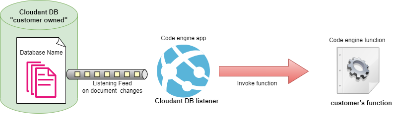
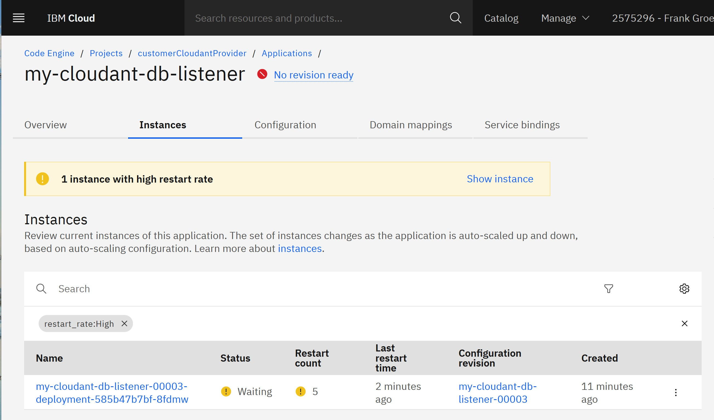
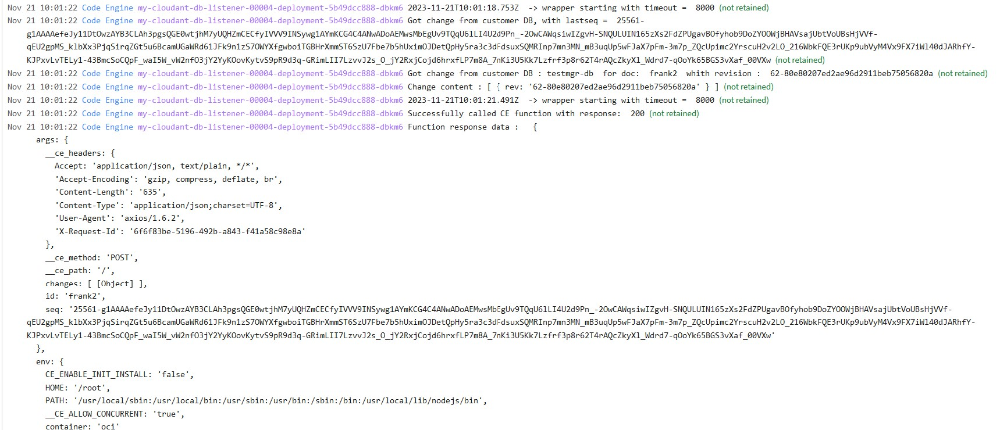

<<<<<<< HEAD
# cloudant_db_listener

## Intention
This quick-start app sample is fully runable basic implementation of an eventHandler listening
on changes in a cloudant DB. For each detected db document change a code engine function will be invoked. 

Customers used "Cloudant Trigger" capability in IBM Cloud Functions may use this app as their cloudant trigger 
migration solution. 

The instruction below describes how to create and run the cloudant_db_listener app using the IBM Cloud UI 

- - -
## Architecture: 


## Let's Get Started

To use the sample app as a starting point for a production ready app it is recommended to move the sample source 
code into a customer owned GIT repository. The codeengine build process is going to pull the code rom customer repository using SSH credentials 
and then build a container image. The image will be uploaded to the IBM Cloud Container registry by default. To start the app 
Code engine pulls the image from the ICR and run it with a MIN_Instances = 1  and MAX_Instances = 1.  That settings ensure that there is continously only one app running. 

### Getting the source code 

1. clone Git Repo "https://github.com/IBM/CodeEngine/" 
1. copy the "cloudant_db_listener" sample to your own GIT Repository 
1. Generate an ssh key pair ( private and public )  ( e.g in GIT or with ssh-keygen)
1. Add the public key to the GIT Repo "Deploy keys" with Read/Write access 
1. get the SSH connectoin URL from Repo  ( e.g:  git@github.ibm.com:XXXX/cloudant_db_listener.git)


### Create the Code engine function 

It is necessaray to create a Code engine function first because the function URL is a mandatory input value for the app. You can use the sample_function.js code in folder "./target_function_source".

The callable CodeEngine function URL will look like "https://fg-sample-function.19grj3rkdaxq.eu-de.codeengine.appdomain.cloud/"

### Get cloudant DB info

This sample assumes that there is already an IBM cloud cloudant DB instance with a service binding and IAM Authentication available 

The cloudant_db_listener app must establish a DB connection to the customer's DB. Therefore the following DB settings must be retrieved from the DB instance: 
=======
# Cloudant-Change-Listener

## Intention
This quick-start daemon job sample is a fully runable basic implementation of a cloudant database change listener long running process. The main feature of the job is to react on each db document change with an invocation of a Code Engine Function or Code Engine Application. 


__HINT__: Customers used "Cloudant Trigger" capability in IBM Cloud Functions may use this app as a cloudant trigger migration solution. 

The instruction below describes how to create and run the Cloudant-Change-Listener daemon job using the IBM Cloud UI in an existing IBM Code Engine project. A full end-to-end example with a  Cloudant-Change-Listener connected to a cloudant sample database and invoking a sample Code Engine function is available as "run" script. The script includes the creation and execution of the daemon job as well as the setup of a sample cloudant db with document changes. 

- - -
## Architecture: 

The Cloudant-Change-Listener is implemented as a Code Engine daemon job because only daemon jobs runsforever and can hold endless database connections using the IBM cloudant SDK API. 
Parallel running instances of the Cloudant-Change-Listener job is supresssed because IBM cloudant SDK would send change notification to each listener connection.


## Let's Get Started
 
This sample job is a fully runable Cloudant-Change-Listener. It can be used "as-is" if the db listening solution requires:  
   - continously listening on exact __ONE__ cloudant database for __EACH__ document create, change and delete  
   - an invocation of a Code Engine Function or Code Engine Application as result of each detected db change 
   - no suppression of duplicate change notifications across restarts of the job 

HINT: The sample code contains "Customer TODO" sections where the job can be improved to fulfill further sollution requirements. 

It is recommended to clone the cloudant_change_lister sample from the GIT repository at first and work with the copy. 


## Pre-conditions

This chapter describes the mandatory and optional tasks before the Cloudant-Change-Listener job can be created and started. The pre-condition tasks are used to collect and set all necessary startup parameters (as environment variables) for the  job.

### Creation of config map 

The name of the config map must follow the rule :  "\<job_name\>-config" 
and has to contain the key/value pair: "DB_LAST_SEQ" : "now"

Step by step see https://cloud.ibm.com/docs/codeengine?topic=codeengine-configmap#configmap-create

Although the job is designed as long running job there is the need to consider the "stop and restart" scenario ( e.g in case of version upgrade or maintenance). That scenario results in a short outage where no database changes received. To ensure that no change get lost the job saves the "DB_LAST_SEQ" last change identifier while stopping to a config map assigned to the CE Project. On restart the DB_LAST_SEQ" will be read and used as start listening identifier while opening a new DB listening connection.

### Creation of ServiceID (apiKey) 

The Cloudant-Change-Listener job needs access permission to the hosting Code Engine Project to control that job is running only once. Therefore a serviceID access with API_KEY must be created for the : 
  - service  : "Code Engine" 
  - Resource : "\<CE-Project-name-where-Job-resides\>"

Step by step see: https://cloud.ibm.com/docs/account?topic=account-serviceids&interface=ui#create_serviceid

==> Use the value of the generated API KEY for the Job's env var CE_API_KEY 


### Get URL of a Code Engine Function or Code Engine Application 

The public endpoint URL of an existing or newly created Code Engine Function (or app) must be retrieved to provide as startup parameter for the Cloudant-Change-Listener app. The endpoint must accept the input parms containing the db change notification details to identify the db document. Additionally the cloudant database's service binding should be attached to the CE Function (or app), so that the db can be connected from the function, too. 

Step by step:
  - Retrieve the Code Engine Function's endpoint URL in UI by calling the "application-URL" in the "test function" dialog of the UI page  " => Code Engine => Projekte => "\<CE-Project-name-where-Function-resides\>" => "\<function-name\>".

  - Retrieve the Code Engine Application's endpoint URL in UI by calling the "functions-URL" in the "test applicaiton" dialog of the UI page  " => Code Engine => Projekte => "\<CE-Project-name-where-Application-resides\>" => "\<application-name\>".

HINT: The source code for a sample function can be found in the folder "./ce_target_source" of this sample package. 

==> Use the value of the generated API KEY for the Job's env var CE_TARGET 

### Retrieve Project ID of hosting project

The daemon job has to know the hosting project ID to be able to ensure that only one Job Instance of it is running. 

Step by step:
  - Retrieve the project ID in UI by reading the GUID value of the project in the "Details" dialog of the " => Code Engine => Projekte => "\<CE-Project-name-where-Application-resides\>" page

==> Use the retrieved project ID (GUID) for the Job's env var CE_PROJECT_ID


### Get cloudant DB info

This sample requires that there is an IBM cloud cloudant DB instance with a service credential and IAM Authentication from which the neccessary values for the job startup can be retrieved. 

The cloudant_change_listener app must establish a DB connection to the customer's DB. Therefore the following DB settings must be retrieved from the DB instance's service credential: 
>>>>>>> 4de4c0e6d6db54cc5b6ba538ac448cd0db0b4af2

- DB Host URL  ( e.g 33286a6c-ad3e-4d11-909b-e67df631a310-bluemix.cloudantnosqldb.appdomain.cloud)
- DB Host Port  ( default is : 443)
- DB Name 
- DB ApiKey  (or DB Username/password)

<<<<<<< HEAD
### Create the app 

1. Logon to IBM Cloud (UI)
1. Goto the IBM Cloud Code engine service 
1. Use an existing Code engine project or create a new one 
1. Open the projects -> Applications page 
1. Use the blue "Create" button to start the application creation dialog 
1. Insert an application name  ( e.g  my-cloudant-db-listener)
1. Select the "Source Code" option to pull the source code from the repository 
1. Set the ssh connection URL  as  "Source code URL" value

    -  Use the blue "Specify build details"
    - Source Code Repo URL =  e.g  git@github.ibm.com:XXXX/cloudant_db_listener.git
    - Code repo access = Create a new repo access by specifying the  ssh private key 
    - Branch name where the source code folder resides 
    - Context directory(path to Dockerfile)  =  cloudant_db_listener    ( if copied with folder name)
    - Next 
    - Strategy : Dockerfile 
    - Dockerfile : Dockerfile 
    - Timeout :  10 min (default)
    - Build resources :  M(1 vCPU/4GB)  (default)
    - Next
    - Output :  use all default values 
    - Done 
1. Define "Resource & Scaling" settings  
    - Instance resources (use defaults)
    - Autoscaling - instance scaling range  Min = 1 ;  Max = 1 
    - Domain mappings ( use public if no restriction necessary)
    - Optional settings -> "Environment variables"
        - CE_TARGET_CE_FUNCTION[Literal] : < function URL >
        - CE_DB_HOST[Literal] : \<db host name>
        - CE_DB_PORT[Literal] : \<port used by DB host> ( default is 443)
        - CE_DB_NAME[Literal] : \<db name >
        - CE_DB_API_KEY[Literal] : \<api key of DB is IAM Authentication used by DB>
        - (Alternative to API Key) CE_DB_USERNAME : \< db user name>
        - (Alternative to API Key) CE_DB_PASSWORD : \< db password>
        
        
1. Use the "Create" button to let Code Engine build a docker image of your app, upload it to IBM container registry (ICR), deploy the app and run it ( initial revision)

````
HINT: In case of build error inspect the log messages of the build an deploy steps using the "view build"
 -> "Build runs" -> "\<your build number>" link in the Image Build section 
````
````
HINT: In case of deploy error (may take minutes) an error message appears on the page with a "learn more" link.
 In this case you will see the deployment log info on the "applications"->"Instances" page 
 ( see screenshot )
````



### Re-build and Re-deploy the app 

In case of any error or enhancement of the app the app must be re-build and re-deployed. Execute following steps in the UI: 

1. Open the "Applications" page and select the Configuration tab of your application 
1. Select the revision of your app that you want to use as base for your modification  and click on the blue "Edit and Create revision" button 
1. Modify the application settings in the sub tabs "Code", "Runtime", "Environment Variables" or "Image start options" 
In case of changed source code the button "Re-run build" in the "code" page must be clicked. Only then a new Image is build and used. 
1. Click on the "Save and create" to execute the build and deploy of the new revision 

Attention: Sometimes the Image Build on the "code" page is not show. So a re-run build cannot be selected. In this case use the "create image from source"  button and insert the repo reference again. 


## Using the cloudant DB listener 

Before using the app it is helpful to enable the logging of the app" by selecting the "logging" link on the "applications view " page. (Follow the log setup instructions shown).

### Testing the app

The cloudant_db_listener app is intentionally not working like a standard code engine app. Typically a code engine app is responsible to act like a web application serving HTTP requests. But the cloudant_db_lister is different. It serves only 3 endpoints for testing and configuration. 

- "/"  - health endpoint used as readiness probe, returning "app is active" 
- "/targetfunction" - dynamically switch the function target 
- "/exit" - only for testing purpose.

The main purpose of the application is to listen on document changes of the connected DB. Customer has to do document changes directly on the DB to trigger listening actions on the app. In this case the app writes log statements into the logging service which can be viewed in the logging dashboard. 

1. Testing the "/" endpoint by  using the  "Test application" button on the "applications overview" page.  -> On successful result the Response "app is active" will be shown. 
1. Testing the db-listening must be initiated by a DB document change. After the docu change the logging dashboard must be opened and checked if the following lines appear: 


 
=======
==> Use the retrieved values for the Job's env vars: 
        - CE_DB_HOST : \<db host name>
        - CE_DB_PORT : \<port used by DB host> ( default is 443)
        - CE_DB_NAME : \<db name >
        - CE_DB_API_KEY : \<api key of DB is IAM Authentication used by DB>
        - (Alternative to API Key) CE_DB_USERNAME : \< db user name>
        - (Alternative to API Key) CE_DB_PASSWORD : \< db password>
        
````
HINT: Instead of copying the DB settings from the service credential into the environment variable it is possible to use it by service binding. (see: https://cloud.ibm.com/docs/codeengine?topic=codeengine-bind-services). The Cloudant DB service binding to CE Job can only be done after the job creation. 
````

## Creation of the Cloudant-Change-Listener job 

The job must be created as daemon job with job index = 0 (the default). 

Create the daemon job following the steps : https://cloud.ibm.com/docs/codeengine?topic=codeengine-job-daemon
by using the same project_name and job_name as above. 
 - As source code location select the ssh git URL of the cloned repository. ( Atttention: A valid ssh key pair must be registered on GIT repo and in the Job's source location definition )
 - Select the branch of the repository 
 - Provide the foldername ( "cloudant_change_listener") as context if folder structur in own repository is not changed after cloning. 
 - Provide the environment variables with the key/value pairs from above. 
 - Add a environment variable as "full reference to the configmap" and select the configmap created above 


## Running Cloudant-Change-Listener job instance 

A job instance can be started on the "Job"s overview page" with the button "Submit job" dialog of the UI page  " => Code Engine => Projekte => "\<CE-Project-name-where-job-resides\>" => "\<job-name\>".

On the Job Instances page the job will appear as active. 
By selecting the "logging" link the log service can be started for this job and the job's output can be observed on the logging page. 


### Stop and restart of the job  

Stopping and starting can be done on the "Job"s overview page",too. 

- To stop a running Job select the active job instance and use the "delete job instance" button.
- To start a new job instance use the "submit button" again. The start of a new job instance will only be successful if the previous running job has completely finished.  ( only 1 instance rule )

see also : https://cloud.ibm.com/docs/codeengine?topic=codeengine-job-plan


### Testing the Job 

The cloudant_change_listener job is immediately starting the listening DB connection on start. So when it appears as active in the job instances list, then it is fully working. 

Customer can test the job by adding,changing or deleting any document in the cloudant database which is reference in the startup env vars of the job. 

Verification of successful handling of a doc change can be done in the activated logging page or by the output of the customer's Code Engine Function ( or app ). 
>>>>>>> 4de4c0e6d6db54cc5b6ba538ac448cd0db0b4af2


## Productize the cloudant DB listener 

<<<<<<< HEAD
The quick-start version is runnable but not production ready. The sample code includes "TODO" sections where a customer has to enhance the sample to get a version usable in production.


=======
The quick-start version is runnable but not fully production ready. The sample code includes "ustomer TODO" sections where a customer may enhance the sample to get a version usable in production.
>>>>>>> 4de4c0e6d6db54cc5b6ba538ac448cd0db0b4af2


