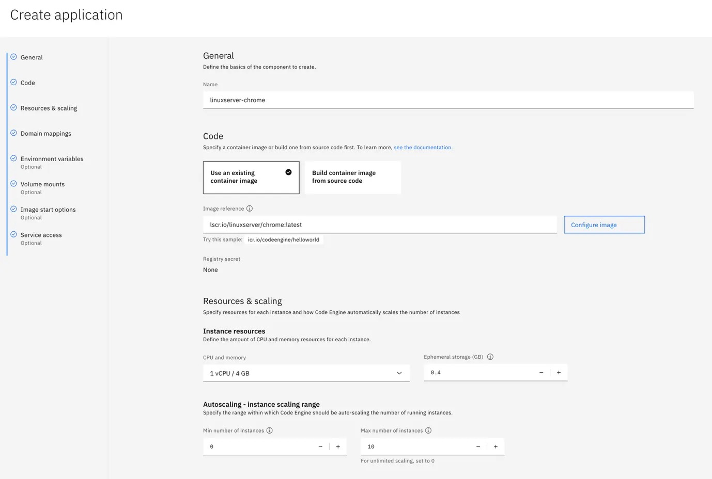
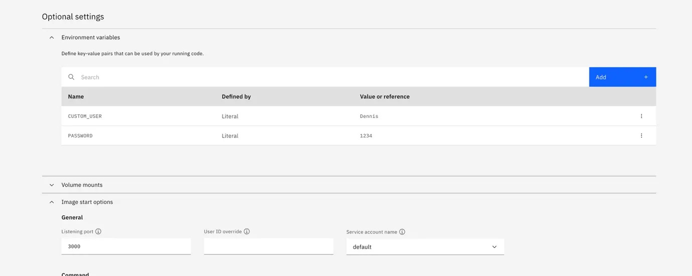
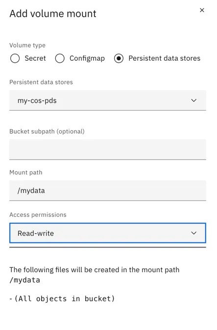
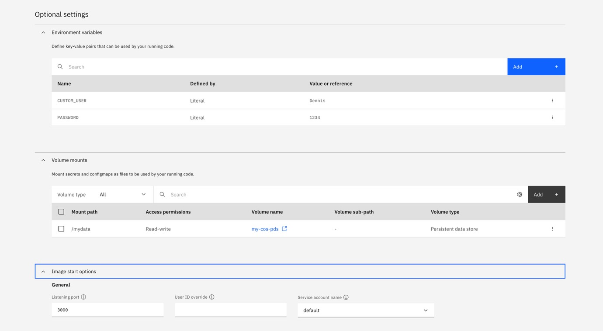

[LinuxServer.io](https://www.linuxserver.io/) is a global community of open-source enthusiasts who maintain one of the most extensive collections of standardized Docker images. These images are designed with simplicity, consistency, and transparency in mind — making them ideal for everyone from curious beginners to seasoned self-hosters. Whether you’re looking to run a media server, a productivity tool, or a creative application, LinuxServer.io offers a rich catalog of ready-to-use containers that are well-documented and regularly updated. Just deploy an image, and you can access the application directly in your browser — no complex setup required.

But where should you run these powerful, community-maintained applications?

Simple, [IBM Cloud Code Engine](https://www.ibm.com/products/code-engine)! IBM’s fully managed, strategic serverless platform makes deploying and running functions, containers, batch jobs and web apps effortless. With Code Engine, you don’t need to worry about provisioning infrastructure, managing servers, or scaling workloads. It automatically handles all of that for you, allowing applications to scale up when needed and scale down to zero when idle, saving you time, money, and complexity.

## A Match Made in the Cloud

Pairing LinuxServer.io with IBM Cloud Code Engine creates a seamless experience for anyone, be it developers, hobbyists, educators, or even small business owners. Whoever wants to run powerful applications in the cloud without the overhead of traditional infrastructure has come to the right place.

- **No DevOps Required:** You don’t need to be a cloud expert to deploy LinuxServer.io containers on Code Engine. Code Engine handles scaling, networking, and resource management automatically.
- **Cost-Efficient:** Thanks to Code Engine’s scale-to-zero feature, your applications only consume resources when they’re actively used.
- **Secure and Customizable:** Easily add environment variables to configure access controls and personalize your deployments.
- **Flexible Access:** Use either the intuitive web UI or the CLI to deploy and manage your applications.

## Explore the Possibilities

LinuxServer.io offers containers for a wide range of use cases:

- **Productivity:** LibreOffice, WPS Office, FileZilla…
- **Creativity:** Blender, Audacity, kdenlive, gimp…
- **Media & Reading:** Jellyfin (Media Server), Calibre (eBook management) …
- **Web Browsing:** Chrome, Firefox…
- **Development Tools:** Visual Studio Code…
- **Gaming:** SteamOS, retroarch, dolphin…

You can browse the full catalog of nearly 200 container images here: [https://www.linuxserver.io/our-images](https://www.linuxserver.io/our-images)

## Getting Started with Code Engine

Before deploying your first container, make sure you have the following prerequisites: A activated [IBM Cloud Account](https://cloud.ibm.com/login) and a Code Engine Project in your preferred region. If you want to do this in the CLI make sure to install the [IBM Cloud CLI](https://cloud.ibm.com/docs/cli?topic=cli-getting-started) and [Code Engine Plugin](https://cloud.ibm.com/docs/codeengine?topic=codeengine-cli).

## Deploying a LinuxServer.io Container via CLI

Here’s how simple it is to deploy Blender using the Code Engine CLI. Specifly your apps name, the port the image that should be used and as a nice bonus each linuxserver.io image comes with Basic Auth which can be configured using the to environment variables `CUSTOM_USER` and `PASSWORD`. This ensures that only you have access to your applications—no complex setup required:

```bash
ibmcloud ce app create \
--name linuxserver-blender \
--port 3000 \
--image lscr.io/linuxserver/blender:latest \
--env CUSTOM_USER="myuser" \
--env PASSWORD="mypwd"
```

Once deployed, Code Engine will provide a secure URL to access your Blender instance. That’s it — your container is live and ready to use!

## Deploying via the IBM Cloud UI

Prefer a visual approach? No problem. Navigate to your Code Engine project : Containers → Serverless Project → your-project → App. Then click the Create button and a creation form for you app will open. Fill in the following values:

- **Application Name**
- **Container Image** (e.g., lscr.io/linuxserver/chrome:latest)
- **Port** (usually 3000 for LinuxServer images)
- **Environment Variables** (CUSTOM_USER, PASSWORD)




Click Create, and your application will be up and running within minutes. Once deployed, simply grab the URL to access your app directly in your browser — no extra configuration needed.
Become a Medium member

Now that you know how easy it is to deploy containers, feel free to explore and run any other LinuxServer.io image. Just create a new application using the desired image, and you’re good to go!

## Extending Functionality with Persistent Storage

Now that we’ve covered the basics of deploying LinuxServer.io containers on IBM Cloud Code Engine, let’s explore how to add **persistent storage** using a **[IBM Cloud Object Storage (COS)](https://www.ibm.com/products/cloud-object-storage) bucket** — with built-in encryption and multi-region support. This feature is especially useful for applications that need to save files across sessions — like office suites, media editors, or file managers. By mounting a COS bucket directly into your running container, you gain a secure, scalable, and high-performance location to store and retrieve data. To proceed with this section, make sure you’ve completed the optional setup steps: creating a COS bucket and configuring a persistent data store within your Code Engine project.

To set up a persistent data storage using IBM Cloud Object Storage (COS) with Code Engine, start by creating a COS instance and bucket, then generate HMAC credentials. See the following [documentation](https://cloud.ibm.com/docs/cloud-object-storage?topic=cloud-object-storage-getting-started-cloud-object-storage) for setting up COS. Use these credentials to create a [HMAC secret in Code Engine](https://cloud.ibm.com/docs/codeengine?topic=codeengine-secret#secret-create-ui-hmac), which you’ll reference when configuring a persistent data store for your COS bucket as described at the followin [Code Engine documentation](https://cloud.ibm.com/docs/codeengine?topic=codeengine-persistent-data-store&interface=ui).

After you have created your COS instance, bucket and HMAC credentials you can use the following Code Engine CLI commands to create your secret and persistent data store.

```bash
ibmcloud ce secret create \
--name cos-hmac-secret \
--access-key-id <your-access-key-id> \
--secret-access-key <your-secret-access-key>
```

```bash
ibmcloud ce pds create \
--name my-cos-pds \
--cos-access-secret cos-hmac-secret \
--cos-bucket-name <your-bucket-name>
```

For example, deploying **WPS Office** with persistent storage via the CLI is as simple as adding one extra flag:

```bash
ibmcloud ce app create \
--name linuxserver-wps-office \
--port 3000 \
--image lscr.io/linuxserver/wps-office:latest \
--env CUSTOM_USER="User" \
--env PASSWORD="mypwd" \
--mount-data-store=/mydata=my-cos-pds
```

The `--mount-data-store=/mydata=my-cos-pds` flag mounts your COS persistent data store (PDS) to the /mydata directory inside the container, allowing **WPS Office** to read and write files directly to cloud storage.

Using the **UI**, the process is just as straightforward. When deploying an app like **LibreOffice**, simply specify the persistent data store under the **Volume Mounts** section in addition to the previously specified configuration. This enables your application to retain documents, configurations, or media files between sessions — perfect for collaborative environments or long-term projects.




## Wrapping Up: What’s Next?

You’ve now successfully deployed a variety of LinuxServer.io container images on IBM Cloud Code Engine — all following a simple, standardized process. The only things that typically change are the **application name** and the **container image** you choose; everything else remains consistent, making it easy to replicate and deploy new applications.

As you explore more applications, consider experimenting with different **CPU and memory configurations** to optimize performance based on your specific use case. Code Engine also offers advanced features like custom **domain mappings**, which can help you make your applications more accessible and professional. For added security and flexibility, you can dive into **advanced container configurations**, or integrate more sophisticated **authentication methods** to protect your services.

## Final Thoughts

IBM Cloud Code Engine and LinuxServer.io together provide a powerful, intuitive way to run open-source applications in the cloud. Whether you’re a developer building scalable services, an educator setting up browser-based labs, or a hobbyist exploring creative tools — this combination makes cloud-native computing accessible to everyone.

**Ready to get started?**

Explore the LinuxServer.io catalog, pick your favorite app, and deploy it with just a few clicks or a single command directly to [IBM Cloud Code Engine](https://www.ibm.com/products/code-engine). The cloud is yours to build with — simple, secure, and serverless.