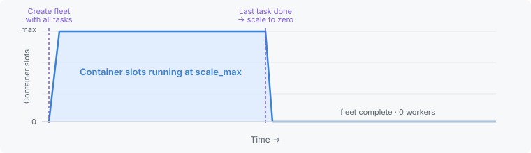
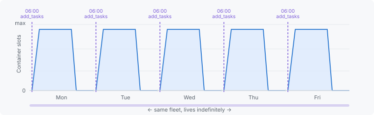
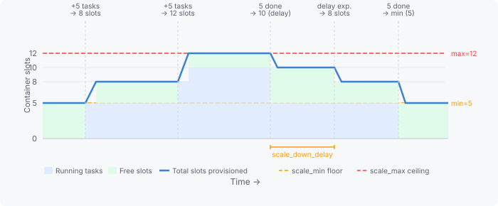

**IBM Cloud Code Engine Serverless Fleets are getting more powerful. Create a fleet once, tune it for your latency requirements, then submit tasks to it over time. Eliminated are repetitive configurations, and infrastructure overhead.**

## What Is IBM Cloud Code Engine?

[IBM Cloud Code Engine](https://www.ibm.com/products/code-engine) is IBM's fully managed, serverless platform that lets you run containerized workloads — applications, batch jobs, event-driven functions, and large-scale parallel task fleets — without ever thinking about the underlying infrastructure. IBM handles provisioning, scaling, networking, and security so you can focus entirely on your code.

[Serverless Fleets](https://cloud.ibm.com/docs/codeengine?topic=codeengine-cefleets) are Code Engine's answer to massively parallel, run-to-completion workloads. They execute tasks across a pool of dedicated Virtual Server Instances (VSIs) inside your own Virtual Private Cloud (VPC), giving you single-tenant isolation, full control over subnets, and access to a wide range of instance flavors — including GPU-enabled ones.

## How Fleets Worked Until Now

When you created a fleet, you supplied everything in one go: the container image, network placement, container resources, environment variables, mounted data stores, the task state store — and the full set of tasks to run. The fleet would spin up workers, process every task, and shut down — ending in a **succeeded** status if all tasks completed successfully, or **failed** if any task encountered an error.

That model works well for a fixed workload, but it has a real limitation: **tasks are a one-time input**. If you needed to process another batch of work — even with the exact same image and infrastructure — you had to create a brand-new fleet and specify all of those details again. There was no way to hand more work to a fleet that was already configured and running.

## What's New: Create Once, Add Tasks Anytime

Today that changes. You can now **add tasks to an existing fleet at any time**.

You configure your fleet's infrastructure exactly once — image, network placement, resources, environment variables, secrets, data store mounts — and then any part of your system can submit new work with a single lightweight call that contains nothing but the task specification itself. No image reference. No network config. No resource declaration. The fleet already knows all of that.

Because a fleet can always receive more work, it no longer terminates with a succeeded or failed status when its tasks finish. Instead, once all tasks completed, the fleet transitions to **standby** status — workers scale down, infrastructure stays configured, and the fleet waits ready for the next batch. It only reaches a terminal status if you explicitly cancel it.

All fleet operations — creating a fleet, adding tasks, and monitoring progress — are available through the **Code Engine UI**, the **`ibmcloud` CLI**, and the **REST API**.

Alongside the ability to add tasks, a set of scaling parameters give you precise control over how the fleet provisions and retains workers:

- **`scale_max_instances`** _(existing)_ — the upper bound on total container slots. The fleet never provisions more workers than needed to fill this many slots in parallel.
- **`scale_min_instances`** _(new)_ — the minimum number of container slots kept provisioned at all times, even when no tasks are pending. The fleet never scales below this floor, so there are always workers ready to pick up incoming tasks without a cold start.
- **`scale_spare_instances`** _(new)_ — the number of free slots maintained above whatever is currently running. When a task arrives and spare slots are available, it starts within seconds. The fleet provisions additional workers in the background to restore the spare buffer.
- **`scale_down_delay`** _(new)_ — how long a worker stays alive after completing its last task before becoming eligible for scale-down. This prevents the fleet from aggressively deprovisioning workers during short gaps between bursts of work.

Together these parameters let you tune a fleet from fully on-demand (default values) to always-warm with instant response, depending on your latency requirements like in the following three patterns.

## The Three Fleet Patterns

The new capabilities enable the usage of fleets for more scenarios that one can devide into three common patterns.

### Pattern 1 — One-Shot Batch _(existing)_

You know all tasks up front, supply them at fleet creation, and the fleet runs to completion. Workers scale up, burn through every task, and scale back to zero automatically.

**The only scaling parameter you need:** `scale_max_instances`

**Best for:** One-time data migrations, bulk re-encoding a media archive, generating a report from a fixed dataset — any workload where you know all the work up front and just want it done.



### Pattern 2 — Scheduled Batch Additions _(new)_

One fleet lives indefinitely. On a predictable schedule — say, every morning — you call the `add_tasks` endpoint to inject the next batch of work. The fleet wakes up, processes everything, and scales back to zero until tomorrow. No need to create a new fleet each cycle. The fleet accumulates task history. Providing a `batch_name` when adding tasks gives you clear traceability per run.

Because the fleet is created once and reused, all the details you only want to specify once — the VPC network placement, the task state store, the container image, environment variables, mounted data stores, and resource sizes — are configured at creation and stay in place forever. Each scheduled `add_tasks` call only carries the new work; nothing else changes.

**The only scaling parameter you need:** `scale_max_instances`

**Best for:** Daily transaction processing, overnight report generation, partner file ingestion from COS.



Each morning, a scheduled Code Engine job adds the new batch of tasks — identified by a `batch_name` for traceability — while the fleet itself requires no changes between runs.

### Pattern 3 — Continuous, Latency-Sensitive Workload _(new)_

Tasks arrive at any time, triggered by user actions, sensor events, or real-time data streams. Cold-starting a new worker for every incoming task would add seconds of latency you can't afford. The new scaling parameters let you maintain a **pool of warm, ready workers** at all times.

Like the scheduled pattern, this fleet is created once. Your infrastructure team sets it up with the right VPC subnet, instance size, GPU type, container image, and secrets — and then any caller anywhere in your system can submit tasks by calling `add_tasks` with nothing more than the task specification. The fleet configuration never has to be in application code that submits the tasks.

**Relevant scaling parameters:** `scale_max_instances`, `scale_min_instances`, `scale_spare_instances`, `scale_down_delay`

**Best for:** Fraud detection, real-time inference, interactive rendering, any latency-sensitive workload.

The diagram below uses the following example configuration to illustrate the scaling behaviour:

- **`scale_min_instances = 5`** — the fleet always keeps at least 5 container slots provisioned, even when no tasks are running (the amber dashed line). At rest, total provisioned = **5**.
- **`scale_spare_instances = 3`** — once tasks are running, 3 additional free slots are maintained above the running count so new tasks can start instantly. At rest there are no running tasks, so no spare is added yet.
- **`scale_max_instances = 12`** — the hard ceiling on total provisioned slots (the red dashed line). This limit becomes relevant when 10 tasks are running: the fleet would want 10 + 3 spare = 13, but is capped at 12, leaving only 2 free slots.
- **`scale_down_delay = 10m`** — after a task completes, the slot stays warm for 10 minutes before scaling down.

With these values the example plays out as follows:

1. **At rest** — 5 slots provisioned (= min), 0 tasks running.
2. **+5 tasks added** — all 5 start immediately on the existing min slots. Fleet adds 3 spare on top → **8 slots total**.
3. **+5 more tasks added** — 3 start immediately on the spare slots; the other 2 are briefly pending while the fleet scales up. Fleet wants 13 but is capped at `scale_max` → **12 slots total** (10 running + 2 free).
4. **First 5 tasks complete** — 5 tasks still running. `scale_down_delay` keeps the freed slots warm → **10 slots total**.
5. **Delay expires** — fleet scales down to running (5) + spare (3) → **8 slots total**.
6. **Remaining 5 tasks complete** — fleet scales back to min → **5 slots total**.



Notice how the first batch of tasks starts without any cold-start wait — the existing min slots are ready. When the second batch arrives, 3 tasks start right away on the spare slots; the remaining 2 start shortly after as the fleet scales up to restore spare capacity.

## Try It: An End-to-End CLI Walkthrough

Here is a complete example using the `ibmcloud` CLI that shows the fleet creation and addition of tasks from start to finish. The fleet is created once — with all infrastructure details locked in — and tasks are added on each daily run without touching the fleet definition again.

### Step 0: Set up the environment (one time only)

Before creating a fleet you need a few IBM Cloud resources in place: a VPC with a subnet, a Code Engine project, and a COS bucket for the task state store and input data. If you don't have these yet, the [one-time setup script](https://github.com/IBM/CodeEngine/tree/main/serverless-fleets#one-time-setup) in the IBM/CodeEngine repository walks through creating everything from scratch using the `ibmcloud` CLI.

If you previously installed the IBM Cloud CLI already, make sure to update the Code Engine plugin to the latest version to have the new features available: `ibmcloud plugin update code-engine`

### Step 1: Create the fleet (one time only)

Create the fleet with its image, network placement, data store mounts, and scaling configuration. No tasks are provided yet.

```bash
ibmcloud code-engine fleet create \
  --name transaction-processor \
  --image icr.io/codeengine/helloworld \
  --subnetpool-name fleet-subnetpool \
  --tasks-state-store fleet-task-store \
  --cpu 1 \
  --memory 4G \
  --scale-max 20 \
  --env SLEEP=10
```

This is the only time you specify the image, VPC placement, resource sizes, and environment variables. From here on, every `fleet task add` call is just a few lines.

### Step 2: Add the first tasks

With a single command, you add tasks to the fleet. The `--fleet-id` targets the existing fleet that you capture from step(1); everything else is just the batch specification.

```bash
ibmcloud code-engine fleet task add \
  --fleet-id <fleet-id> \
  --batch-name 2026-09-03-transactions \
  --tasks 100
```

Code Engine picks up the new tasks, spins up workers against the already-configured fleet, and scales back to zero once the batch is done.

In a real-world scenario you will probably not run it with `--tasks 100` but with `--tasks-from-local-file` or `--tasks-from-cos-bucket` to provide the relevant input data of your tasks instead of just some indices.

### Step 3: Add another batch whenever work arrives

The same command works at any time — even while the fleet is still processing a previous batch. Tasks from multiple batches can run concurrently up to `scale-max`.

```bash
ibmcloud code-engine fleet task add \
  --fleet-id <fleet-id> \
  --batch-name 2026-09-04-transactions \
  --tasks 100
```

Note that we here used different batch names. However uniqueness is not required. You can as well use the same batch for multiple task additions - for example when you retry failed tasks from a previous batch, or when you group tasks in a way where the reuse makes sense. An example could be that you group transactions by your partners and use the partner name as batch name.

## Getting Started

Fleets are available today in all [IBM Cloud Code Engine](https://www.ibm.com/products/code-engine) regions. Check out the [Serverless Fleets documentation](https://cloud.ibm.com/docs/codeengine?topic=codeengine-cefleets) to get started, or explore the ready-to-run samples in the [IBM/CodeEngine GitHub repository](https://github.com/IBM/CodeEngine/tree/main/serverless-fleets).

Whether you're processing daily transaction files, running real-time fraud checks, or orchestrating GPU-accelerated AI inference — Code Engine Serverless Fleets now have a pattern for every workload shape.
