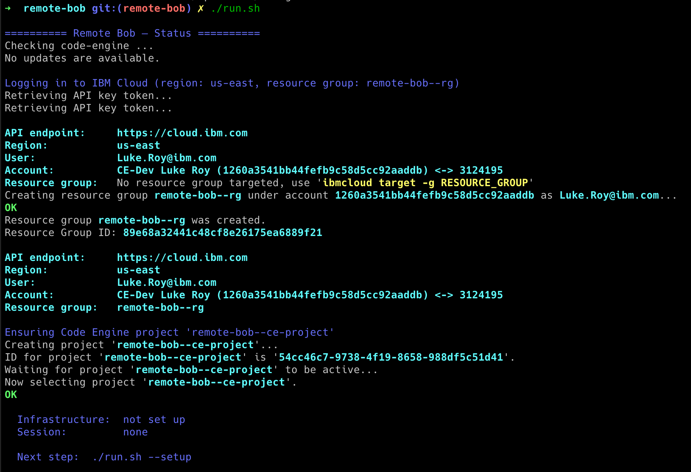
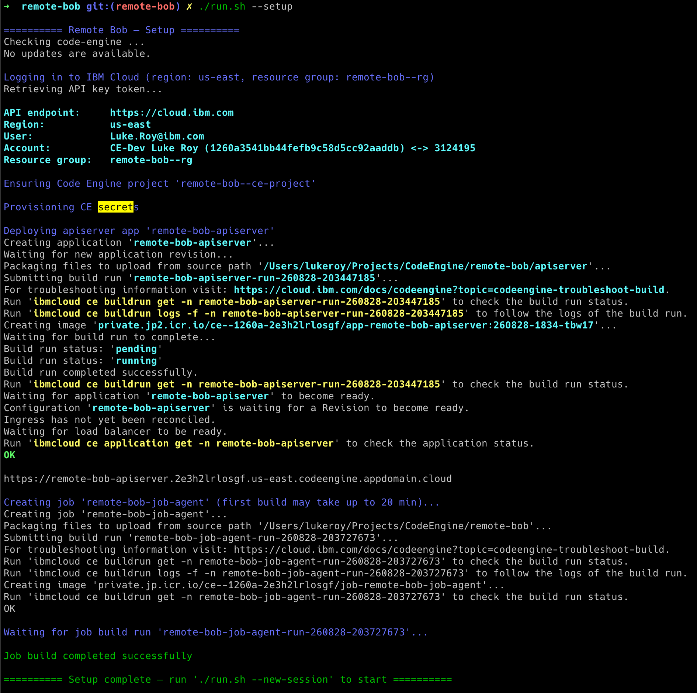
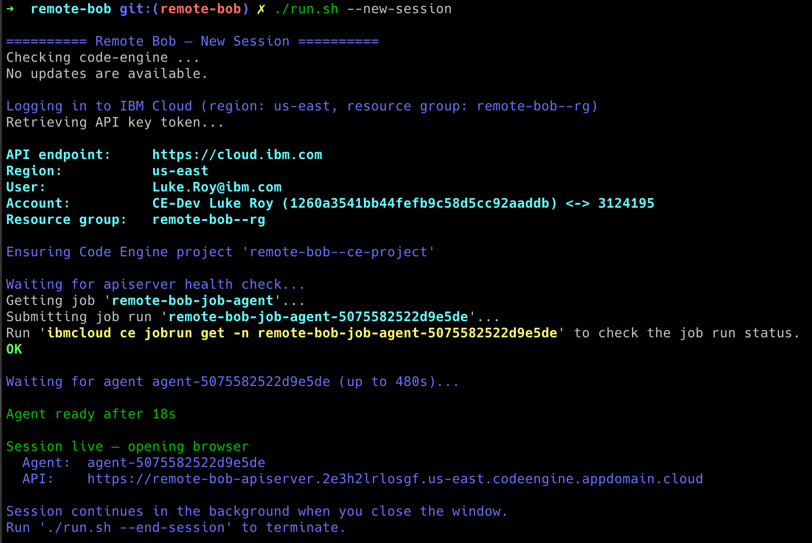
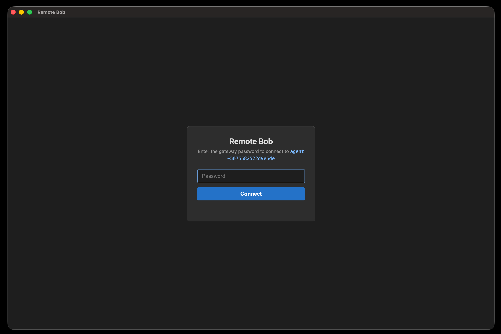
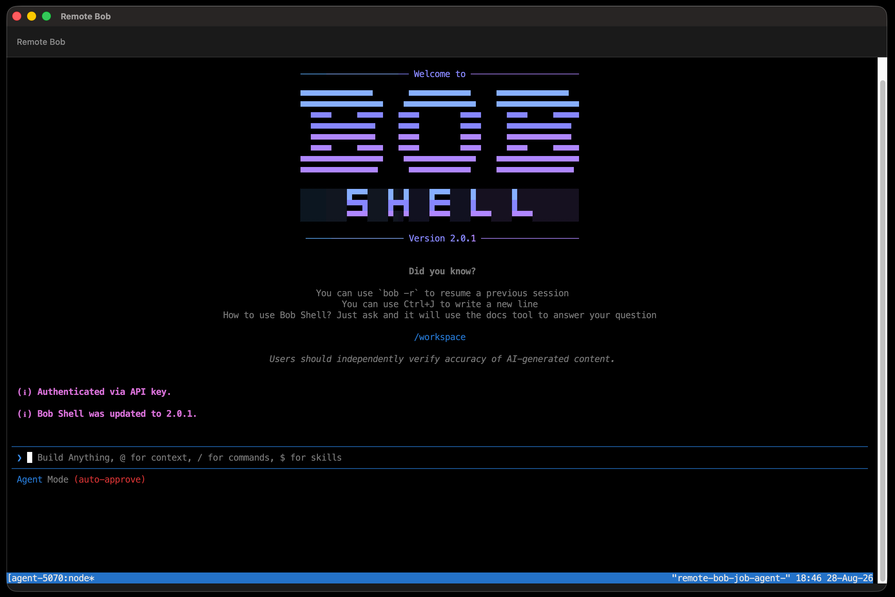
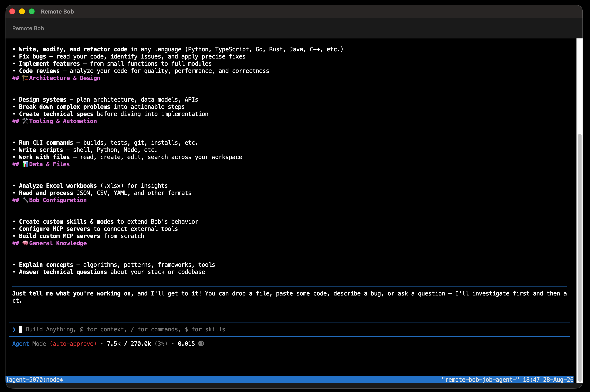
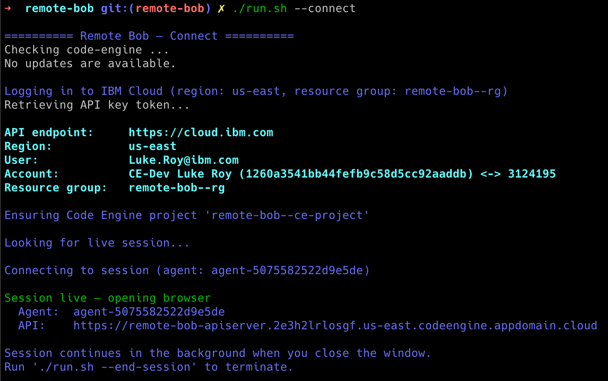
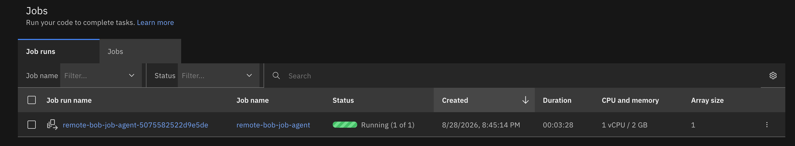
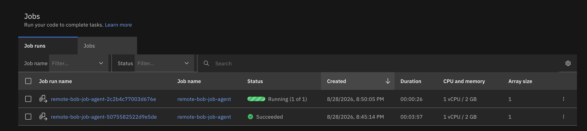

## Introduction

[IBM Cloud Code Engine](https://www.ibm.com/products/code-engine) is IBM's fully managed, strategic serverless platform. It lets you run containerised workloads — applications, batch jobs, and functions — without ever touching infrastructure. Code Engine scales to zero when idle, scales out automatically under load, and charges only for the compute you actually consume. It is the platform of choice for teams that want the power of Kubernetes without the operational overhead.

[Bob](https://bob.ibm.com/)  is IBM's AI software engineering assistant. Bob understands your codebase, executes multi-step agentic tasks, runs CLI commands, manages secrets, and integrates with the full IBM Cloud ecosystem through its skill and MCP-server plugin architecture. Bob Shell — the terminal-first interface to Bob — takes this further: it is a full interactive environment where Bob operates as an autonomous agent, capable of writing, running, and iterating on code with no human in the loop for each individual step.

Together, Code Engine and Bob open up a compelling new pattern: **running Bob Shell as a serverless cloud workload**. This is what Remote Bob is about.

Remote Bob gives you a **full Bob Shell terminal running in IBM Cloud Code Engine**, accessible from your local browser. One command provisions the infrastructure. A second command starts a session and opens the terminal. Close the browser tab — the session keeps running in the cloud. Reopen it with a single command. When you are done, tear everything down cleanly or simply let it sit at zero cost until you need it again.

## Why Run Bob in the Cloud?

Running an AI coding agent locally is fine for interactive work, but several scenarios benefit from — or require — a cloud-hosted agent:

### Sandboxed Execution

Bob can write and execute arbitrary code. When working on exploratory or risky tasks — generating and running build scripts, testing untrusted dependencies, bulk-modifying a large codebase — you may want that execution to happen in an isolated environment, not on your laptop. A Code Engine job run is a disposable container: every session starts from a clean image, and when the job ends the container is gone. Nothing persists to your local machine.

### Autonomous Long-Running Tasks

Some tasks take hours: large-scale refactors, multi-stage data pipelines, training-data preprocessing, automated code reviews across hundreds of files. Running these on your laptop ties up your machine, drains the battery, and breaks if you close the lid. Code Engine job runs are designed for exactly this pattern — they run to completion in the cloud while you do other things. Remote Bob makes it trivial to attach a terminal to that running job whenever you want to check progress.

### Remote and Multi-Device Access

With Remote Bob, your Bob Shell session is not tied to a single machine. Start a session from your workstation in the morning, reconnect from a laptop on the go, and check in from a coffee shop in the afternoon — all connecting to the same live session. The terminal state, tmux layout, and open buffers are all preserved in the cloud-hosted container.

### High-Performance Compute on Demand

Bob doesn't just read code — it builds it, tests it, and runs it. Agentic tasks can be surprisingly compute-intensive: compiling a large monorepo, running a full test suite, processing large datasets as part of an automated pipeline, or parallelising tool calls across many files simultaneously. On a laptop, these tasks compete with everything else running on your machine. In a Code Engine job run, Bob gets dedicated resources.

The job-agent container supports up to **12 vCPUs and 48 GB of memory** per session. Two lines in `.env` are all it takes:

```bash
DEFAULT_CPU=12
DEFAULT_MEMORY=48G
```

The next `--new-session` picks up the new sizing automatically — no rebuilding, no re-provisioning. Bob gets exactly the headroom it needs for the duration of the session, and the job costs nothing when it is not running.

### Cost Efficiency

Because the apiserver scales to zero between sessions and job runs are stopped when not needed, the idle cost is effectively zero. You pay only for active compute time — typically a few cents per hour of actual use.

---

## Prerequisites

Before you begin, make sure you have the following in place. You will need a Bob subscription (or free trial), an IBM Cloud account with the right permissions, two API keys (one for IBM Cloud, one for Bob Shell), and a handful of CLI tools that the launcher script relies on. Everything else — the Code Engine project, container images, secrets — is created automatically by `./remote-bob --setup`.

- **Bob subscription** — An active Bob subscription or [free trial](https://bob.ibm.com) is required to obtain a Bob Shell API key
- **IBM Cloud account** — With permission to create Code Engine projects and Container Registry namespaces
- **IBM Cloud API key** — Needs Code Engine Writer + Container Registry Writer roles
- **Bob Shell API key** — From [bob.ibm.com](https://bob.ibm.com) → Settings → API Keys
- **`ibmcloud` CLI** — [Install](https://cloud.ibm.com/docs/cli); the `code-engine` plugin is installed automatically by the launcher
- **`jq`**, **`curl`**, **`openssl`** — `brew install jq` / `apt install jq`; curl and openssl are pre-installed on macOS and most Linux distros
- **Google Chrome** — Auto-detected on macOS and Linux

---

## Quickstart

### Step 1: Clone the repository and configure

```bash
git clone https://github.com/IBM/CodeEngine
cd CodeEngine/remote-bob

# Copy the config template and fill in your three keys
cp .env.template .env
```

Open `.env` and set the three required values:

```bash
BOBSHELL_API_KEY=your-bob-shell-api-key   # from bob.ibm.com → Settings → API Keys
GATEWAY_PASSWORD=choose-any-password       # protects the browser terminal endpoint
IBMCLOUD_API_KEY=your-ibm-cloud-api-key    # needs Code Engine Writer + ICR Writer
```

That is it. Everything else — region, resource group name, container image tags, CPU and memory — has sensible defaults and the system works out of the box without touching any of them. That said, all of these values are fully configurable: adjust the region, resource sizing, or any other parameter to match your preferences, and the launcher will pick up the changes on the next run.

### Step 2: Run status to log in and see current state

```bash
./remote-bob
```

Running `./remote-bob` with no arguments logs in to IBM Cloud and prints a status summary. On first run it creates the resource group and Code Engine project, then tells you what to do next.



### Step 3: Provision infrastructure and build images

```bash
./remote-bob --setup
```

`--setup` is idempotent: it creates the Code Engine project, provisions secrets, builds the apiserver container image and the job-agent container image, and deploys the apiserver as a Code Engine application. The first run takes a few minutes because both images are built from source on Code Engine. Subsequent runs skip steps that are already complete and only rebuild if source code has changed.



At the end of setup you will see the apiserver URL and a prompt to run `--new-session`.

### Step 4: Start a session

```bash
./remote-bob --new-session
```

This submits a new Code Engine job run, waits for the agent to connect to the apiserver (typically under 30 seconds), and then opens a Chrome window pointed at the browser client.



### Step 5: Log in and start working

The browser client is a self-contained HTML page served from `file://` — no web server required. It prompts for your gateway password, then opens a full xterm.js terminal connected over WebSocket to your Bob Shell session running in Code Engine.



Once authenticated, you are in Bob Shell — the same experience you would have locally, but running as an isolated job in the cloud.



Bob Shell in the cloud has the full set of capabilities: writing and running code in any language, executing CLI commands, managing files, calling external APIs, and working through multi-step agentic tasks autonomously.



### Step 6: Disconnect and reconnect

Close the browser tab at any time. The Code Engine job run keeps running — the tmux session inside is untouched.

To reconnect from any machine:

```bash
./remote-bob --connect
```

`--connect` queries IBM Cloud for the live session, constructs the browser client URL, and opens Chrome again. No re-provisioning, no waiting.



### Step 7: View the running job in IBM Cloud

You can also monitor the session directly from the IBM Cloud console. Navigate to your Code Engine project and open the Jobs section. You will see the job run listed as **Running**.



Only one session can be active at a time — `--new-session` will refuse to start if one is already running. Once you end a session with `--end-session`, you can start a fresh one. The IBM Cloud console keeps a history of all job runs, showing completed sessions alongside the current one.



### Step 8: End the session and clean up

```bash
# End the current session (stops job runs; infrastructure stays for fast restart)
./remote-bob --end-session

# Start another session without rebuilding (seconds, not minutes)
./remote-bob --new-session

# Remove all IBM Cloud resources when finished
./remote-bob --clean
```

`--end-session` gracefully disconnects the agent and deletes all job runs. The apiserver application and Code Engine project remain, so the next `--new-session` starts in seconds rather than minutes.

`--clean` removes everything: job runs, job definition, application, secrets, Code Engine project, and resource group. It is only needed if you want a complete teardown and to remove all IBM Cloud resources entirely. If you simply end the session without cleaning up, the apiserver scales to zero and no job runs are executing — so no costs are generated. You can start a new session at any time with `--new-session` without going through setup again.

---

## How It Works

```
Browser  (Chrome, file:// page, xterm.js)
  │  WebSocket  /ws/browser?token=<wsToken>&agent=<id>&service=ttyd
  ▼
Apiserver  (Go, IBM Code Engine app, scales to zero)
  │  auth: POST /auth/login → 60s WS token
  │        POST /auth/runs  → per-run agent token (HMAC-signed)
  │  relay: opaque frame proxy — text + binary frames preserved verbatim
  │  WebSocket  /ws/agent  (Bearer <runToken>)
  ▼
Job-agent  (Go, IBM Code Engine job run)
  │  dials apiserver on startup, registers services
  │  opens upstream ttyd connection per relay request
  ▼
ttyd → tmux → Bob Shell
```

**Apiserver** is a thin authenticated relay deployed as a Code Engine application. It maintains an in-memory agent registry, issues short-lived single-use tokens, and proxies WebSocket frames between the browser and the job-agent without inspecting the payload. It scales to zero when no agent is connected — zero idle cost.

**Job-agent** is a Go binary deployed as a Code Engine job run. On startup it dials the apiserver control WebSocket, registers the `ttyd` service, and handles relay connections by piping raw frames between the apiserver and a local `ttyd` process. It runs `tmux` → Bob Shell inside `ttyd` and provides a health endpoint for the job run lifecycle. An idle timeout shuts it down automatically.

**Browser client** is a single self-contained HTML file loaded from `file://`. It authenticates with the gateway password, opens a WebSocket relay connection, and renders the terminal using xterm.js — no server-side rendering, no CDN dependencies.

**Secrets** are stored in two IBM Code Engine secrets injected as environment variables:
- `remote-bob-gateway` — `GATEWAY_PASSWORD`, `ENCRYPTION_KEY`
- `remote-bob-bobshell` — `BOBSHELL_API_KEY`

---

## Use Cases in Depth

### Sandboxed Agentic Coding

Give Bob a task that involves writing and running unknown code — for example, "generate a data cleaning pipeline for this CSV schema and run it." In a cloud job, that code executes in an isolated container with no access to your local filesystem, no persistent state beyond the job lifetime, and no way to interfere with your development environment. When the job ends, the container is gone.

### Autonomous Long-Running Agents

Kick off a task that takes hours — a large-scale codebase migration, an exhaustive test suite run, a multi-repository dependency audit — and let it run overnight. You do not need to keep your laptop awake. Check in from any device with `./remote-bob --connect` to see where Bob got to. For compute-heavy workloads, scale the job up to 12 vCPUs and 48 GB of memory by setting `DEFAULT_CPU` and `DEFAULT_MEMORY` in `.env` before starting the session.

### CI/CD Integration

The `--new-session` flow is scriptable. You can trigger a Remote Bob session from a GitHub Actions workflow, inject environment variables via `--env-from-secret`, let Bob run a task, and collect results — all without provisioning or managing long-lived infrastructure.

### Team Shared Agents

Technically, multiple people can `--connect` to the same running session as long as they have the gateway password. In practice, the setup is personal by design — the IBM Cloud account and Bob subscription being used belong to whoever ran `--setup`. For personal use, one person at a time is the natural model.

That said, if the system is provisioned using a shared IBM Cloud account and a functional ID with a team Bob subscription, the session can be shared across a team. In that context, `--connect` makes it easy to hand off a task mid-flight, do a pair-programming style review of what Bob is working on, or demonstrate a live agentic workflow to a colleague.

---

## Command Reference

- **`./remote-bob`** — Log in, print infrastructure + session status, suggest next step
- **`./remote-bob --setup`** — Provision IBM Cloud resources and build container images. Idempotent — safe to re-run after code changes.
- **`./remote-bob --new-session`** — Submit a job run, wait for the agent to connect, open Chrome
- **`./remote-bob --connect`** — Find the live session and reopen Chrome. No re-provisioning.
- **`./remote-bob --end-session`** — Stop all job runs gracefully. Infrastructure remains for a fast restart.
- **`./remote-bob --clean`** — Delete all provisioned IBM Cloud resources

All commands accept `--config=FILE` to use a config file other than `.env`.

---

## Conclusion

Remote Bob demonstrates a pattern that becomes increasingly useful as AI agents take on longer and more complex tasks: **decouple the agent runtime from the developer's local machine** and let serverless infrastructure handle the lifecycle.

IBM Cloud Code Engine is a natural fit for this. Job runs give you isolated, ephemeral containers that start in seconds and cost nothing when idle. The apiserver application scales to zero between sessions. The total infrastructure footprint is minimal, and the total idle cost is zero.

Three API keys, one command to provision, one command to start — and Bob is running in the cloud. No infrastructure to manage, no servers to maintain, and nothing running idle when you are not using it. That is the promise of Remote Bob, and Code Engine is what makes it possible.

## Try It — and Make It Your Own

Get the code from the [CodeEngine sample repository](https://github.com/IBM/CodeEngine), fill in your three keys, and run `--setup`. From there, the system is yours to extend.

**Add the tools you need.** The job-agent is a standard container. If Bob needs a tool — a specific CLI, a language runtime, a build toolchain — add it to the Dockerfile. The next `--setup` rebuilds the image and every subsequent session has it available.

**Persist your work across sessions.** By default each session starts from a clean container. If you want Bob to pick up where it left off — keeping a workspace, a git clone, or accumulated context — connect a [Code Engine persistent volume](https://cloud.ibm.com/docs/codeengine?topic=codeengine-getting-started) to the job and mount it into the workspace directory. Files written there survive across sessions.

**Work with data elegantly.** Code Engine integrates natively with IBM Cloud Object Storage. Mount a bucket directly into the job container and Bob can read and write files at scale without any additional infrastructure — useful for large datasets, build artefacts, or shared outputs between sessions.

**Run your own MCP server.** Deploy any MCP server as a Code Engine application alongside the apiserver, wire up the URL as an environment variable in the job-agent secret, and Bob will have access to it in every session. Your tools, your APIs, your data sources — all reachable from the cloud agent without exposing anything to the public internet.

Remote Bob is a starting point. The session lifecycle, the relay architecture, and the launcher script are all open and composable. Take it, adapt it, and build the cloud agent environment that fits your workflow.

## Resources

- [IBM Cloud Code Engine](https://www.ibm.com/products/code-engine)
- [Code Engine Documentation](https://cloud.ibm.com/docs/codeengine)
- [Code Engine Sample Repository](https://github.com/IBM/CodeEngine) — Remote Bob source code lives here
- [Bob (watsonx Code Assistant)](https://www.ibm.com/products/watsonx-code-assistant)
- [IBM Cloud CLI](https://cloud.ibm.com/docs/cli)
