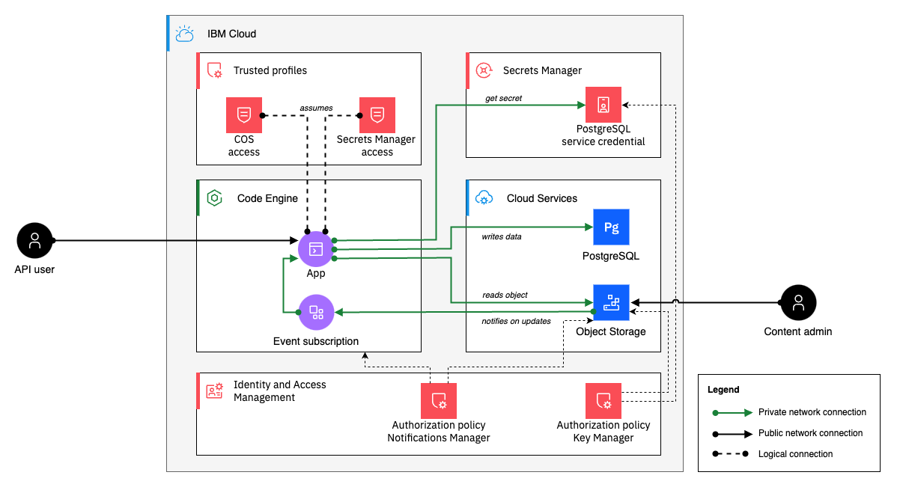

# IBM Cloud Code Engine - Integrate Cloud Object Storage and PostgreSQL through a app and an event subscription

This sample demonstrates how to read CSV files hosted on a IBM Cloud Object Storage and save their contents line by line into relational PostgreSQL database, leveraging IAM trusted profiles.



## Prerequisites

Make sure the [IBM Cloud CLI](https://cloud.ibm.com/docs/cli/reference/ibmcloud?topic=cloud-cli-getting-started) and the following list of plugins are installed
- `ibmcloud plugin install code-engine`
- `ibmcloud plugin install cloud-object-storage`
- `ibmcloud plugin install secrets-manager`

Install `jq`. On MacOS, you can use following [brew formulae](https://formulae.brew.sh/formula/jq) to do a `brew install jq`.

## Setting up all IBM Cloud Service instances

* Login to IBM Cloud via the CLI and target the `ca-tor` region:
    ```
    REGION=ca-tor
    RESOURCE_GROUP=Default
    ibmcloud login -r ${REGION} -g ${RESOURCE_GROUP}
    ```

* Create the Code Engine project
    ```
    CE_INSTANCE_NAME=cos-to-sql--ce
    ibmcloud code-engine project create --name ${CE_INSTANCE_NAME}

    CE_INSTANCE_GUID=$(ibmcloud ce project current -o json | jq -r .guid)
    CE_INSTANCE_ID=$(ibmcloud resource service-instance ${CE_INSTANCE_NAME} --output json | jq -r '.[0] | .id')
    ```

* Create the COS instance
    ```
    COS_INSTANCE_NAME=cos-to-sql--cos
    ibmcloud resource service-instance-create ${COS_INSTANCE_NAME} cloud-object-storage standard global

    COS_INSTANCE_ID=$(ibmcloud resource service-instance ${COS_INSTANCE_NAME} --output json | jq -r '.[0] | .id')
    ```

* Create a COS bucket
    ```
    ibmcloud cos config crn --crn ${COS_INSTANCE_ID} --force
    ibmcloud cos config auth --method IAM
    ibmcloud cos config region --region ${REGION}
    ibmcloud cos config endpoint-url --url s3.${REGION}.cloud-object-storage.appdomain.cloud
    COS_BUCKET_NAME=${CE_INSTANCE_GUID}-csv-to-sql
    ibmcloud cos bucket-create \
        --class smart \
        --bucket $COS_BUCKET_NAME
    ```

* Create the PostgreSQL instance
    ```
    DB_INSTANCE_NAME=cos-to-sql--pg
    ibmcloud resource service-instance-create $DB_INSTANCE_NAME databases-for-postgresql standard ${REGION} --service-endpoints private -p \
    '{
        "disk_encryption_instance_crn": "none",
        "disk_encryption_key_crn": "none",
        "members_cpu_allocation_count": "0 cores",
        "members_disk_allocation_mb": "10240MB",
        "members_host_flavor": "multitenant",
        "members_members_allocation_count": 2,
        "members_memory_allocation_mb": "8192MB",
        "service-endpoints": "private",
        "version": "16"
    }'

    DB_INSTANCE_ID=$(ibmcloud resource service-instance $DB_INSTANCE_NAME --location ${REGION} --output json | jq -r '.[0] | .id')
    ```

* Create the Secrets Manager instance. **Note:** To be able to create secret through the CLI running on your local workstation, we are creating the SecretsManager instance with private and public endpoints enabled. For production use, we strongly recommend to specify `allowed_network: private-only` 
    ```
    SM_INSTANCE_NAME=cos-to-sql--sm
    ibmcloud resource service-instance-create $SM_INSTANCE_NAME secrets-manager 7713c3a8-3be8-4a9a-81bb-ee822fcaac3d ${REGION} -p \
    '{
        "allowed_network": "public-and-private"
    }'

    SM_INSTANCE_ID=$(ibmcloud resource service-instance $SM_INSTANCE_NAME --location ${REGION} --output json | jq -r '.[0] | .id')
    SM_INSTANCE_GUID=$(ibmcloud resource service-instance $SM_INSTANCE_NAME --location ${REGION} --output json | jq -r '.[0] | .guid')
    SECRETS_MANAGER_URL_PRIVATE=https://${SM_INSTANCE_GUID}.private.${REGION}.secrets-manager.appdomain.cloud
    ```

* Create a S2S policy "Key Manager" between SM and the DB
    ```
    ibmcloud iam authorization-policy-create secrets-manager databases-for-postgresql \
        "Key Manager" \
        --source-service-instance-id $SM_INSTANCE_ID \
        --target-service-instance-id $DB_INSTANCE_ID
    ```

* Create the service credential to access the PostgreSQL instance
    ```
    SM_SECRET_FOR_PG_NAME=pg-access-credentials
    ibmcloud secrets-manager secret-create \
        --secret-type="service_credentials" \
        --secret-name="$SM_SECRET_FOR_PG_NAME" \
        --secret-source-service="{\"instance\": {\"crn\": \"$DB_INSTANCE_ID\"},\"parameters\": {},\"role\": {\"crn\": \"crn:v1:bluemix:public:iam::::serviceRole:Writer\"}}"

    SM_SECRET_FOR_PG_ID=$(ibmcloud sm secret-by-name --name $SM_SECRET_FOR_PG_NAME --secret-type service_credentials --secret-group-name default --instance-id $SM_INSTANCE_GUID --region $REGION --output JSON|jq -r '.id')
    ```

* Create the Code Engine app:
    ```
    CE_APP_NAME=csv-to-sql
    TRUSTED_PROFILE_FOR_COS_NAME=cos-to-sql--ce-to-cos-access
    TRUSTED_PROFILE_FOR_SM_NAME=cos-to-sql--ce-to-sm-access

    ibmcloud code-engine app create \
        --name ${CE_APP_NAME} \
        --build-source https://github.com/IBM/CodeEngine \
        --build-context-dir cos-to-sql/ \
        --trusted-profiles-enabled="true" \
        --probe-ready type=http \
        --probe-ready path=/readiness \
        --probe-ready interval=30 \
        --env COS_REGION=${REGION} \
        --env COS_TRUSTED_PROFILE_NAME=${TRUSTED_PROFILE_FOR_COS_NAME} \
        --env SM_TRUSTED_PROFILE_NAME=${TRUSTED_PROFILE_FOR_SM_NAME} \
        --env SM_SERVICE_URL=${SECRETS_MANAGER_URL_PRIVATE} \
        --env SM_PG_SECRET_ID=${SM_SECRET_FOR_PG_ID}
    ```

## Trusted Profile setup

* Create a trusted profile that grants a Code Engine app access to your COS bucket
    ```
    ibmcloud iam trusted-profile-create ${TRUSTED_PROFILE_FOR_COS_NAME}
    ibmcloud iam trusted-profile-link-create ${TRUSTED_PROFILE_FOR_COS_NAME} \
        --name ce-app-${CE_APP_NAME} \
        --cr-type CE --link-crn ${CE_INSTANCE_ID} \
        --link-component-type application \
        --link-component-name ${CE_APP_NAME}
    ibmcloud iam trusted-profile-policy-create ${TRUSTED_PROFILE_FOR_COS_NAME} \
        --roles "Content Reader" \
        --service-name cloud-object-storage \
        --service-instance ${COS_INSTANCE_ID} \
        --resource-type bucket \
        --resource ${COS_BUCKET_NAME}
    ```


* Create the trusted profile to access Secrets Manager
    ```
    ibmcloud iam trusted-profile-create ${TRUSTED_PROFILE_FOR_SM_NAME}
    ibmcloud iam trusted-profile-link-create ${TRUSTED_PROFILE_FOR_SM_NAME} \
        --name ce-app-${CE_APP_NAME} \
        --cr-type CE --link-crn ${CE_INSTANCE_ID} \
        --link-component-type application \
        --link-component-name ${CE_APP_NAME}
    ibmcloud iam trusted-profile-policy-create ${TRUSTED_PROFILE_FOR_SM_NAME} \
        --roles "SecretsReader" \
        --service-name secrets-manager \
        --service-instance ${SM_INSTANCE_ID}
    ```

## Setting up eventing

* Create an authorization policy to allow the Code Engine project receive events from COS:
    ```
    ibmcloud iam authorization-policy-create codeengine cloud-object-storage \
        "Notifications Manager" \
        --source-service-instance-id ${CE_INSTANCE_ID} \
        --target-service-instance-id ${COS_INSTANCE_ID}
    ```

* Create the subscription for COS events of type "write":
    ```
    ibmcloud ce sub cos create \
        --name "coswatch-${CE_APP_NAME}" \
        --bucket ${COS_BUCKET_NAME} \
        --event-type "write" \
        --destination ${CE_APP_NAME} \
        --destination-type app \
        --path /cos-to-sql
    ```

## Verify the solution

* Upload a CSV file to COS, to initate an event that leads to a job execution:
    ```
    curl --silent --location --request GET 'https://raw.githubusercontent.com/IBM/CodeEngine/main/cos-to-sql/samples/users.csv' > CodeEngine-sample-users.csv

    cat CodeEngine-sample-users.csv

    ibmcloud cos object-put \
        --bucket ${COS_BUCKET_NAME} \
        --key users.csv \
        --body ./CodeEngine-sample-users.csv \
        --content-type text/csv
    ```

* Inspect the app execution by opening the logs:
    ```
    ibmcloud code-engine app logs \
        --name ${CE_APP_NAME} \
        --follow
    ```
