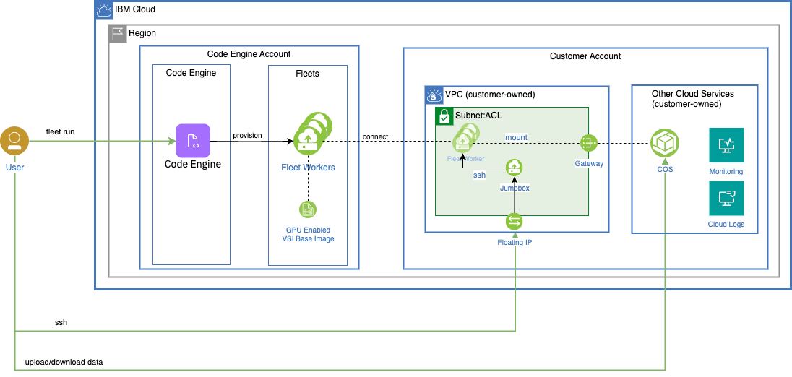
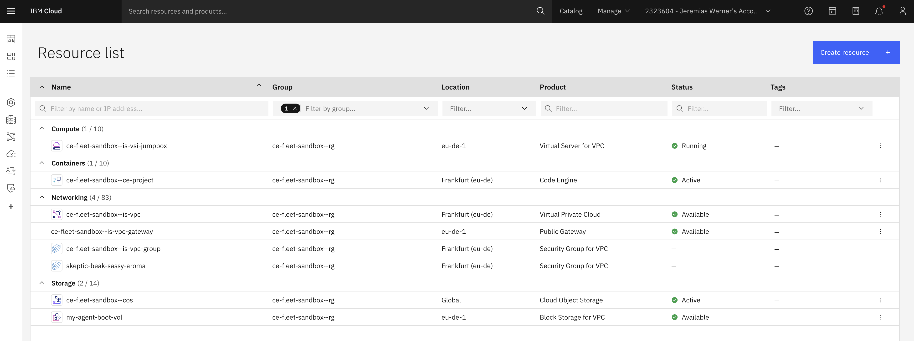
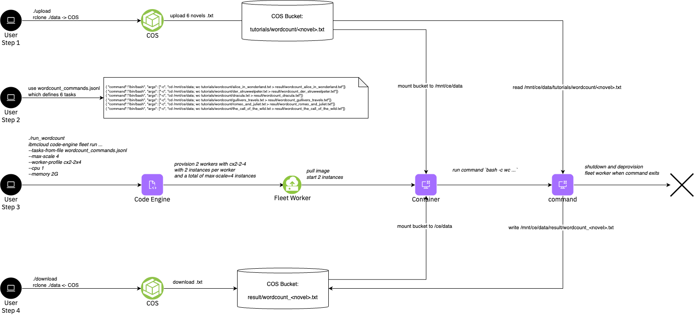

# Serverless Fleets (experimental)

Serverless Fleets is an experimental feature of IBM Cloud Code Engine.

**Table of Contents:**
- [What is a fleets](#what-is-a-fleet)
- [Why using a fleets](#why-using-a-fleet)
- [The fleet concept](#the-fleet-concept)
- [Fleet specification](#fleet-specification)
- [Architecture](#architecture)
- [One Time Setup](#one-time-setup)
- [Launch a Fleet](#launch-a-fleet)
- [Launch a Fleet with GPUs](#launch-a-fleet-with-gpus)
- [Launch a fleet with parallel tasks](#launch-a-fleet-with-parallel-tasks)
- [Launch a fleet to count words of novels](#Launch-a-fleet-to-count-words-of-novels)
- [Tutorials](#tutorials)
- [HowTo](#howto)
- [Troubleshooting](#troubleshooting)

## What is a fleet

A fleet, also serverless fleet, is a Code Engine compute component that runs one or more instances of user code in order to complete its tasks. Instances run on workers which are automatically provisioned and de-provisioned based on the number and resource requirements of the instances. Fleets can provision any machine type which connect to Virtual Private Clouds (VPCs) and securely interoperate with user data and services there.

## Why using a fleet

Fleets provide the following main key differentiators:
1. Any machine type including GPUs
2. Connected to the customers VPC network
3. Large scale parallel computing without limits on vCPU, Memory and duration
4. Dynamic task queuing to millions of tasks

## The fleet concept

Fleets have three principal elements: tasks, instances and workers.


### Tasks

The tasks of a fleet represent the work that the fleet is intended to perform and are specified as part of the fleet specification at creation time.

To perform that work, the fleet starts instances of user code on behalf of the tasks and maintains a representation of the current task statuses as instances are started and ending. Tasks change their initial “pending” status to “running” as soon as an instance is started on their behalf. The task status changes to “succeeded” if its instance process ends with a successful return code. If the instance ends unsuccessfully the associated task changes to status “failed” unless its maximum number of retries is not yet exhausted. In that case the task status is set back to “pending” so that a new instance can be started on behalf of the task. A special task status is “cancelled” which applies if the fleet is cancelled by user action.

Once all tasks of a fleet have reached a final status, the fleet status also changes to a final status. The final fleet status is “succeeded” if all tasks have finished successfully, “failed” if at least one task failed and “cancelled” if the user has cancelled the fleet. Once a fleet has reached a final status, all instances have ended and all worker nodes are (being) de-provisioned - unless specific configuration settings change this behavior for debugging purposes.

Through the tasks specification users can control the number of tasks, the order in which instances are started and which specific command and arguments are used to start an instance for a task.

### Instances

Instances of user code are started for the fleet’s tasks on top of worker nodes. Each instance is started on behalf of exactly one task, its associated task. Different instances always have different associated tasks.

Fleets can work on many tasks in parallel by starting multiple instances concurrently. The maximum number of concurrent instances (max_scale) is part of the fleet’s specification. All instances are created with the same amount of vCPU and memory as per the fleet’s specification.

Instances run user code as per the fleet’s code specification in combination with task parameters that allow for task-specific start commands and arguments.

Instances terminate when the user code exits the instance process. The return code provided at that point signals whether the associated task was successfully completed (exit 0) or failed. The status of the associated task is updated accordingly and retries might be attempted as described in the preceding section on tasks.

Instances might also be stopped if the fleet is cancelled with the “hard stop” option by user action or by exceeding the maximum execution time.

### Workers

Worker nodes are virtual machines automatically provisioned and de-provisioned based on the number and amount of resources required to run the fleet’s instances.

Worker nodes are the basis for charging fleet resource consumption in terms of vCPU consumption, memory consumption and potential GPU uplifts.

Users can influence the selection of worker node machine profiles by defining minimum requirements for eligible machine profiles or even specifying a certain one.

## Fleet specification

Fleets run as soon as they are created so that “running a fleet” is the same operation as “creating a fleet”. Therefore the CLI provides `fleet run` and `fleet create` as synonyms. When creating a fleet the following aspects are specified - either explicitly or by default:
- name
- code
- tasks
- instance resources and scaling
- worker nodes
- connectivity
- environment variables (opt.)
- data store mounts (opt.)

The default values are suitable in many cases so that running a fleet can be very easy and quick as shown in the examples section.

### Name specification

The fleet name identifies the fleet entity within the Code Engine project. It has to be a unique within fleets of the same Code Engine project, i.e. it might be the same as an app’s or job’s name in the same Code Engine project. 

### Tasks specification

Fleets require at least one task and are designed to handle large number of tasks. There are two options to specify tasks:
- number of tasks: N
- tasks from file: <file>

Each tasks gets an index assigned from 0..N. The tasks index is provided as an environment variable `CE_TASK_INDEX` into the instance.

In order to specify tasks in a file create a text file with line-wise definition of parameters in JSON syntax (according to JSONL standard). The task parameters "command" and "args" can be used to override of the command and arguments when starting an instance of user code on behalf of the task. If one or both of these parameters are specified their values are used instead of the respective definitions in the container image or in the fleet's code specification. For example, see [wordcount_commands.jsonl](./wordcount_commands.jsonl)

### Code specification

The fleet’s code determines what is run in one or more instances in order to work on tasks. The specification has two parts: the base specification defines a container image reference and optional command and arguments overrides. (This is the same for Code Engine apps and jobs.). In addition, fleets can override command and arguments in a task-specific way as described in the “Task specification” section.

### Instance resources and scaling specifications

vCPU and memory required by each instance can be specified and determines how many instances can fit/run on a fleet worker. In addition, the maximum number of concurrent instances (max_scale) can be specified.

For example, if an instance requires 2 vCPU and 8 GB memory and a total of 100 instances should run concurrently, the fleet will provision a total of 200 vCPU and 800 GB memory.

### Worker specifications

Users can influence what machine profiles are used as worker nodes to different degrees.

In the example above, if the user selects a bx2-8x32 worker profile, each worker can run 4 instances. Therefore a total of 25 workers will be provisioned.

### Environment variables

The instance will get the following environment provided by the system:
```
CE_FLEET_VERSION=v1
CE_REQUEST_ID=33af980d-8175-4925-85d0-0f0cf8812cb5
CE_PROJECT_ID=e1501040-e56e-48b6-b9f0-1695908199bf
CE_FLEET_CONCURRENCY=1
CE_TASK_ID=0
CE_USER_MOUNT_POINT=/mnt/ce/data
CE_FLEET_KEEP_WORKER=false
CE_FLEET_ID=33af980d-8175-4925-85d0-0f0cf8812cb5
CE_FLEET_IS_GPU=false
```

## Architecture 

The architecture used in this tutorial looks as follows.



Key aspects of the architecture:
1. Code Engine is running the fleet and provisions fleet workers
2. Fleet workers are VPC VSIs running in the Code Engine managed accounts
3. Fleet workers are provisioned based on an VSI image provided and managed by Code Engine
4. Fleet workers are connected to the VPC subnet owned by the customer
5. Tasks and data are stored in a COS bucket owned by the customer
6. Logs are ingested to an IBM Cloud Logs instances owned by the customer
7. A jumpbox VSI is being provisioned in the customer account to support debugging and troubleshooting.

In terms of roles and responsibilities it's important to understand that:
- The user is responsible to manage the VPC, Jumpbox, COS Bucket and ICL instance
- Code Engine is responsible to manage the life-cycle of Fleets, Tasks, Instances and Workers.

The One-time-setup procedure will help to automatically provision / de-provision all required resources, but NOT manage their life-cycle.


## One Time Setup

The tutorial has been tested on a MacOS and Ubuntu24 client machine with the following tools pre-installed:
- `ibmcloud` - IBM Cloud CLI
- `jq` - for parsing JSON response
- `rclone` - for syncing local directory with COS bucket

Clone this repository
```
git clone https://github.com/IBM/CodeEngine.git 
```

Switch to the `experimental/serverless-fleets` directory, which will be the root directory for all steps of this tutorial

To run this end-to-end sample, open a terminal, [login into your IBM Cloud account using the IBM Cloud CLI](https://cloud.ibm.com/docs/codeengine?topic=codeengine-install-cli).

Install the Code Engine CLI with the latest version and enable fleets:
```
CE_EXPERIMENTAL_FLEET=true ibmcloud plugin install code-engine -f --quiet
```

If you don't have a fleet sandbox, choose one of the two methods to create one.

<a name="Fully automated creation of cloud resources (recommended)"></a>
<details>
  <summary>Fully automated creation of cloud resources</summary>

Run the following command, which will create all required cloud resources for you.
```
./init-fleet-sandbox
```

The following resources will be created in the resource group `ce-fleet-sandbox--rg` in `eu-de`.



> Note: The automated setup will provision in `eu-de` region.

> Note: To protect the environment, the access to the jumpbox is only allowed from the network where your client was located when running the initilization (curl https://ipv4.icanhazip.com/). You can modify the security group to change the IP adress or CIDR. 

> Note: Your account need wide permissions to create all the resources mentioned above. If you don't have persmission, ask you Administrator or follow the steps for the [custom configuration](#custom-configuration)

> Note: An rclone environment is configured and files can be uploaded with `./upload` from local directory `./data` to the COS bucket, which is then mounted under `/ce/data` in each container instance.

You can later clean-up all resources by running `./init-fleet-sandbox clean`.
</details>

<a name="Bring your own cloud resources"></a>
<details>
  <summary>Bring your own cloud resources</summary>

If you already have a VPC, subnets, COS bucket and credentials you can just create the code engine project and related artefacts, as follows:

```
ibmcloud code-engine project create --name ce-fleet-sandbox--ce-project
ibmcloud code-engine project select --name ce-fleet-sandbox--ce-project
```

Create a secret for the container registry:
```
ibmcloud ce secret create --name fleet-registry-secret --format registry --server '<region>.icr.io' --username iamapikey --password <api-key>
```

Create a ssh secret with the public key
```
ibmcloud ce secret create --name fleet-ssh-secret --format ssh --key-path ~/.ssh/id_rsa.pub
```

Create a configmap with your VPC details. Make sure, that the subnet has a public gateway attached.
```
ibmcloud ce configmap create --name fleet-vpc-config \
--from-literal NETWORK_ZONE="${REGION}-1" \
--from-literal SSH_SECRET_NAME="fleet-ssh-secret" \
--from-literal VPC_ID="<id>" \
--from-literal SUBNET_ID="<id>" \
--from-literal SECURITY_GROUP_ID="<id>" \
--from-literal VSI_IMAGE_ID="<id>" \  // example: r010-e7b25759-7857-455a-aec0-904b65c3c4cb
--from-literal VSI_PREFERRED_PROFILE="cx2-2x4"
```

Use one of the image IDs below. Only eu-de and us-east region is supported at this point.
| region | imageid |
| ------ | ------- |
| eu-de  | `r010-e7b25759-7857-455a-aec0-904b65c3c4cb` |
| eu-gb  | `r018-31655c46-96e7-4d38-b61a-2ab1b66b9bbd` |
| us-east | `r014-b7f47448-72db-4012-b018-bb120518b078` |


Create a secret with all COS related credentials
```
ibmcloud ce secret create --name fleet-cos-config \
--from-literal access_key_id="" \
--from-literal secret_access_key="" \
--from-literal apikey="" \
--from-literal endpoint="https://s3.direct.${REGION}.cloud-object-storage.appdomain.cloud" \
--from-literal bucket_name="" \
--from-literal bucket_region="" \
--from-literal mountpoint="/ce/data" \
--from-literal prefix="" \
--from-literal resource_instance_id="" 
```

Optionally, create the observability related configuration. If you do not want LOGGING or MONITORING just don't add the values. 
```
ibmcloud ce secret create --name fleet-observability-config \
--from-literal LOGGING_INGESTION_APIKEY="<API KEY>" \
--from-literal LOGGING_INGESTION_HOST="<UUID>.ingress.<REGION>.logs.cloud.ibm.com" \
--from-literal MONITORING_INGESTION_KEY="<API KEY>" \
--from-literal MONITORING_INGESTION_REGION="<REGION>"
```
See the following documentation how to obtain the API keys for [logging](https://cloud.ibm.com/docs/cloud-logs?topic=cloud-logs-iam-ingestion-serviceid-api-key) and [monitoring](https://cloud.ibm.com/docs/monitoring?topic=monitoring-access_key)

</details>
</br>

## Launch a Fleet

Run a serverless fleet that runs 1 single task and instance with 2 CPUs and 4 GB of memory that sleeps for 2 minutes
```
./run
```

<a name="output"></a>
<details>
  <summary>Output</summary>

```
➜  serverless-fleets ./run
ibmcloud code-engine experimental fleet run
   --name fleet-e8035973-1
   --image registry.access.redhat.com/ubi8/ubi-minimal:latest
   --registry-secret fleet-registry-secret
   --command=bash
   --arg -c
   --arg 'echo Serverless Fleets; sleep 120'
   --worker-profile cx2-2x4
   --tasks 1
   --max-scale 1
Preparing your tasks: ⠹ Please wait...took 0.428629 seconds.
Preparing your tasks: ⠸ Please wait...
COS Bucket used 'ce-fleet-sandbox-data-fbfdde1d'...
Launching fleet 'fleet-e8035973-1'...
Current fleet status 'Launching'...
OK
```
</details>
<br>

To observe the fleet and its progress, run a combination of the following commands. The fleet summarizes the number of workers, tasks and instances. A single worker will be provisioned. The worker will process a single task, which will move from *Pending* to *Running* to *Succeeded*. Afterwards the worker will be deprovisioned.

### Get the details of the fleet

```
ibmcloud ce exp fleet get -n <fleet-name>
```
<a name="output"></a>
<details>
  <summary>Output</summary>

```
➜  serverless-fleets ibmcloud ce exp fleet get -n fleet-e8035973-1
Getting Fleet 'fleet-e8035973-1'...
OK

Name:          fleet-e8035973-1
Status:        provisioning
Age:           22s
Created:       2025-04-29T10:51:09+02:00
Project Name:  ce-fleet-sandbox--ce-project
ID:            e4a23052-67bd-4d12-aa4f-98e8ad99111c

Task Summary:
  Tasks:                 1
  Instances:             1
  Workers:               1
  Instances per Worker:  1
```
</details>
<br>

### List the tasks of the fleet

```
ibmcloud ce exp fleet task list --fleet-name <fleet-name>
```
<a name="output"></a>
<details>
  <summary>Output</summary>

```
➜  serverless-fleets ibmcloud ce exp fleet task list --fleet-name fleet-e8035973-1
Getting your tasks: ⠦ Please wait...Duration of list in seconds '0.792116'...
Project Name:  ce-fleet-sandbox--ce-project
Project ID:    e1501040-e56e-48b6-b9f0-1695908199bf
Fleet Name:    fleet-e8035973-1
ID:            e4a23052-67bd-4d12-aa4f-98e8ad99111c


COS Task Store:
Bucket Name:  ce-fleet-sandbox-data-fbfdde1d
Prefix:       e1501040-e56e-48b6-b9f0-1695908199bf/e4a23052-67bd-4d12-aa4f-98e8ad99111c/v1/queue/

Task Summary:
Pending Tasks:    1
Running Tasks:    0
Failed Tasks:     0
Succeeded Tasks:  0
```
</details>
<br>

### List the workers running in the fleet

```
ibmcloud ce exp fleet worker list
```
<a name="output"></a>
<details>
  <summary>Output</summary>

```
➜  serverless-fleets ibmcloud ce exp fleet worker list
Listing serverless fleet workers...
OK

Name                           Status   IP           Zone     Age  Profile  Fleet Name
fleet-e8035973-10000-056abc8e  running  10.243.0.93  eu-de-1  47s  cx2-2x4  fleet-e8035973-1
```
</details>
<br>

🚀 You just launched a fleet with a single task 🚀


## Launch a Fleet with GPUs

Run a fleet that runs a single task on a *Serverless GPU* using a Nvidia L40s for 2 minutes:
```
./run_gpu
```

Observe the progress of the fleet with the same commands as above.

🚀 You just launched a fleet with a Serverless GPU 🚀

## Launch a fleet with parallel tasks

Run a serverless fleet to process 100 tasks where each tasks gets 1 CPU and 2 GB memory. Run 10 tasks in parallel and use a worker profile of cx2-2x4:

```
./run_parallel_tasks
```

<a name="output"></a>
<details>
  <summary>Output</summary>

```
➜  serverless-fleets ./run_parallel_tasks
ibmcloud code-engine experimental fleet run
  --name fleet-ef650482-1
  --image registry.access.redhat.com/ubi8/ubi-minimal:latest
  --registry-secret fleet-registry-secret
  --worker-profile cx2-2x4
  --command=sleep
  --arg 2
  --tasks 100
  --cpu 1
  --memory 2G
  --max-scale 10
Preparing your tasks: ⠋ Please wait...took 6.193297 seconds.
Preparing your tasks: ⠹ Please wait...
COS Bucket used 'ce-fleet-sandbox-data-fbfdde1d'...
Launching fleet 'fleet-ef650482-1'...
Current fleet status 'Launching'...
OK
```
</details>
<br>

In the fleet details you will see 5 workers being provisined. The number of workers is determined by the profile, cpu/memory and number of parallel tasks. 

```
ibmcloud ce exp fleet get -n <fleet-name>
```

<a name="output"></a>
<details>
  <summary>Output</summary>

```
➜  serverless-fleets ibmcloud ce exp fleet get -n fleet-ef650482-1
Getting Fleet 'fleet-ef650482-1'...
OK

Name:          fleet-ef650482-1
Status:        done
Age:           65s
Created:       2025-04-29T17:02:19+02:00
Project Name:  ce-fleet-sandbox--ce-project
ID:            8844325f-6bc6-4ec7-a1cb-fc3f0d2f6d1e

Task Summary:
  Tasks:                 100
  Instances:             10
  Workers:               5
  Instances per Worker:  2
```
</details>
<br>


In our case, a cx2-2x4 has two CPUs and can run 2 instances on a single worker. Since we want to process 10 tasks in parallel, Code Engine provisioned 5 workers.

Repeat the following command until you see the Fleet worker to appear, which takes about 30s:

```
ibmcloud ce exp fleet worker list
```

<a name="output"></a>
<details>
  <summary>Output</summary>

```
➜  serverless-fleets ibmcloud ce exp fleet worker list
Listing serverless fleet workers...
OK

Name                           Status   IP            Zone     Age  Profile  Fleet Name
fleet-ef650482-10000-f6506e8d  running  10.243.0.108  eu-de-1  57s  cx2-2x4  fleet-ef650482-1
fleet-ef650482-10001-233f2643  running  10.243.0.106  eu-de-1  57s  cx2-2x4  fleet-ef650482-1
fleet-ef650482-10002-9eba12ae  running  10.243.0.104  eu-de-1  57s  cx2-2x4  fleet-ef650482-1
fleet-ef650482-10003-91fd6d78  running  10.243.0.107  eu-de-1  57s  cx2-2x4  fleet-ef650482-1
fleet-ef650482-10004-954cf4c5  running  10.243.0.105  eu-de-1  57s  cx2-2x4  fleet-ef650482-1

```
</details>
<br>

Observe the progress of the task execution by repeatingly running the following command:

```
ibmcloud ce exp fleet task list --fleet-name <fleet-name>
```

<a name="output"></a>
<details>
  <summary>Output</summary>

```
➜  serverless-fleets ibmcloud ce exp fleet task list --fleet-name fleet-ef650482-1
Getting your tasks: ⠸ Please wait...Duration of list in seconds '0.283214'...
Project Name:  ce-fleet-sandbox--ce-project
Project ID:    e1501040-e56e-48b6-b9f0-1695908199bf
Fleet Name:    fleet-ef650482-1
ID:            8844325f-6bc6-4ec7-a1cb-fc3f0d2f6d1e


COS Task Store:
Bucket Name:  ce-fleet-sandbox-data-fbfdde1d
Prefix:       e1501040-e56e-48b6-b9f0-1695908199bf/8844325f-6bc6-4ec7-a1cb-fc3f0d2f6d1e/v1/queue/

Task Summary:
Pending Tasks:    20
Running Tasks:    10
Failed Tasks:     0
Succeeded Tasks:  70
```
</details>
<br>

Repeat the steps to observe the fleet.

:rocket: You just launched your first Serverless Fleet which run 100 tasks in parallel and scaled down after all tasks completed :rocket:

## Launch a fleet to count words of novels

This example will run a simple `wc` (word count) on a list of [novels](./data/tutorial/wordcount) stored as objects in .txt format in Cloud Object Storage.
The 6 tasks are submitted using the `tasks-from-file` option using the [wordcount_commands.jsonl](./wordcount_commands.jsonl) as input.




Four steps are required to run the example:
1. `./upload` - will upload the .txt files from the local data directory to Cloud Object Storage
2. `./run_wordcount` - launch the fleet to perform `wc` on each of the novels.
3. `./watch_result wordcount` - will watch the COS bucket for the results, press ctrl-c if all 6 results are present
4. `./download` - will download the results from the COS bucket

🚀 The example was successful, if you can tell the number of words of the "Alice in Wonderland" novel 🚀

> Note, this example assumes that the automated One-Time-Setup has been performed. Otherwise, the upload and download would need to be done manually.

## Tutorials

- [Tutorial: Monte Carlo Simulation](./tutorials/simulation/README.md)
- [Tutorial: Docling](./tutorials/docling/README.md)


## HowTo

### How to use your own container and image

In order to use your own container image, you would need to build and push the image to an ICR namespace within the cloud account.

Build:
```
podman build --platform linux/amd64,linux/amd64 . -t <region>.icr.io/<namespace>/<image>:<tag>
```

Push:
```
ic cr login --client podman
podman push <region>.icr.io/<namespace>/<image>:<tag>
```

Update the Code Engine registry secret to use the same registry endpoint:
```
ibmcloud ce secret update --name fleet-registry-secret --server <region>.icr.io
```

Once the push is complete, you can run the fleet by modifying `./run` and replace
- the image, e.g. `--image <region>.icr.io/<namespace>/<image>:<tag>`
- the command, e.g. `--command "/bin/bash"`
- the arguments, e.g. `--arg "-c" --arg "sleep 120"`
- the environment variables, e.g. `--env foo=bar`

### How to access the worker

From the output of the `worker list` command you can grep the IP of the worker and jump to the worker via ssh by running:
```
./jump 10.243.0.x
```

On the worker you can see how it's being initilized and the container and command is being executed:

```
tail -f /var/log/cloud-init-output.log
```

You can check if the command was successfully running:
```
podman ps -a
```

You can check the logs of the container:
```
podman logs <container-id>
```

### How to share data with your container using COS

The COS bucket is mounted in the container directory under the *mountpoint* `/mnt/ce/data`.

The `init-fleet-sandbox` script configures a local rclone environment including the `.rclone-config` as well as the `upload` and `download` script. Use `./upload` to load data from you local `./data` directory to COS and `./download` vice versa. This allows you to share files easily with your container instance.

### How to access logs

An IBM Cloud Logs instance is being setup and enabled by default during the automated One Time Setup. Each fleet worker will ingest logs to the IBM Cloud Logs instance by default. [Navigating to the UI](https://cloud.ibm.com/docs/cloud-logs?topic=cloud-logs-instance-launch) and use [Using Livetail](https://cloud.ibm.com/docs/cloud-logs?topic=cloud-logs-livetail) or [Filtering log data](https://cloud.ibm.com/docs/cloud-logs?topic=cloud-logs-query-data-filter) to view the logs.


### Cleanup the Environment

To clean up all IBM Cloud resources, that have been created as part of the provided script, run:

```
./init-fleet-sandbox clean
```

## Troubleshooting

### How to keep fleet workers alive for troubleshooting?

With CLI v1.53.0, by default, workers get deleted not only if the workload runs to completion, but also if the agent or the user command fail.

To keep workers alive for troubleshooting if the agent or the user command fail, you would need to set the environment variable `CE_FLEET_KEEP_WORKER=true` at submission of the `fleet run` command.

**Note: Keeping workers alive incurs cost in your account!** You need to delete them manually once you are done with troubleshooting.

Run the following command to keep workers alive for troubleshooting:
```
CE_FLEET_KEEP_WORKER=true ibmcloud code-engine experimental fleet run ...
```

Please follow the steps [How to access the worker](#How-to-access-the-worker) to conduct your troubleshooting.

### How to delete workers manually?

If you need to end your fleet's processing before it ran to completion, or to get rid of workers that are kept alive for troubleshooting (see above), you can delete the workers.

Run the following command to delete a single worker:

```
ibmcloud ce exp fleet worker delete -n <worker-name>
```

Run the following command to delete all workers in your project:
```
ibmcloud ce exp fleet worker list | grep "fleet-" | awk '{print $1}' | xargs -L1 -I {} ibmcloud ce exp fleet worker delete --name {} -f
```


### Fleet creation fails with duplicate key exception

Sample log output:
```
"ERROR: duplicate key value violates unique constraint \"idx_capacity_request_request_id\" (SQLSTATE 23505)"
```

* Solution:
    * use a fleet name that is unique and prefixed with a personal identifier; e.g. `reggeenr-fleet-2`


### Timeout to ssh/jump to the Fleet worker

Note, that the ssh port `22` is restricted to the IP address of the network you're connected to when setting up the fleet sandbox. The IP is determined by `curl https://ipv4.icanhazip.com/`

If you change the network you are not able to connect via ssh to the jumpbox. In order to allow access you need to add a rule for your current network:

```
remote_ip=$(curl https://ipv4.icanhazip.com/)
ibmcloud is security-group-rule-add ce-fleet-sandbox--is-vpc-group inbound tcp --remote ${remote_ip} --port-min 22 --port-max 22 --vpc ce-fleet-sandbox--is-vpc >/dev/null
```
