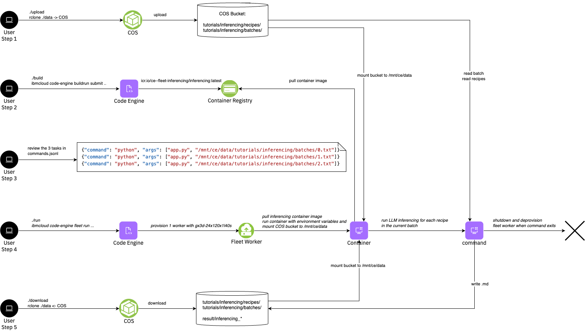

# Tutorial: Batch Inferencing

This tutorial provides a comprehensive guide on using Serverless GPUs to perform batch inferencing. As an example, we choose cookbook recipes (from [recipebook](https://github.com/dpapathanasiou/recipebook)) and using an LLM to extract temperature and duration for each of the steps in the recipe.

For example, the input is a cookbook like:
```
{
    "directions": [
        "In a large pot over medium heat, cook chicken pieces in oil until browned on both sides.  Stir in onion and cook 2 minutes more.  Pour in water and chicken bouillon and bring to a boil.  Reduce heat and simmer 45 minutes.",
        "Stir in celery, carrots, garlic, salt and pepper.  Simmer until carrots are just tender.  Remove chicken pieces and pull the meat from the bone.  Stir the noodles into the pot and cook until tender, 10 minutes.  Return chicken meat to pot just before serving."
    ],
    "ingredients": [
        "2 tablespoons vegetable oil",
        "2 skinless chicken leg quarters",
        "1/2 cup chopped onion",
        "2 quarts water",
        "3 cubes  chicken bouillon, crumbled",
        "1 stalk celery, chopped",
        "3 carrots, chopped",
        "1 clove roasted garlic, minced",
        "salt and pepper to taste",
        "1 (12 ounce) package thin egg noodles"
    ],
    "language": "en-US",
    "source": "allrecipes.com",
    "tags": [],
    "title": "A-1 Chicken Soup",
    "url": "http://allrecipes.com/recipe/25651/a-1-chicken-soup/"
}
```

We use three different prompts for performing the inferencing task which are formulated as follows (see [src/app.py](./src/app.py))
1. `extract temperature and duration values for each step of the following recipe. Use the following format for each sentence of the recipe: temperature=..., duration=....`
2. `from the following recipe, list temperature and time like: temperature=..., duration=...`
3. `summarize temperature and time values for this recipe, where applicable in the following format: step1: temperature=..., time=...; step2: etc.`

As a result we receive an augmented .json file which is including the quantitivate meassures
```
Temperature: 375 degrees F (190 degrees C)
Duration: 1 hour
```

The tutorial consists of 30 cookbooks which are devided into 3 batches each containing 10 cookbooks. Defining the tasks as batches of 10 cookbooks is improving the efficiency by reducing overhead of loading the LLM into the GPU. The Serverless Fleet is launched with 3 tasks to process the 3 batches on a single GPU. However, the 3 tasks could simply distributed across 3 different GPUs in order to accelerate the computation. Of-course the batch size, number of batches and the number of GPUs is only limited by actual available capacity.

Key steps covered in the tutorial:
1. Upload the recipes and batches to COS
2. Build the container image
2. Run a fleet with Serverless GPUs
4. Download the resulting augmented json files from COS




> Note: The tutorial assumes that you have created the fleet sandbox using the fully automated approach which creates the rclone environment as well as the upload/download scripts. If that's not the case, you would need to upload the PDFs and download the results using the COS CLI or other means.

## Steps


### Step 1 - Upload

The 30 example cookbooks and 3 batches are located in the `data/tutorials/inferencing/` directory. Run the following commands in the root directory to list and upload the example PDFs to COS.
```
ls data/tutorials/inferencing/recipes
ls data/tutorials/inferencing/batches

./upload
```

### Step 2 - Build the container image

If you're interested review the code by looking at [src/app.py](./src/app.py), which downloads the LLM and generates the responses for the prompts on each line in the batch file.

Now, run the build script to run a Code Engine build to build a container image using and push it to the container registry

```
cd tutorials/inferencing
./build
```


### Step 3 - Review the commands

Review the `commands.jsonl` which defines the tasks to run the docling command and arguments for each of the pdfs.
```
cd tutorials/inferencing
cat commands.jsonl
```

<a name="Output"></a>
<details>
  <summary>Output</summary>

```
➜  cat commands.jsonl

{"command": "python", "args": ["app.py", "/mnt/ce/data/tutorials/inferencing/batches/0.txt"]}
{"command": "python", "args": ["app.py", "/mnt/ce/data/tutorials/inferencing/batches/1.txt"]}
{"command": "python", "args": ["app.py", "/mnt/ce/data/tutorials/inferencing/batches/2.txt"]}

```
</details>
<br/>

### Step 3 - Run the Fleet

Now run the fleet to process the PDFs. In this tutorial we use the static array index with `--tasks-from-file commands.jsonl` to specify the tasks for the 11 pdfs. We give each task 24 vCPU, run docling with `--num-threads 24` and choose a mx3d-24x240 worker profile with 24 vCPU. Therefore we run only 1 docling command per worker at a time and utilize the full worker per pdf processing. We run `--max-scale 4` instances and workers in parallel. 

Launch the fleet with the following command in the `tutorials/docling` directory.
```
./run
```

<a name="Output"></a>
<details>
  <summary>Output</summary>

```
➜  inferencing ./run
ibmcloud code-engine experimental fleet run
  --name fleet-f7e02a29-1
  --image de.icr.io/ce--fleet-inferencing-7e0a5f0d/inferencing
  --tasks-from-file commands.jsonl
  --worker-profile gx3-24x120x1l40s
  --cpu 24
  --memory 120G
  --max-scale 1
Preparing your tasks: ⠹ Please wait...took 0.375807 seconds.
Preparing your tasks: ⠇ Please wait...
COS Bucket used 'ce-fleet-sandbox-data-fbfdde1d'...
Launching fleet 'fleet-f7e02a29-1'...
Current fleet status 'Launching'...
OK
Getting Fleet 'fleet-f7e02a29-1'...
OK

Name:          fleet-f7e02a29-1
Status:        provisioning
Age:           71s
Created:       2025-08-06T08:35:35Z
Project Name:  ce-fleet-sandbox--ce-project
ID:            5772d148-f655-4b98-a04b-2e51698aa4b8

COS Task Store:
  Bucket Name:  ce-fleet-sandbox-data-fbfdde1d
  Prefix:       e1501040-e56e-48b6-b9f0-1695908199bf/5772d148-f655-4b98-a04b-2e51698aa4b8/

Task Summary:
  Tasks:                 3
  Instances:             1
  Workers:               1
  Instances per Worker:  1
```
</details>
<br/>


Verify that the machines are starting
```
ibmcloud code-engine experimental fleet worker list
```
<a name="Output"></a>
<details>
  <summary>Output</summary>

```
➜  inferencing ibmcloud ce exp fleet worker list
Listing serverless fleet workers...
OK

Name                           Status   IP            Zone     Age    Profile           Fleet Name
fleet-f7e02a29-10000-4a7d3832  running  10.243.0.245  eu-de-1  2m1s   gx3-24x120x1l40s  fleet-f7e02a29-1
```
</details>
<br/>

Observe the tasks:

```
ibmcloud code-engine experimental fleet task list --fleet-name <fleet-name>
```
<a name="Output"></a>
<details>
  <summary>Output</summary>

```
Getting your tasks: ⠹ Please wait...Duration of list in seconds '0.371897'...
OK

Project Name:  ce-fleet-sandbox--ce-project
Project ID:    e1501040-e56e-48b6-b9f0-1695908199bf
Fleet Name:    fleet-f7e02a29-1

COS Task Store:
  Bucket Name:  ce-fleet-sandbox-data-fbfdde1d
  Prefix:       e1501040-e56e-48b6-b9f0-1695908199bf/5772d148-f655-4b98-a04b-2e51698aa4b8/v1/queue/

Task Summary:
  Pending Tasks:     3
  Claimed Tasks:     0
  Running Tasks:     0
  Failed Tasks:      0
  Successful Tasks:  0
```
</details>
<br/>


#### Playing with more parallism

If you want to modify the tutorial to add some more parallism, e.g. to run each batch on it's own GPU, you can change `--max-scale 3` in the run script.


### Step 4 - Download results

Download the results from the COS by running the following command in the root directory:
```
./download
```

You can find the results under
```
ls -l data/result/inferencing_*
```


