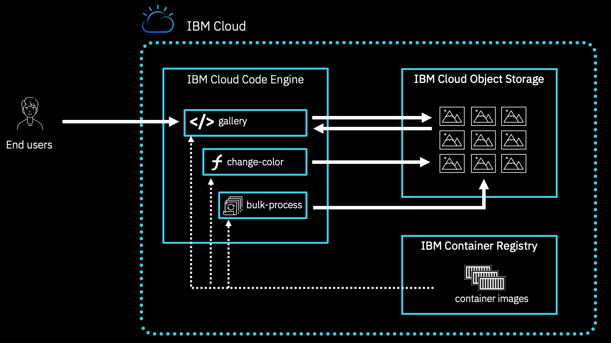
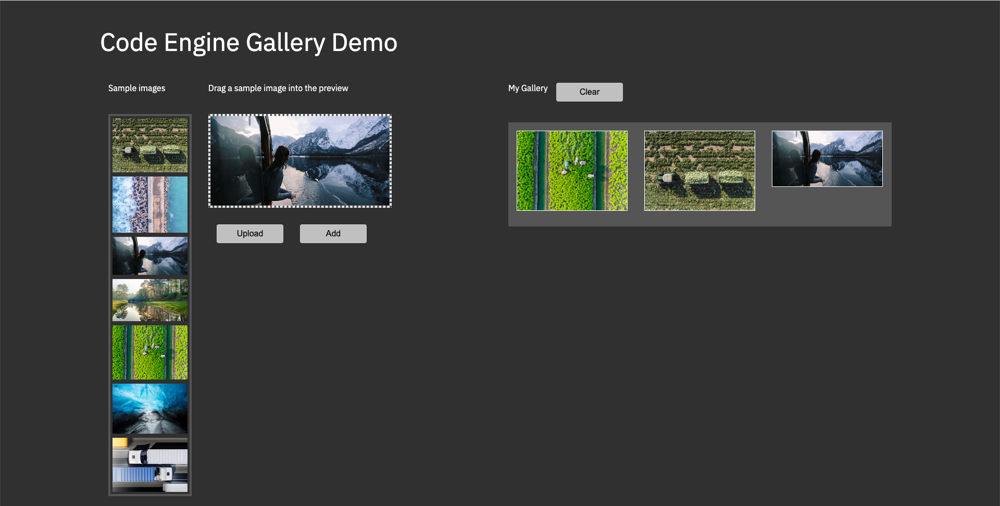
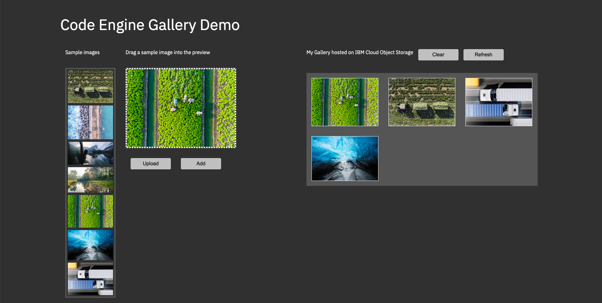
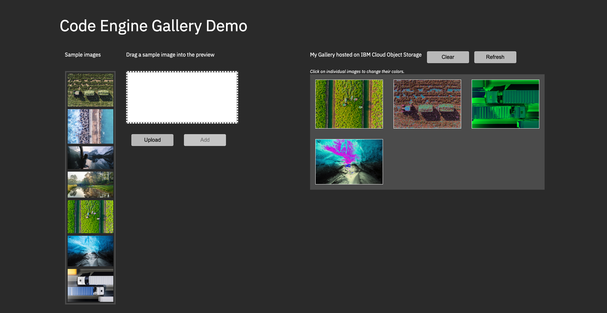
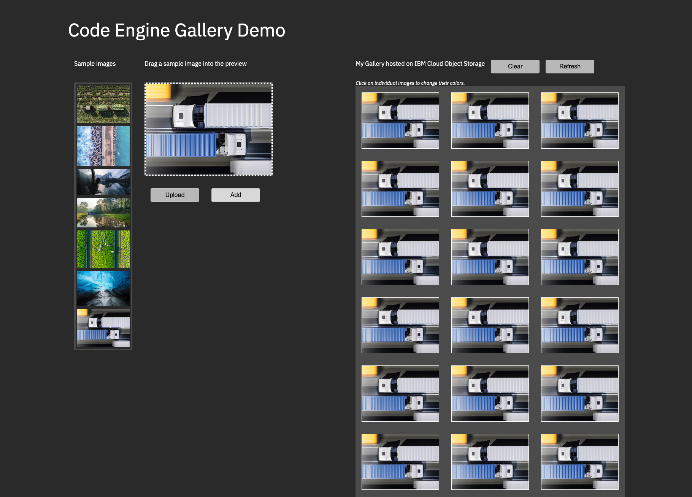
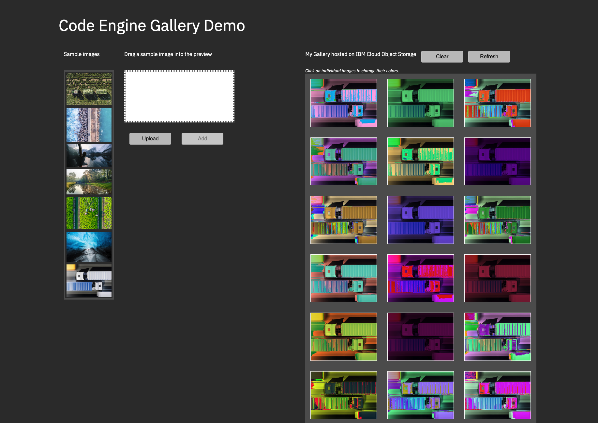

# Code Engine Gallery Demo

This tutorial demonstrates how to build an Image Gallery that demonstrates how multiple Code Engine components can be used together in order to build a complex software solution.

The solution is based on:
- an application that renders a web application and which is capable to get extended to connect to an Object Storage bucket to store gallery images
- a function that is capable to read and write to a COS bucket and change the colors of a single PNG image that is stored in the bucket
- a job that that is capable to read and write to a COS bucket and change the colors of a all PNG images that are stored in the bucket




## Setup

### Prererquisites

If you use your own machine you'll need to install the following (if not
already installed):
- [IBM Cloud command line (`ibmcloud`)](https://cloud.ibm.com/docs/cli/reference/ibmcloud?topic=cloud-cli-getting-started)
- [Code Engine plugin (`ce`)](https://cloud.ibm.com/codeengine/cli)
- [Cloud Object Storage plugin (`cos`)](https://cloud.ibm.com/docs/cloud-object-storage-cli-plugin)

Furthermore, you'll need to have `jq` installed on your local machine. On MacOS, you can use [Homebrew](https://brewinstall.org/) to install this tool:
```
$ brew install jq
```

### Project

Login into IBM Cloud using the CLI 
```
$ ibmcloud login 
```

Choose a proper region and resource group. In this script, we'll use the Frankfurt region and the default resource group.
```
$ ibmcloud target -r eu-de
```

Create a new project 
```
$ ibmcloud ce project create --name gallery 

Creating project 'gallery'...
ID for project 'gallery' is '91efff97-1001-4144-997a-744ec8009303'.
Waiting for project 'gallery' to be active...
Now selecting project 'gallery'.
OK
```

Read the project guid from the CLI output and store it in a local variable. 
We'll need it later on to configure the bucket.
```
$ export CE_PROJECT_GUID=$(ibmcloud ce project current --output json|jq -r '.guid')
$ echo "CE_PROJECT_GUID: $CE_PROJECT_GUID"
```

Once the project has become active, you are good to proceed with the next step.

### Gallery application

Create an application
```
$ ibmcloud ce app create --name gallery --image icr.io/codeengine/gallery

Creating application 'gallery'...
Configuration 'gallery' is waiting for a Revision to become ready.
Ingress has not yet been reconciled.
Waiting for load balancer to be ready.
Run 'ibmcloud ce application get -n gallery' to check the application status.
OK

https://gallery.172utxcdky5l.eu-de.codeengine.appdomain.cloud
```

That deployed the application is a very basic web application, which is able 
to compose an image gallery by either dragging the sample images into 
the preview box and click `Add`. Furthermore, it is possible to upload images 
from the local workstation, by clicking `Upload`. 

Note, that the image gallery will reset, once the browser reloads.



### Setting up the Cloud Object Storage instance and the bucket

Now that we've proven that the logic of our image gallery works, we need
to change things a bit so that instead of just storing the gallery images in 
the users browser, we're going to store them in a persistent store - or
in this case IBM Cloud Object Storage. 

First we'll create a new instance of that service:
```
$ ibmcloud resource service-instance-create gallery-cos \
    cloud-object-storage standard global

Creating service instance gallery-cos in resource group default of account John Doe's Account as abc@ibm.com...
OK
Service instance gallery-cos was created.
                  
Name:             gallery-cos
ID:               crn:v1:bluemix:public:cloud-object-storage:global:a/7658687ea07db8396963ebe2b8e1897d:c0f324be-33fd-4989-a4af-376a13abb316::
GUID:             c0f324be-33fd-4989-a4af-376a13abb316
Location:         global
State:            active
Type:             service_instance
Sub Type:         
Allow Cleanup:    false
Locked:           false
Created at:       2023-09-08T07:38:48Z
Updated at:       2023-09-08T07:38:50Z
Last Operation:             
                  Status    create succeeded
                  Message   Completed create instance operation
```

From this output you'll need to save the `ID` value for a future command.
So to make life easier, let's save it as an environment variable:

```
$ export COS_ID=$(ibmcloud resource service-instance gallery-cos --output json|jq -r '.[]|.crn')
$ echo "COS_ID: $COS_ID" 
```

Let's direct all COS CLI uses to our COS instance:
```
$ ibmcloud cos config crn --crn $COS_ID --force

Saving new Service Instance ID...
OK
Successfully stored your service instance ID.
```

Now, let's use the "IAM" authentication method which will use the same API Key
that the rest of our CLI commands will use:

```
$ ibmcloud cos config auth --method IAM

OK
Successfully switched to IAM-based authentication. The program will access your Cloud Object Storage account using your IAM Credentials.
```

Next, let's go ahead and create a new bucket into which our data will be stored.
To do this you'll need to provide a unique name for your bucket. It needs to be
globally unique across all buckets in the IBM Cloud. In the command below
we'll use our project's ID appended with "-gallery", but you can technically use any value you want as long as it's unique. Let's save that name in an environment variable for
easy use:

```
$ export BUCKET="$CE_PROJECT_GUID-gallery"
$ echo "BUCKET: $BUCKET"
```

Now let's ask COS to create our bucket:

```
$ ibmcloud cos bucket-create --bucket $BUCKET

OK
Details about bucket 91efff97-1001-4144-997a-744ec8009303-gallery:
Region: eu-de
Class: Standard
```

To complete this setup, we'll need to adjust the application configuration and make it aware of the persistence store.
```
$ ibmcloud ce app update --name gallery \
    --env BUCKET=$BUCKET \
    --scale-down-delay 3600

Updating application 'gallery' to latest revision.
Traffic is not yet migrated to the latest revision.
Ingress has not yet been reconciled.
Waiting for load balancer to be ready.
Run 'ibmcloud ce application get -n gallery' to check the application status.
OK

https://gallery.172utxcdky5l.eu-de.codeengine.appdomain.cloud
```

Furthermore, we'll create a service binding between the application and the COS instance, which will expose
credentials to the application allowing it to read and write to the COS instance.
```
$ ibmcloud ce app bind --name gallery --service-instance gallery-cos

Binding service instance...
Status: Done
Waiting for application revision to become ready...
The Configuration is still working to reflect the latest desired specification.
Traffic is not yet migrated to the latest revision.
Ingress has not yet been reconciled.
Waiting for load balancer to be ready.
OK
```

Open the gallery application in your browser. Notice the Gallery title on the right-hand side has slightly changed. It now says `My Gallery hosted on IBM Cloud Object Storage`. Play around with the gallery by adding a few images. Notice, that the gallery images re-appear after reloading the page.



### Add a function that changes the colors of gallery images

Now, let us further extend the solution by adding a function that is capable of changing the color of an individual image. The source code of the gallery app is prepared to enable an onClick handler on each gallery image that calls a function endpoint. Functions are designed to respond lightning fast and as such their are ideal for use cases that require a fast response. As opposed to apps, functions must only contain the source code that is essential for executing the desired business logic.

```
git clone git@github.com:IBM/CodeEngine.git
```

Nabigate to the subfolder `function` within the gallery tutorial.

```
cd gallery/function
```

Utilize local build capabilities, which is able to take your local source code and convert it into an executable artifact and create a new function called `change-color`.

```
$ ibmcloud ce fn create --name change-color \
    --build-source . \
    --runtime nodejs-18 \
    --memory 4G \
    --cpu 1 \
    --env BUCKET=$BUCKET

Preparing function 'change-color' for build push...
Creating function 'change-color'...
Packaging files to upload from source path '.'...
Submitting build run 'change-color-run-230912-101533983'...
Creating image 'private.de.icr.io/ce--76586-172utxcdky5l/function-change-color:230912-0815-mrawq'...
Waiting for build run to complete...
Build run status: 'Running'
Build run completed successfully.
Run 'ibmcloud ce buildrun get -n change-color-run-230912-101533983' to check the build run status.
Waiting for function 'change-color' to become ready...
Function 'change-color' is ready.
OK                                                
Run 'ibmcloud ce function get -n change-color' to see more details.

https://change-color.172utxcdky5l.eu-de.codeengine.appdomain.cloud
```

In order to allow the function to read and write to the bucket, we'll need to create a binding between the COS instance and the function to expose the Object Storage credentials to the functions code. As we already created such credentials for the application, we'll want to make sure to re-use it, as opposed to create new ones.

List all service credentials of the Object Storage instance:
```
$ ibmcloud resource service-keys --instance-id $COS_ID

Retrieving all service keys in resource group default under account John Does's Account as abc@ibm.com...
OK
Name                               State    Created At
gallery-ce-service-binding-prw1t   active   Fri Sep  8 07:56:19 UTC 2023
```

Extract the name of the service access secret, that has been created for the app
```
$ export COS_SERVICE_CREDENTIAL=$(ibmcloud resource service-keys --instance-id $COS_ID --output json|jq -r '.[0].name')
$ echo "COS_SERVICE_CREDENTIAL: $COS_SERVICE_CREDENTIAL"
```

Finally expose the COS credentials to the function by binding the service access secret to the function
```
$ ibmcloud ce function bind --name change-color \
    --service-instance gallery-cos \
    --service-credential $COS_SERVICE_CREDENTIAL

Binding service instance...
Status: Done
OK
```

In order to complete this step, we'll update the app and make it aware that there is a function that allows to change the colors of individual images.

```
$ ibmcloud ce app update --name gallery \
    --env COLORIZER=change-color

Updating application 'gallery' to latest revision.
Traffic is not yet migrated to the latest revision.
Ingress has not yet been reconciled.
Waiting for load balancer to be ready.
Run 'ibmcloud ce application get -n gallery' to check the application status.
OK

https://gallery.172utxcdky5l.eu-de.codeengine.appdomain.cloud
```

Open the gallery application in your browser. Notice that a Gallery subtitletitle on the right-hand side has appeared. It now says `Click on individual images to change their colors.`. Play around with the gallery by clickon on a few images. Notice, that the gallery images change their colors after a short amount of time.

 

### Add a job that process the whole bucket as a bulk

In the next step of this tutorial we'll want to add the job, which is capable of processing the whole bucket and change the color of each of the images in a bulk operation. 

Create a job. Note: this time we are configuring the target COS bucket right-away as part of the creation. 
```
$ ibmcloud ce job create --name bulk-process \
    --image icr.io/codeengine/gallery-job \
    --env BUCKET=$BUCKET

Creating job 'bulk-process'...
OK
```

Bind the job to the COS bucket by using the very same credentials that have been shared with the app and function, too. 
```
$ ibmcloud ce job bind --name bulk-process \
    --service-instance gallery-cos \
    --service-credential $COS_SERVICE_CREDENTIAL

Binding service instance...
Status: Done
OK
```

Open the gallery application in your browser and clear the whole gallery by clicking the clear button. Afterwards, make sure to add a ton of images to the gallery. 

 

Submit a job run that process all images
```
$ ibmcloud ce jobrun submit --job bulk-process

Getting job 'bulk-process'...
Submitting job run 'bulk-process-jobrun-mjkf4'...
Run 'ibmcloud ce jobrun get -n bulk-process-jobrun-mjkf4' to check the job run status.
OK
```

Once the jobrun has been completed, re-load the gallery app in the browser. Notice that the colors of all images have been changed:

 
