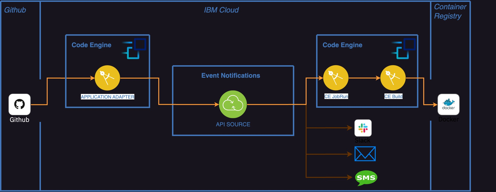
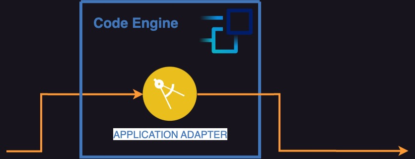

# Integrating IBM Cloud Code Engine with Github and Event Notifications

Automating software deployment upon changes in your Git repository isn't  a novel idea. In IBM Cloud Code Engine, we provide samples like [Github](https://github.com/IBM/CodeEngine/tree/main/github) or [Github Action Workflows](https://github.com/IBM/CodeEngine/tree/main/github-action-workflows), enabling users to respond to changes in their repositories through Code Engine workloads.

Given the importance of automated continuous deployments for cloud-native applications, this blog post delves deeper into the topic and proposes a new architecture for IBM Cloud users.

By integrating, Git, Code Engine and IBM Cloud [Event Notifications](https://cloud.ibm.com/docs/event-notifications?topic=event-notifications-getting-started), we can offer users an end-to-end workflow from changes in Git to notifications across multiple destinations, including a Code Engine Job.

## Architecture

Our starting point is Git. Cloud Native Applications code is commonly hosted in these version control systems. Through Github [webhooks](https://docs.github.com/en/webhooks), changes such as `push` events(_e.g. commiting to your main branch_) can trigger integrations to take responsive actions.

Knowing when these events occur leads us to the questions; what actions can we take? and who can take an action?

In this architecture, IBM Cloud Event Notifications is our integration of choice, taking a responsive action upong Git Events.




In the image above, we use Event Notifications as an intermediary, leveraging their source and destination concepts to facilitate the transportation of our Github event payloads to multiple destinations.

Our final destination is a Code Engine Job, which, upon receiving the event, will trigger the creation of a Code Engine Build (rebuilds a container image from the Git code where the event originated) and will redeploy any Code Engine Application referencing that container image.

### Tell me more!

By leveraging Code Engine with Event Notifications, we can take continuous deployments of Cloud Native applications to the next level. In addition, users can switch the destination, or use multiple ones, such as Slack, Email, IBM Cloud Object Storage, IBM Cloud Functions, et al.

## A Clever Workaround



If you paid attention to the first diagram, you will have noticed the need for an Application Adapter.

This adapter is essential for translating the Github Webhook payload into a format that an Event Notification Source can understand, enabling the complete end-to-end flow.

However, there's no need to worry - this application adapter runs as a Code Engine application, scaling to zero when no events are ocurring.

## Pre-requisites

If you reach this point, it's clear you have an interest in this architecture. Before diving in, there are three key prerequisites we need to have in place for deploying the architecture:

1. An Event Notifications Instance. See [docs](https://cloud.ibm.com/docs/event-notifications?topic=event-notifications-en-create-en-instance)
2. A valid IBM Cloud IAM API Key. See [docs](https://cloud.ibm.com/docs/account?topic=account-ibmcloud_commands_iam#ibmcloud_iam_api_key_create)
3. A Code Engine Project. See [docs](https://cloud.ibm.com/docs/codeengine?topic=codeengine-manage-project).
4. A Code Engine Build. This needs no be defined in advance, so that the architecture knows how to rebuild your container image. See [docs](https://cloud.ibm.com/docs/codeengine?topic=codeengine-plan-build).

## Try It!

In this directory, you will find a deployable architecture that provides an end-to-end workflow for rebuilding your container image upon code changes. To run the architecture, you need to set some environment variables in advance:

- `EN_INSTANCE_ID`: Your Event Notification Instance ID.
- `IAM_API_KEY`: A valid IAM API Key.
- `USER_BUILD_NAME`: The name of the Code Engine Build.
- `CE_PROJECT_NAME`: The name of the Code Engine Project.

Finally, you just need to execute the following command:

```sh
./run.sh
```

If you want to clean-up your Code Engine resources, you can run the following:

```sh
./run.sh clean
```

## Questions and feedback

If you have feedback, suggestions, or questions on this post, you can always open [GitHub issues](https://github.com/IBM/CodeEngine/issues) on the related code samples for clarification.
