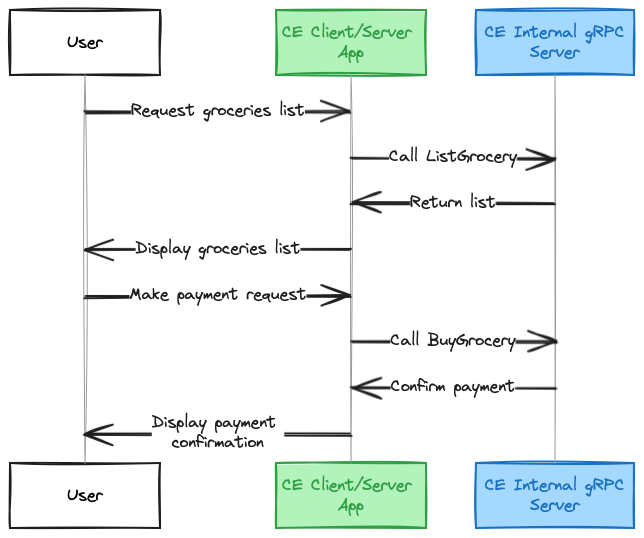

# gRPC Application

A basic gRPC microservice architecture, involving a gRPC server and a
client, that allow users to buy items from an online store.

The ecommerce interface provided by the gRPC server, allows users to
list and buy groceries via the public client/server application.

The client/server application is deployed as a Code Engine application,
with a public endpoint. While the gRPC server is deployed as a Code Engine
application only exposed to the Code Engine project.

See architecture diagram:



## Source code

Check the source code if you want to understand how this works. In general,
we provided three directories:

- `/ecommerce` directory hosts the protobuf files and declares the `grocery`
  interface for a set of remote procedures that can be called by clients. This directory
  can be regenerated upon changes to the `.proto` file, by calling the `./regenerate-grpc-code.sh`.
- `/server` directory hosts the `grocery` interface implementation and creates a gRPC server.
- `/client` directory defines an http server and calls the gRPC server via its different
  handlers.

## Try it!

You can try to deploy this microservice architecture in your Code Engine project.
Once you have selected your Code Engine project, you only need to run:

```sh
./run
```

If you want to clean-up resources from this sample app, do not forget to run:

```sh
./run clean
```