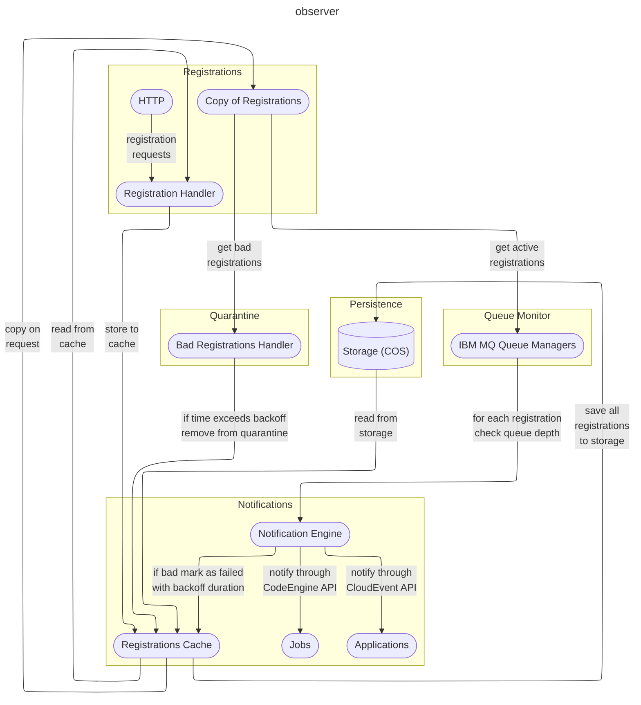

# Observer Deepdive

## Go Version
Built and tested with `go` version go 1.22.2 on darwin/arm64

## Dependencies
There are five dependencies:
- github.com/google/uuid 
- github.com/IBM/ibm-cos-sdk-go
- github.com/cloudevents/sdk-go/v2@v2.15.1
- github.com/IBM/code-engine-go-sdk/codeenginev2
- github.com/IBM/go-sdk-core/v5/core

pulled in by running
```
go get -u github.com/IBM/ibm-cos-sdk-go
```

## Component Diagram



## Overview
The observer consists of six parts. 
- The Observer exposes http endpoints that allow applications to register, and unregister.
- The Registration Handler manages the register of signed up applications.
- The QM Monitor checks queue manager queues against registrations maintaining a temporary cache so that a queue manager is only asked about queue depths only once on each iteration. 
- The Notifier, monitors the queue depths and pokes the applications and jobs that have registered. 
- The Restore monitor is only started if bad registrations are not 
to be removed. It monitors the registrations marked as backoff. If the back off duration has been exceeded, the fail count and back off are reset, allowing the registration to become active again.
- The Persister, periodically checks if the store of active registrations has been modified, and persists the list to storage.

## Execution mode
By default this sample runs in combined reservations and notifications mode.

To run this sample in reservations only mode set the environment variable `ENABLE_RESERVATIONS`. This will run this sample in reservations only mode, allowing for the registration and unregistration of reservations. The notifications code is disabled

To run this sample in notifications only mode set the environment variable `ENABLE_NOTIFICATIONS`, which switches off the http registrations part. In which case the registrations are read from storage. 

If running in notifications only or reservations only mode then consider reducing the time duration between persistence actions, `PERSIST_INTERVAL` to allow changes in the reservation datato be picked up.

Setting both `ENABLE_RESERVATIONS` and `ENABLE_NOTIFICATIONS` has the effect of running in combined mode. 

We did consider have the default to be notifications only, but that means that persistent storage has to be used, and a friendlier default allows for the use of seed data, cache only, and no object storage.

## Notification pattern
Out of the box, this sample checks active registations once every 5 minutes. The interval can be overriden by setting the envrionment variable `NOTIFY_INTERVAL`

For each registration a check is made against the Queue Manager / Queue. If the queue is not empty a notification is sent to the registered application / job. There is no check to see if the job previously started for the registration is still running. 

If needed this check can be added to the notification code inside `jobpoker.go` with the launched job run name saved with the registration data. The logic would be:

- Has a job already been run for this registration?
    - Yes, check if it still running
        - Skip the job run launch 
- Launch the job run

## observer.go
This contains the observer main function, which  
- Sets up a store of active registrations to be managed by the registration handler.
- Starts the notifier as a go routine, giving it a link to the registrations.  
- Starts the persister as a go routine, giving it a link to the registrations.
- Checks storage (not yet implemented) for persisted registrations. if found it passes the list to the store of active
registrations.
- Sets up handlers that 
  - return 404 for `/`
  - handle POST and DELETE for `/register`
  - handle POST on `/notify` as a circular test when the observer registers itself to be notified.
  - handle DELETE on `/admin/flush` to clear out the cache of registrations.
The listening port defaults to 8080, but can be overriden by setting the envrionment variable `PORT`


## Registration Handler
The registration handler consists of three source files
- registrations.go
- registrationRequest.go
- registrationhandler.go

### registrations.go
This manages access to the store of registrations using 
a RW Mutex to control concurrent access. For all write accesses the store is marked as dirty, so it can be persisted.

Failed notifications are marked on the registration. If the number of failures exceeds the threshold, then the registration is either 
dropped, if the envrionment variable DROP_BAD is set, or marked with a backoff duration, which defaults to 24 hours, during which notifications for the registration are suspended.

Unless the envrionment variable `NO_COS` is set. On start up it attempts to retrieve the store of active registrations  from persistence storage.

### registrationRequest.go
This defines the structure of a registration request, allowing a request to be created from data submitted either as json or as a form.
Once extracted the request fields are private, ensuring that access outside the package is only through helper functions.

### registrationhander.go
This provides the http handlers for registration / unregistration requests. New registrations are added to the store, dropped registrations are removed. 

## QM Monitor
The Queue Manager monitor has a list of queue managers that it will be monitoring. It obtains the list from the file `env.json`. Each entry consists of:

- QMGR
- MQ_REST_HOST
- MQ_REST_PORT
- ADMIN_USER
- ADMIN_PASSWORD

which can be overriden by environment variables. These values are used to construct a query against the queue manager of the form `/ibmmq/rest/v1/admin/qmgr/QM1/queue?status=status.currentDepth`

After the query is run, filters applied to reduce the queue set to application queues with a positive queue depth.

You can specify upto 20 queue managers as envrionment variables, using a 0 offset suffix to specify which slot you are overriding. eg. for slot 0, use the following envirionment variables

- QMGR0
- MQ_REST_HOST0
- MQ_REST_PORT0
- ADMIN_USER0
- ADMIN_PASSWORD0

for slot 0, use

- QMGR1
- MQ_REST_HOST1
- MQ_REST_PORT1
- ADMIN_USER1
- ADMIN_PASSWORD1

If you need more than 20, then create the required number of slots in the `env.json` then override using the appropriate suffix.

### queuestatus.go
This defines the json data structures that the queue manager query will return


## Notifier
The notifier runs as a separate go routine. It goes into an endless loop. At the top of the loop it sleeps then after waking it checks for registrations. 

### notifier.go
This provides the sleep registration check loop. The sleep defaults to 1 minute, but can be overriden by setting the envrionment variable `NOTIFY_INTERVAL`. The specified value is interpreted as minutes to sleep. 

On waking the notifier creates a new cache. This cache contains the positive results of queue depth queries in this iteration. 

The notifier requests a copy of the active registrations. For each registration (Queue Manager / Queue) pair:
- It checks the cache to see if a query has already been run in this iteration against the queue manager
  - If not then it runs a query against the queue manager
  - Stores the result in the cache
- Checks the cache to see if the Queue has a queue depth
  - If so it invokes the registered endpoint
  - If the http get on the endpoint fails then 
    - The failure count for the registration is incremented
    - If the increment is greater than the failure limit `DEFAULT_FAIL_TO_DROP` then the registration is revoked.

### viewedcache.go
This implements the cache of results from already queried queue managers.

### invoker.go
This contains the http code that runs the queue depth queries, through `queuechecker.go`, it parses and filters the data. 

The invoker contains ciide that invokes the registered notifications using the appropriate mechanism: 
- as CloudEvents in `cloudeventspoker.go` 
- as HTTP Post in `httppoker.go`. 
- as CodeEngine jobs in `jobpoker.go`

The default mechanism for applications listening on http is CloudEvents, unless the environment variable `HTTP_NOTIFY` is set. If the variable `CLOUD_EVENTS` is set then CloudEvents are used, regardless of whether `HTTP_NOTIFY` is set.

The following information is passed to the notified application / job.

- *CE_QMGR* queue manager
- *CE_QUEUE* queue 
- *CE_DEPTH* queue depth
- *notification* set to `messages found on queue`
- *ID* registration Id


### jobpoker.go 
This uses the code engine api to find the required job in projects in all the specified regions.

Code engine credentials are obtained from `env.json`. An entry consists of 
    - **ce_apikey** 
    - **regions** an array of regions
        - **region**

which can be overriden by environment variables. The `regions` are overriden with a comma separated string envrionment variable. EG.

```
regions="us-south,us-east"
```

## Persistance
This periodically checks if the store of active registrations has become dirty. If so it:
- Obtains a copy of all the registrations
- Stores the copy into persistance storage
- Resets the dirty flag on the active registrations store.

### persister.go
This implements the check to to determine if the peristance storage needs to be updated. It encapsulates the load and save persistence action. 

### store.go
This provides functions that will load and save the list of active registrations to persistent storage. 

### Cloud Object Store
If you are using Cloud Object Store for the persitence layer, then you will need to provide the following information, either in the env.json file or as environment variables, `bucket`,
`auth_endpoint`, `apikey`, `endpoints`

```
    "COS_STORAGE" : {
        "bucket": " ",
        "object_key" : " ",
        "auth_endpoint": " ",
        "cos_apikey": " ",
        "endpoints": " ",
        "resource_instance_id": " "
    }
```

where
- *bucket* is the bucket name you specified
- *object_key* is the key for the persisted data
- *auth_endpoint* if not specified then the endpoint will default to `https://iam.cloud.ibm.com/identity/token`
- *cos_apikey* can be obtained from your bucket > configuration > Service credential
- *endpoints* can be obtained from your bucket > configuration > endpoints, and will look something like `s3.us-east.cloud-object-storage.appdomain.cloud`
- *resource_instance_id* can be obtained from your bucket > configuration > Service credential

The api should be granted with a write role, to allow the observer to both read and write the registrations cache to cloud object storage.

## Restore monitor
The Restore monitor runs as a separate go routine. It is only
started if bad registrations are not be deleted, ie. the environment variable `DROP_BAD` is not set.

### monitor.go
On each iteration this obtains a copy of the backed off registrations. For each it
- Checks if the back off duration has expired
  - If so it re-activates the registration
  - Updates the registration map with the reactivated registration

## Override of cycle durations
The cycle durations have defaults but can be overriden with the following environment settings.

- **TEST** If set shorter test based default durations are used 
- **NOTIFY_INTERVAL** The interval in minutes that the notifier routine waits between cycles in which it checks queue depths against registrations. 
- **PERSIST_INTERVAL** The interval in minutes that the persistance routine waits between cycles in which it checks if the registration cache needs to be persisted to storage.
- **BACKOFF_DURATION** The duration in minutes for which registered applications or jobs that fail to respond to a notification will be quarantined. The applications / jobs will not receive notifications during the backoff duration.
- **RESTORE_INTERVAL** The interval in minutes between cycles of the routine that checks if quarantined applications / jobs can be restored. ie. their time in quarantine exceeds the backoff_duration.
- **CE_REFRESH_INTERVAL** The time in minutes between caching cycles of the visible code engine jobs. A check is made before each invocation cycle in which at least one job run is to be started. if needed the cache is refreshed. 

## Running as a container
A Dockerfile is provided to allow the observer to run as a container. The archicture (`amd64` or `arm64`) is specified as a build arg, but defaults to `amd64`

To build as an arm image run

```
docker build --build-arg arch=arm64 -t mq-observer .
```

To start the container run

```
docker run --rm --publish 8080:8080 localhost/mq-observer:latest
```

To use `TEST` intervals and durations run

```
docker run --rm --env TEST=1 --publish 8080:8080 localhost/mq-observer:latest
```


