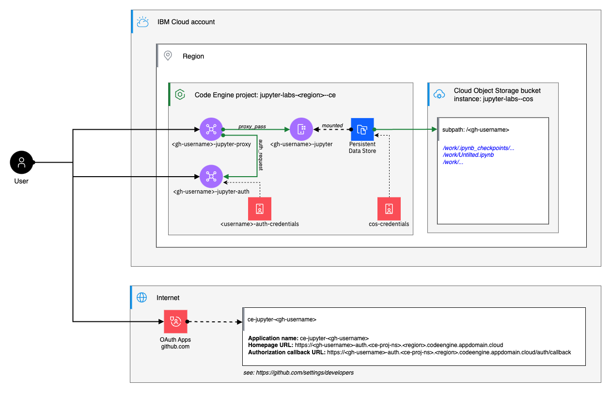

# JupyterLab Sample

This example demonstrates how to deploy JupyterLab on IBM Cloud Code Engine. 

The example comprises of 
- OIDC SSO based on GitHub "OAuth apps"
- State of all JupyterLabs is being stored in Cloud Object Storage 
- Each user has its own, dedicated Jupyter Notebook instance




## Setting up the example

* Command to initialize the COS instance, the Code Engine project, and the Code Engine persistent data store
```
./run init
```

* Command to add setup a new tenant that provides a dedicated JupyterLab instance
```
./run deploy <gh-username>
```

* Command to remove a tenant 
```
./run remove <gh-username>
```

* Command to purge everything 
```
./run clean
```

* Following environment variables can be used to tweak the run script

| Name | Description | Default value |
|:----|:---|:---|
| COS_INSTANCE_NAME | Set the name of the COS instance that should host all buckets to persist user data  | `jupyter-labs--cos` |
| REGION | Region of the Code Engine project | `eu-es` |
| RESOURCE_GROUP_NAME | Set the name of the resource group that should contain all artifacts created by this example | `jupyter-labs--rg` |
| VERBOSE | Determine whether debug output should be rendered, or not  | `false` |

