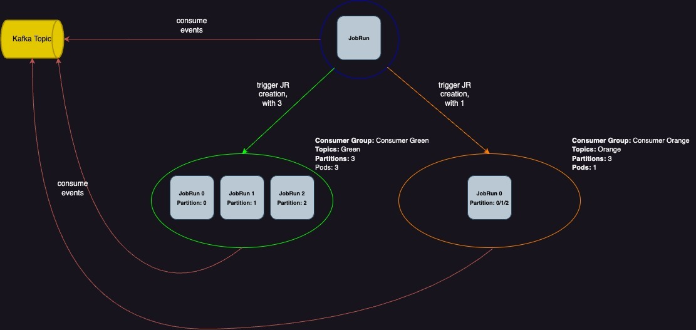

# Kafka Observer

## Introduction

This sample demonstrates how you can use IBM Cloud Code Engine to consume streams of messages from an Apache Kafka Service, such as IBM Cloud Event Streams.

The architecture of this sample consists of an **observer** and a **consumer**, implementing a _wake-up_ mechanism, that provides an efficient and serverless way for your Kafka consumers to run.

See the following diagram:



### Observer

The **observer** is a Code Engine Job operating in Daemonset mode. At runtime, it dynamically creates a new consumer group based on provided Kafka Broker addresses and configurations (_including Kafka Topics_), persistently waiting for incoming messages to be claimed from a Kafka Broker.

When a new message is claimed from a specific Kafka Topic, the **observer** wakes-up the corresponding **consumer** Job, by submitting a JobRun. The decision on which **consumer** Job to wake-up depends on the Topic the **consumer** Job is using. This wake-up mechanism allows **consumer** Jobs to only run when needed, optimizing resource consumption in a serverless fashion.


### Consumer

The **consumer** is a Code Engine Job operating in Daemonset mode. Unlike the observer, the **consumer** runs only in response to incoming messages within the desired Kafka Topics. Once running, it will gracefully shutdown within one minute, if none further messages are claimed.

In this sample, we provided a native Kafka client implementation written in Go. Code Engine users can opt-in for other native clients using different runtimes, such as Java, when implementing their **consumer** logic.


## Requirements

To successfully run this sample, some resources are required in advance and some mandatory input data.

### IBM Cloud Resources:

We require a Kafka Service for producing and consuming events, and a Code Engine Project, to deploy our observer pattern:

- An [IBM Cloud Events streams](https://cloud.ibm.com/eventstreams-provisioning/6a7f4e38-f218-48ef-9dd2-df408747568e/create) instance. The ES instance should have the following topics:
  - `payments` Topic with `4` partitions.
  - `shipping` Topic with `3` partitions.

- An [IBM Cloud Codeengine project](https://cloud.ibm.com/docs/codeengine?topic=codeengine-manage-project#create-a-project).

- An application producing Kafka messages is required. You can easily create one within your Code Engine Project. See our [tutorial](https://cloud.ibm.com/docs/codeengine?topic=codeengine-subscribe-kafka-tutorial).

### Input Data

Before running the sample `run.sh` script, a user must define a set of environment variables locally, for proper authentication and creation of additional resources:

- `IAM_API_KEY`: Required for the **observer** to authenticate to the CE Project. See the [docs](https://cloud.ibm.com/docs/account?topic=account-manapikey)
- `ES_SERVICE_INSTANCE`: Required for the run.sh script, to identify the Event Streams instance name to use, in order to bind it to the Code Engine **observer** and **consumer** Jobs. This allow the JobRuns to automatically get all authentication data of the Event Streams instance at runtime.

## Observer to Consumer Mapping

Prior to running our Code Engine sample, we must establish the relationship between the **observer**, **consumers** and Kafka. For the sample, this is already done for you, but here we explain the rational.

The mapping is defined via the following [kafkadata](resources/kafkadata) file, which is embedded into a configmap later and mounted into our **observer** Pod as an environment variable:

```yaml
payments:
  partitions: 4
  jobs:
    - payments-consumer
shipping:
  partitions: 3
  jobs:
    - shipping-consumer
```

The above is explained as follows:
- `.payments` and `.shipping` correspond to the existing Topics of interest within the same Kafka instance.
- `.payments.partitions` and `.shipping.partitions` correspond to the partition size of the Kafka Topics.
- `.payments.jobs` and `.shipping.jobs` correspond to the CodeEngine **consumer** Jobs that want to consume messages from the related Kafka Topic.

As an example, if you have one single Topic `foobar` with `2` partitions and you want CE Job `foobar-consumer` to consume from it, this is how the `kafkadata` file will look:

```yaml
foobar:
  partitions: 2
  jobs:
    - foobar-consumer
```

## Running the Sample

1. Login to IBM Cloud

```
ibmcloud login --apikey <IBMCLOUD_API_KEY> -r <REGION_OF_CE_PROJECT> -g <RESOURCE_GROUP>
```

2. Select the Code Engine Project.
```
ibmcloud ce project select --name <CE_PROJECT_NAME>
```

3. Execute `run.sh` file
```
./run.sh
```

Once you execute `run.sh`, the script will create the necessary resources in your Code Engine Project. For this sample, you will see three different Jobs, one for the **observer** and two for the **consumers**. In addition, the **observer** Jobrun will be up and running.

Now you can send messages using your producer to the Kafka Topics. The **observer** will watch for messages and will submit the corresponding **consumer** JobRuns based on the configuration in the [kafkadata](resources/kafkadata) file.

4. You can clean the resources in the Code Engine Project as part of this sample, as follows:

```
./run.sh clean
```