# IBM Cloud Code Engine - Metrics Collector

Code Engine job that demonstrates how to collect resource metrics (CPU, memory and disk usage) of running Code Engine apps, jobs, and builds

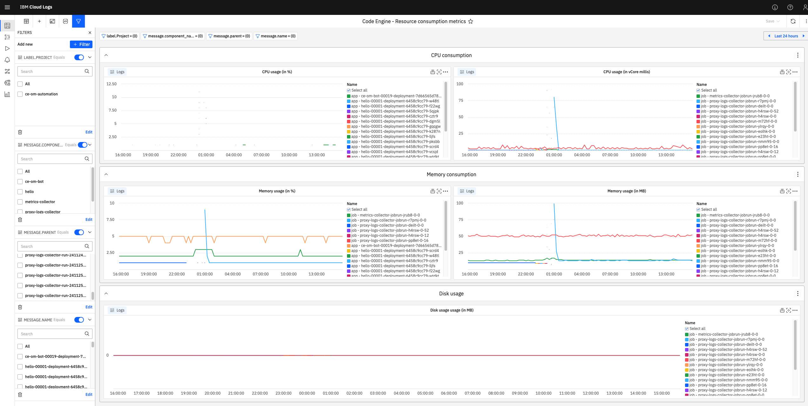

## Installation

### Capture metrics every n seconds

* Create Code Engine job template
```
$ ibmcloud ce job create \
    --name metrics-collector \
    --src . \
    --mode daemon \
    --cpu 0.25 \
    --memory 0.5G \
    --wait
```

* Submit a daemon job that collects metrics in an endless loop. The daemon job queries the Metrics API every 30 seconds
```
$ ibmcloud ce jobrun submit \
    --job metrics-collector \
    --env INTERVAL=30 
```


### Capture metrics every n minutes

* Create Code Engine job template
```
$ ibmcloud ce job create \
    --name metrics-collector \
    --src . \
    --mode task \
    --cpu 0.25 \
    --memory 0.5G \
    --wait
```

* Submit a Code Engine cron subscription that triggers the metrics collector every minute to query the Metrics API
```
$ ibmcloud ce subscription cron create \
    --name collect-metrics-every-minute \
    --destination-type job \
    --destination metrics-collector \
    --schedule '*/1 * * * *'
```

## Configuration

Per default the metrics collector collects memory and CPU statistics, like `usage`, `current` and `configured`. 

One can use the environment variable `COLLECT_DISKUSAGE=true` to also collect the amount of disk space that is used. Please note, the metrics collector can only calculate the overall file size stored in the pods filesystem which includes files that are part of the container image, the epheremal storage as well as mounted COS buckets. Hence, this metric cannot be used to calculate the ephemeral storage usage. 

## IBM Cloud Logs setup

Once your IBM Cloud Code Engine project has detected a corresponding IBM Cloud Logs instance, which is configured to receive platform logs, you can consume the resource metrics in IBM Cloud Logs. Use the filter `metric:instance-resources` to filter for log lines that print resource metrics for each detected IBM Cloud Code Engine instance that is running in a project.

### Custom dashboard

Follow the steps below to create a custom dashboard in your IBM Cloud Logs instance, to gain insights into resource consumption metrics.


**Setup instructions:**

* Navigate to the "Custom dashboards" view, hover of the "New" button, and click "Import dashboard"

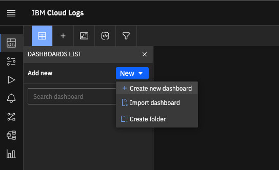

* In the "Import" modal, select the file [./setup/dashboard-code_engine_resource_consumption_metrics.json](./setup/dashboard-code_engine_resource_consumption_metrics.json) located in this repository, and click "Import"

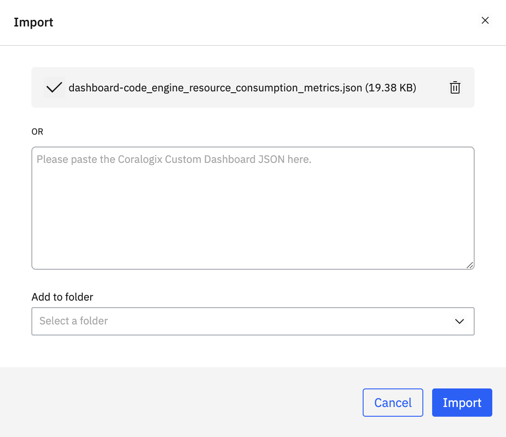

* Confirm the import by clicking "Import" again


### Logs view

Follow the steps below to create a Logs view in your IBM Cloud Logs instance, that allows you to drill into individual instance-resources log lines.


**Setup instructions:**

* Filter only log lines related collected istio-proxy logs, by filtering for the following query
```
app:"codeengine" AND message.metric:"instance-resources"
```

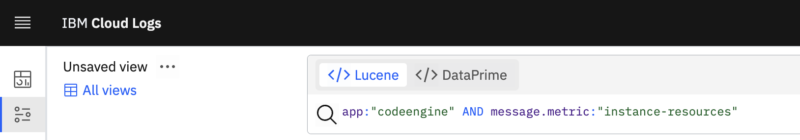

* In the left bar, click "Add Filter" and add the following filters
    * `Application`
    * `App`
    * `Label.Project`
    * `Message.Component_name`

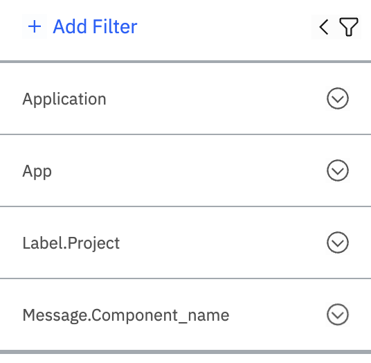

* In the top-right corner, click on "Columns" and configure the following columns:
    * `Timestamp`
    * `label.Project`
    * `message.component_type`
    * `message.component_name`
    * `message.message`
    * `Text`

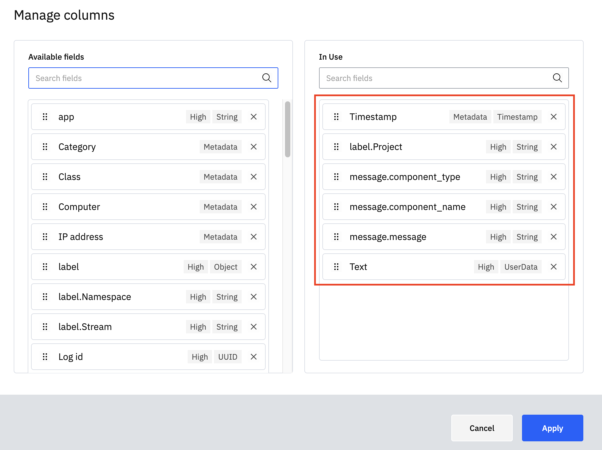

* Once applied adjust the column widths appropriately

* In the top-right corner, select `1-line` as view mode


* In the graph title it says "**Count** all grouped by **Severity**". Click on `Severity` and select `message.component_name` instead. Furthermore, select `Max` as aggregation metric and choose `message.memory.usage` as aggregation field

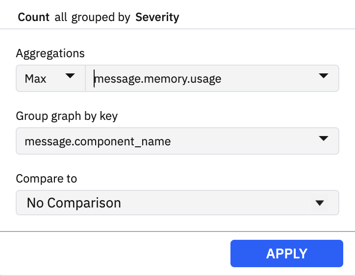

* Save the view

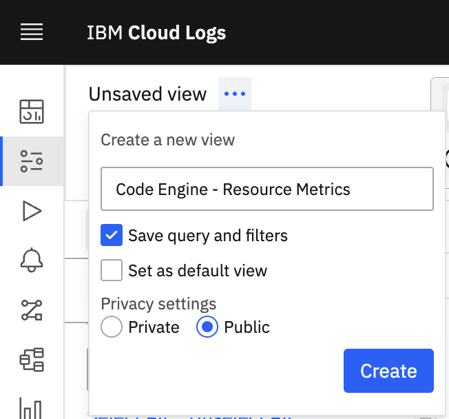

* Utilize the custom logs view to drill into HTTP requests


## IBM Log Analysis setup (deprecated)

### Log lines

Along with a human readable message, like `Captured metrics of app instance 'load-generator-00001-deployment-677d5b7754-ktcf6': 3m vCPU, 109 MB memory, 50 MB ephemeral storage`, each log line passes specific resource utilization details in a structured way allowing to apply advanced filters on them.

E.g.
- `cpu.usage:>80`: Filter for all log lines that noticed a CPU utilization of 80% or higher
- `memory.current:>1000`: Filter for all log lines that noticed an instance that used 1GB or higher of memory
- `component_type:app`: Filter only for app instances. Possible values are `app`, `job`, and `build`
- `component_name:<app-name>`: Filter for all instances of a specific app, job, or build
- `name:<instance-name>`: Filter for a specific instance

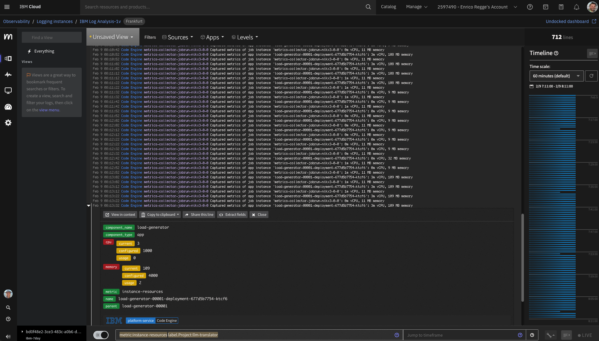

### Log graphs

Best is to create IBM Cloud Logs Board, in order to visualize the CPU and Memory usage per Code Engine component.

1. In your log instance navigate to Boards
1. Give it a proper name, enter `metric:instance-resources` as query and submit by clicking `Add Graph`
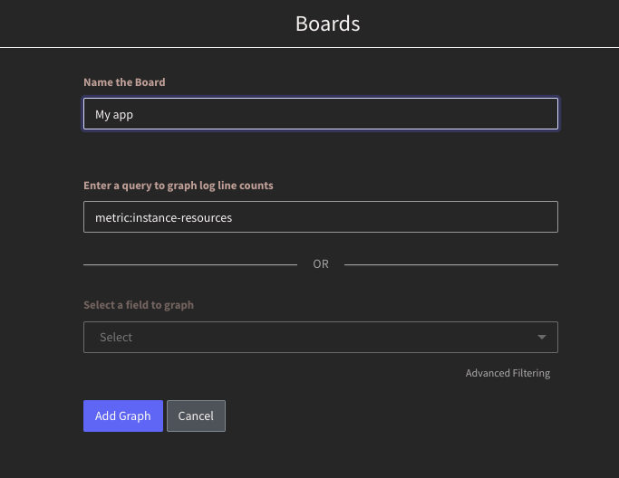
1. Now the graph shows the overall amount of logs captured for the specified query per time interval
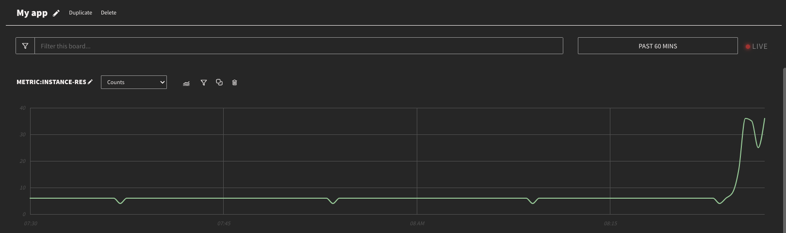
1. Click on the filter icon above the graph and put in `metric:instance-resources AND component_name:<app-name>`
1. Switch the metric of the Graph to `Maximums`
1. Below the graph Add a new plot`cpu.usage` as field and choose `ANY` as field values
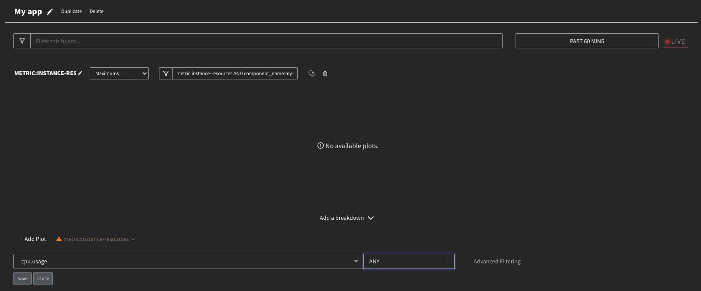
1. Add another plot for the field `memory.usage` and values `ANY`
1. Finally delete the plot `metrics:instance-resources` and adjust the plot colors to your likings
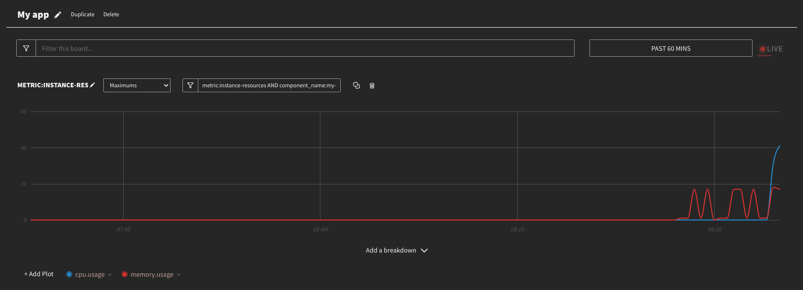
1. The usage graph above renders the utilization in % of the CPU and Memory

#### Add CPU utilization
1. Duplicate the graph, change its name to CPU and replace its plots with `cpu.configured` and `cpu.current`.
- The resulting graph will render the actual CPU usage compared to the configured limit. The the unit is milli vCPUs (1000 -> 1 vCPU).
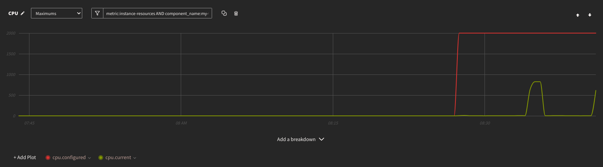


#### Add memory utilization
1. Duplicate the graph, change its name to Memory and replace its plots with `memory.configured` and `memory.current`.
1. The resulting graph will render the actual memory usage compared to the configured limit. The the unit is MB (1000 -> 1 GB).
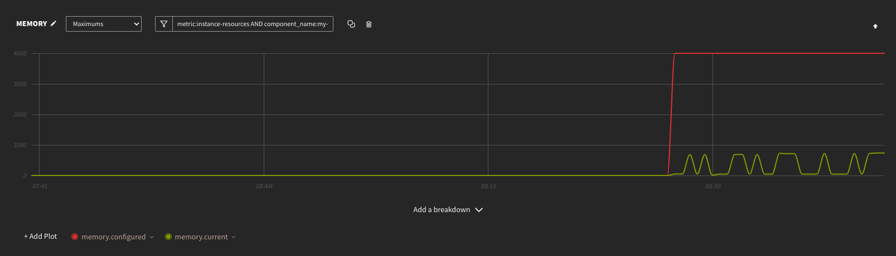


#### Add disk utilization
1. Duplicate the graph or create a new one, change its name to "Disk usage" and replace its plots with `disk_usage.current`.
1. The resulting graph will render the actual disk usage. While this does not allow to identify the usage of disk space compared with the configured ephemeral storage limit, this graph gives an impression on whether the disk usage is growing over time. The the unit is MB (1000 -> 1 GB).


