# IBM Cloud Code Engine - Metrics Collector

Code Engine job that demonstrates how to collect resource metrics (CPU, memory and disk usage) of running Code Engine apps, jobs, and builds

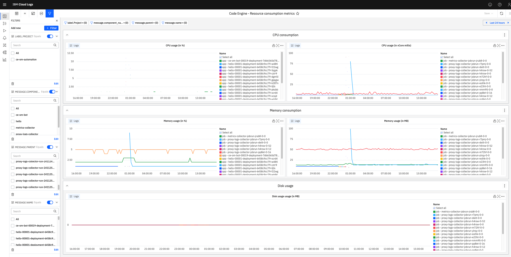

## Installation

## Capture metrics every n seconds

* Create Code Engine job template
```
$ ibmcloud ce job create \
    --name metrics-collector \
    --src . \
    --mode daemon \
    --cpu 0.25 \
    --memory 0.5G \
    --wait
```

* Submit a daemon job that collects metrics in an endless loop. The daemon job queries the Metrics API every 30 seconds
```
$ ibmcloud ce jobrun submit \
    --job metrics-collector \
    --env INTERVAL=30 
```


## Send metrics to IBM Cloud Monitoring

When `METRICS_ENABLED=true`, the metrics collector runs an embedded Prometheus agent that scrapes metrics from the local `/metrics` endpoint and forwards them to IBM Cloud Monitoring.

### Prerequisites

1. **IBM Cloud Monitoring Instance**: You need an IBM Cloud Monitoring instance with an API key
2. **Code Engine project**: The collector must run in a Code Engine project

### Setup Instructions

**Step 1: Create a secret with your IBM Cloud Monitoring API key**
```bash
ibmcloud ce secret create --name monitoring-apikey --from-literal monitoring-apikey=<YOUR_IBM_CLOUD_MONITORING_API_KEY>
```

**Step 2: Determine your IBM Cloud Monitoring ingestion endpoint**

The `METRICS_REMOTE_WRITE_FQDN` depends on your IBM Cloud Monitoring instance region:
- **US South (Dallas)**: `ingest.prws.us-south.monitoring.cloud.ibm.com`
- **US East (Washington DC)**: `ingest.prws.us-east.monitoring.cloud.ibm.com`
- **EU Central (Frankfurt)**: `ingest.prws.eu-de.monitoring.cloud.ibm.com`
- **EU GB (London)**: `ingest.prws.eu-gb.monitoring.cloud.ibm.com`
- **JP Tokyo**: `ingest.prws.jp-tok.monitoring.cloud.ibm.com`
- **AU Sydney**: `ingest.prws.au-syd.monitoring.cloud.ibm.com`

**Step 3: Update your job with the required configuration**
```bash
ibmcloud ce job create \
    --name metrics-collector \
    --src "." \
    --mode daemon \
    --cpu 0.25 \
    --memory 0.5G \
    --build-size xlarge \
    --env INTERVAL=30 \
    --env METRICS_ENABLED=true \
    --env METRICS_REMOTE_WRITE_FQDN=ingest.prws.eu-es.monitoring.cloud.ibm.com \
    --mount-secret /etc/secrets=monitoring-apikey
```

**Step 4: Submit a job run**
```bash
ibmcloud ce jobrun submit \
    --job metrics-collector
```

### How It Works

1. The metrics collector exposes Prometheus metrics on `localhost:9100/metrics`
2. The embedded Prometheus agent scrapes these metrics every 15 seconds
3. The agent also discovers and scrapes pods with the `codeengine.cloud.ibm.com/userMetricsScrape: 'true'` annotation
4. All metrics are forwarded to IBM Cloud Monitoring via remote write
5. If either the collector or Prometheus agent crashes, the container exits with a non-zero code to trigger a restart

### Required Environment Variables for Prometheus Integration

- **`METRICS_ENABLED=true`**: Enables the Prometheus agent
- **`METRICS_REMOTE_WRITE_FQDN`**: IBM Cloud Monitoring ingestion endpoint FQDN (required when `METRICS_ENABLED=true`)
- **Secret Mount**: `/etc/secrets/monitoring-apikey` must contain your IBM Cloud Monitoring API key

### Troubleshooting

If the container fails to start with `METRICS_ENABLED=true`, check the logs for:
- Missing `/etc/secrets/monitoring-apikey` file
- Missing `METRICS_REMOTE_WRITE_FQDN` environment variable

## Configuration

Per default the metrics collector collects memory and CPU statistics, like `usage`, `current` and `configured`.

### Environment Variables

- **`INTERVAL`** (default: `30`): Collection interval in seconds (minimum 30 seconds). Controls how frequently metrics are collected in daemon mode.
- **`COLLECT_DISKUSAGE`** (default: `false`): Set to `true` to collect disk space usage. Note: The metrics collector calculates the overall file size stored in the pod's filesystem, which includes files from the container image, ephemeral storage, and mounted COS buckets. This metric cannot be used to calculate ephemeral storage usage alone.
- **`METRICS_ENABLED`** (default: `false`): Set to `true` to enable the HTTP metrics server. When disabled, the collector still runs and logs metrics to stdout but does not expose the HTTP endpoint.
- **`METRICS_PORT`** (default: `9100`): HTTP server port for the Prometheus metrics endpoint. Only used when `METRICS_ENABLED=true` in daemon mode.

## Prometheus Metrics Endpoint

When running in **daemon mode** with **`METRICS_ENABLED=true`**, the metrics collector exposes an HTTP server on port 9100 (configurable via `METRICS_PORT`) with a `/metrics` endpoint that provides Prometheus-compatible metrics.

**Note**: The HTTP server is only started when `METRICS_ENABLED=true`. When disabled, the collector continues to run and log metrics to stdout in JSON format, but does not expose the HTTP endpoint.

### Accessing the Metrics Endpoint

The metrics endpoint is available at `http://<pod-ip>:9100/metrics` and can be scraped by Prometheus or accessed directly.

### Exposed Metrics

The following Prometheus metrics are exposed as gauges:

#### Container Metrics
- **`ibm_codeengine_instance_cpu_usage_millicores`**: Current CPU usage in millicores
- **`ibm_codeengine_instance_cpu_limit_millicores`**: Configured CPU limit in millicores
- **`ibm_codeengine_instance_memory_usage_bytes`**: Current memory usage in bytes
- **`ibm_codeengine_instance_memory_limit_bytes`**: Configured memory limit in bytes
- **`ibm_codeengine_instance_ephemeral_storage_usage_bytes`**: Current ephemeral storage usage in bytes (if `COLLECT_DISKUSAGE=true`)

#### Collector Self-Monitoring Metrics
The following 3 metrics are used to monitor the collector itself:
- **`ibm_codeengine_collector_collection_duration_seconds`**: Time taken to collect metrics in seconds (if `METRICS_INTERNAL_STATS=true`)
- **`ibm_codeengine_collector_last_collection_timestamp_seconds`**: Unix timestamp of last successful collection (if `METRICS_INTERNAL_STATS=true`)
- **`ibm_codeengine_collector_collection_errors_total`**: Total number of collection errors (counter) (if `METRICS_INTERNAL_STATS=true`)

### Metric Labels

All container metrics include the following labels:
- `instance_name`: Name of the pod instance
- `component_type`: Type of component (`app`, `job`, or `build`)
- `component_name`: Name of the Code Engine component

### Example Metrics Output

```prometheus
# HELP ibm_codeengine_instance_cpu_usage_millicores Current CPU usage in millicores
# TYPE ibm_codeengine_instance_cpu_usage_millicores gauge
ibm_codeengine_instance_cpu_usage_millicores{pod_name="myapp-00001-deployment-abc123",component_type="app",component_name="myapp"} 250

# HELP ibm_codeengine_instance_memory_usage_bytes Current memory usage in bytes
# TYPE ibm_codeengine_instance_memory_usage_bytes gauge
ibm_codeengine_instance_memory_usage_bytes{pod_name="myapp-00001-deployment-abc123",component_type="app",component_name="myapp"} 134217728
```

### Prometheus Scrape Configuration

**Note**: The HTTP server is only started when `METRICS_ENABLED=true` and running in daemon mode (`JOB_MODE != "task"`). In task mode, metrics are collected once and logged to stdout without starting the HTTP server. When `METRICS_ENABLED` is not set to `true`, the collector runs in daemon mode but only logs metrics to stdout without exposing the HTTP endpoint.

## IBM Cloud Logs setup

Once your IBM Cloud Code Engine project has detected a corresponding IBM Cloud Logs instance, which is configured to receive platform logs, you can consume the resource metrics in IBM Cloud Logs. Use the filter `metric:instance-resources` to filter for log lines that print resource metrics for each detected IBM Cloud Code Engine instance that is running in a project.

### Custom dashboard

Follow the steps below to create a custom dashboard in your IBM Cloud Logs instance, to gain insights into resource consumption metrics.


**Setup instructions:**

* Navigate to the "Custom dashboards" view, hover of the "New" button, and click "Import dashboard"

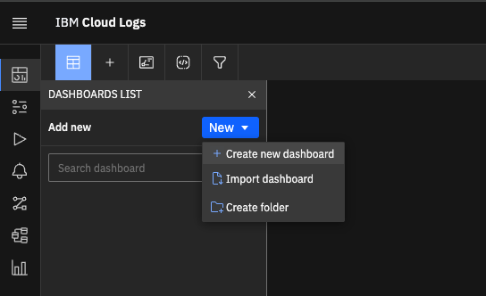

* In the "Import" modal, select the file [./setup/ibm-cloud-logs/dashboard-code_engine_resource_consumption_metrics.json](./setup/ibm-cloud-logs/dashboard-code_engine_resource_consumption_metrics.json) located in this repository, and click "Import"

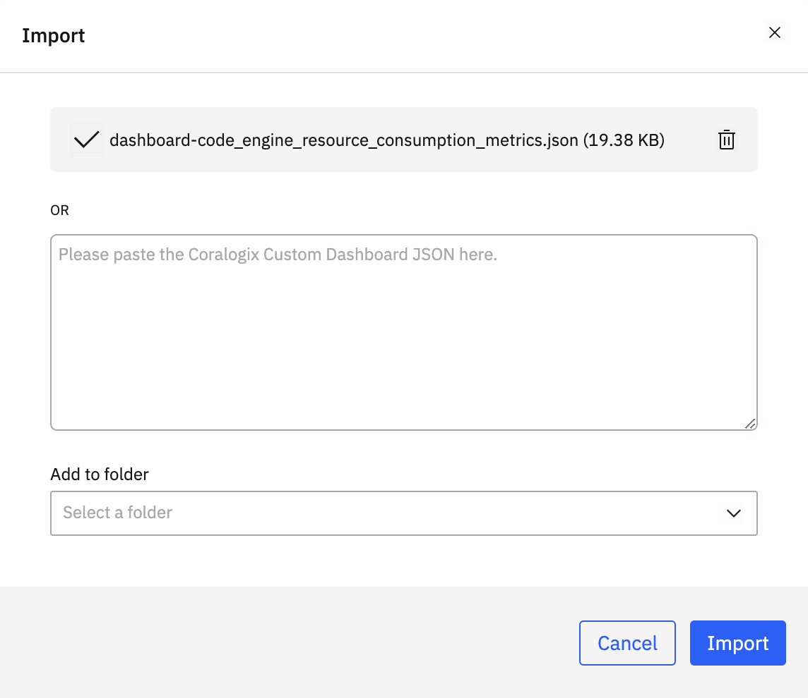

* Confirm the import by clicking "Import" again

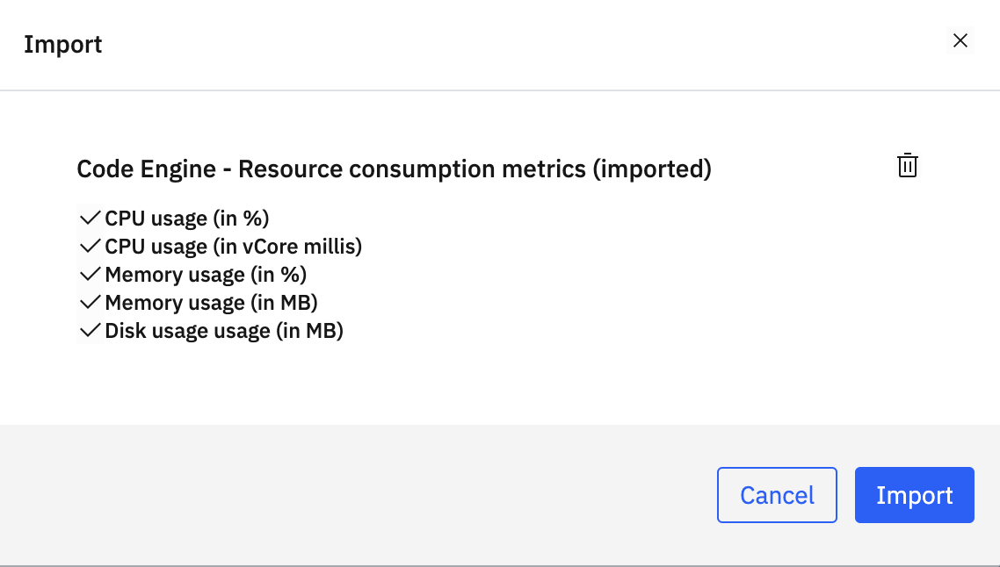


### Logs view

Follow the steps below to create a Logs view in your IBM Cloud Logs instance, that allows you to drill into individual instance-resources log lines.

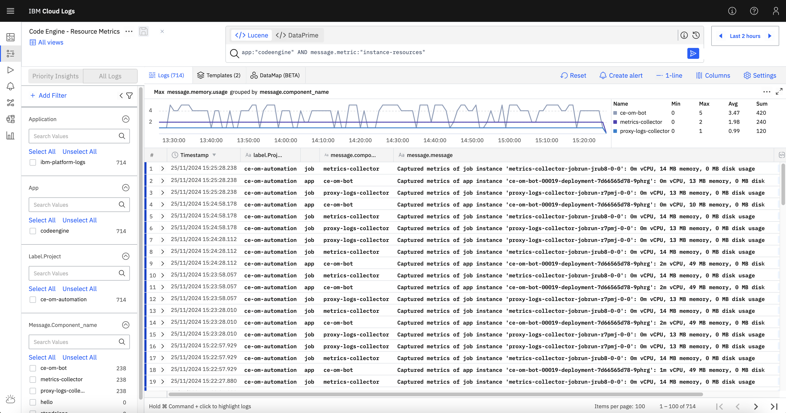

**Setup instructions:**

* Filter only log lines related collected istio-proxy logs, by filtering for the following query
```
app:"codeengine" AND message.metric:"instance-resources"
```

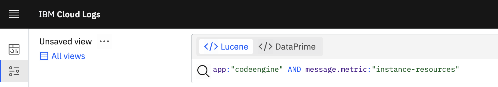

* In the left bar, click "Add Filter" and add the following filters
    * `Application`
    * `App`
    * `Label.Project`
    * `Message.Component_name`

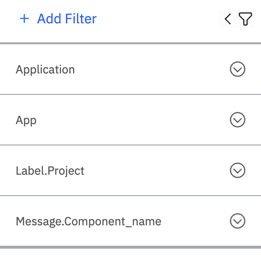

* In the top-right corner, click on "Columns" and configure the following columns:
    * `Timestamp`
    * `label.Project`
    * `message.component_type`
    * `message.component_name`
    * `message.message`
    * `Text`

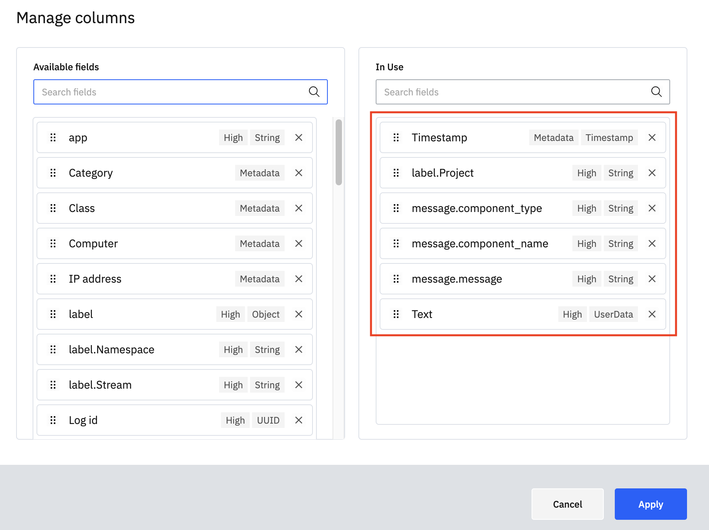

* Once applied adjust the column widths appropriately

* In the top-right corner, select `1-line` as view mode


* In the graph title it says "**Count** all grouped by **Severity**". Click on `Severity` and select `message.component_name` instead. Furthermore, select `Max` as aggregation metric and choose `message.memory.usage` as aggregation field

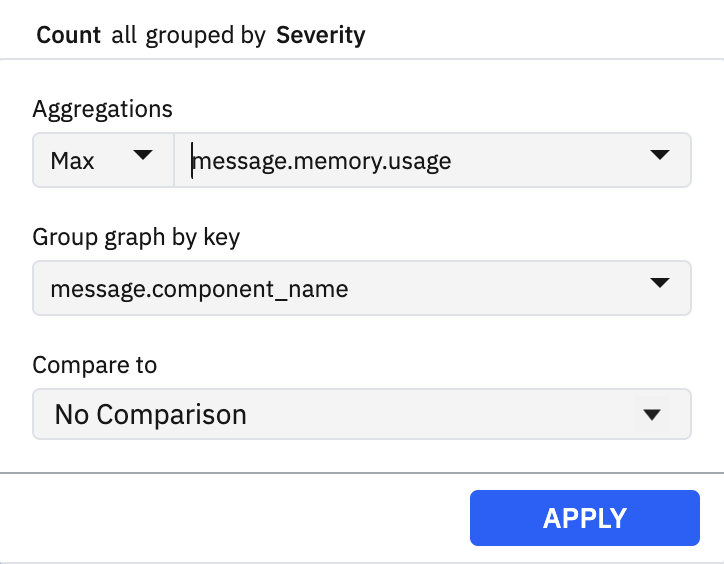

* Save the view

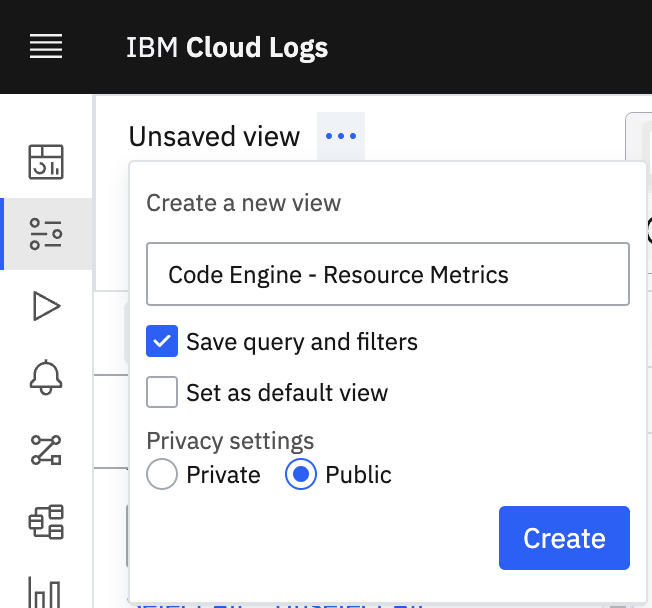

* Utilize the custom logs view to drill into HTTP requests


### Log graphs

Best is to create IBM Cloud Logs Board, in order to visualize the CPU and Memory usage per Code Engine component.

1. In your log instance navigate to Boards
1. Give it a proper name, enter `metric:instance-resources` as query and submit by clicking `Add Graph`
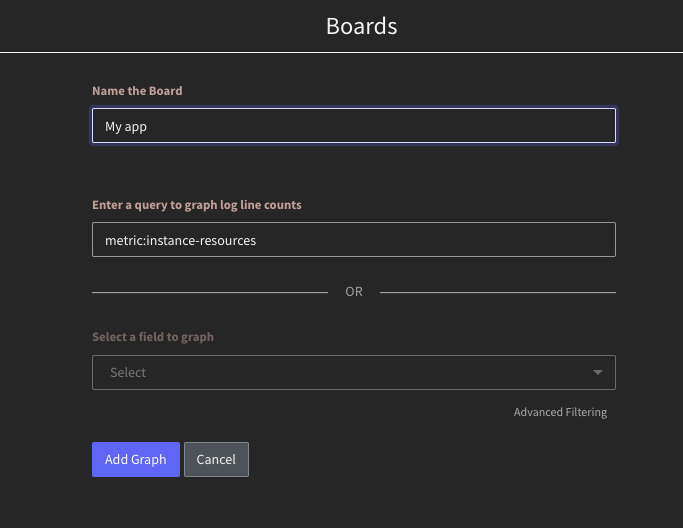
1. Now the graph shows the overall amount of logs captured for the specified query per time interval
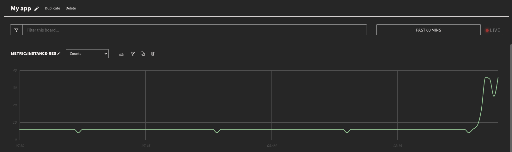
1. Click on the filter icon above the graph and put in `metric:instance-resources AND component_name:<app-name>`
1. Switch the metric of the Graph to `Maximums`
1. Below the graph Add a new plot`cpu.usage` as field and choose `ANY` as field values
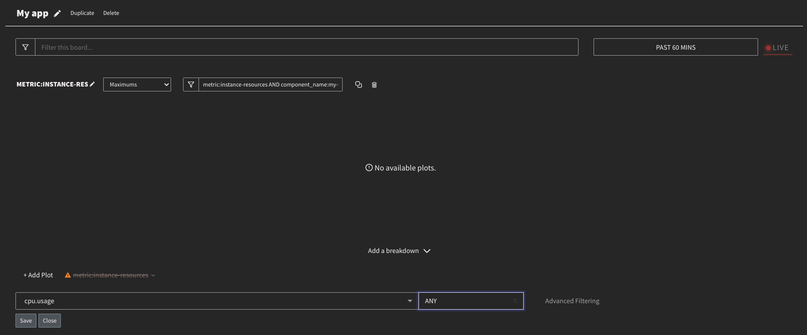
1. Add another plot for the field `memory.usage` and values `ANY`
1. Finally delete the plot `metrics:instance-resources` and adjust the plot colors to your likings
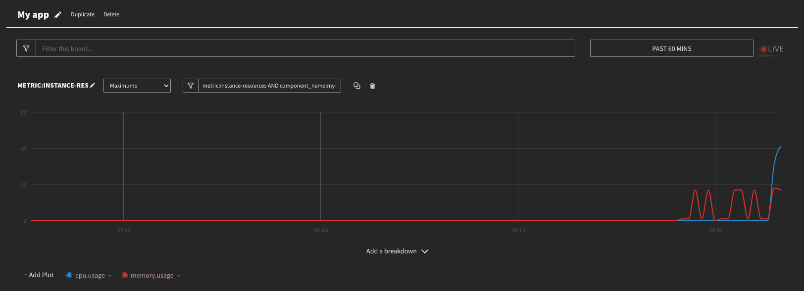
1. The usage graph above renders the utilization in % of the CPU and Memory

#### Add CPU utilization
1. Duplicate the graph, change its name to CPU and replace its plots with `cpu.configured` and `cpu.current`.
- The resulting graph will render the actual CPU usage compared to the configured limit. The the unit is milli vCPUs (1000 -> 1 vCPU).
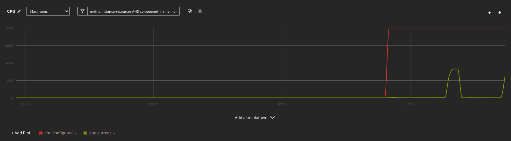

#### Add memory utilization
1. Duplicate the graph, change its name to Memory and replace its plots with `memory.configured` and `memory.current`.
1. The resulting graph will render the actual memory usage compared to the configured limit. The the unit is MB (1000 -> 1 GB).
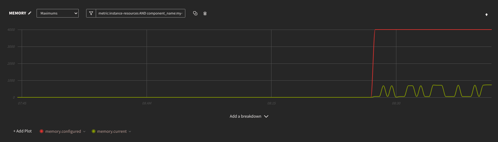

#### Add disk utilization
1. Duplicate the graph or create a new one, change its name to "Disk usage" and replace its plots with `disk_usage.current`.
1. The resulting graph will render the actual disk usage. While this does not allow to identify the usage of disk space compared with the configured ephemeral storage limit, this graph gives an impression on whether the disk usage is growing over time. The the unit is MB (1000 -> 1 GB).


