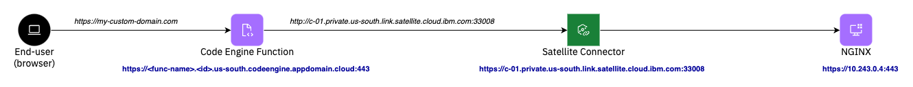
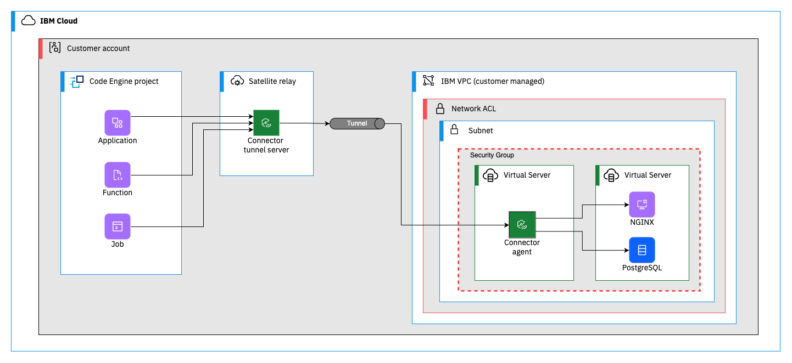

# Connect your Code Engine workload to IBM VPC infrastructure using Satellite Connector

The script provided in this folder installs an end-to-end working solution, which showcases how workload deployed on IBM Cloud Code Engine can connect to backends (e.g. databases, nginx) hosted on IBM VPC infrastructure.

Mainly, this sample covers the following two typical use cases:
1. As a user I want to expose my API backend, that requires specialized hardware and is therefore deployed on VPC VSI, through a frontend app deployed on Code Engine, which provides a secure and reliable HTTPS endpoint and adds advanced scaling and caching capabilities.
2. As a user I want to access my database backend on TCP port XYZ from workload deployed on Code Engine, without exposing my VPC to the public internet.

**Use case: HTTP proxy**

To simulate the HTTP proxy use case the script deploys a NGINX server on the origin server VSI and a simple Code Engine function (see [Node.js source code](./ce-function/index.js)). The purpose of the function is to proxy the payload sent by NGINX server. To keep the sample installation simple, the NGINX server does not expose a TLS/SSL endpoint. With minor adjustments this setup would also work, if NGINX would expose an HTTPS endpoint. The request flow looks as depicted in the diagram below:



_Please note: The custom domain mentioned in the flow is not part of this scripted sample, but is a worthful addition in real-world solutions. Custom domains can be easily configured through Code Engine domain mappings (see https://cloud.ibm.com/docs/codeengine?topic=codeengine-fun-domainmapping for further information)_

**Use case: Database backend**

To simulate the database use case the script deploys a PostgreSQL database on the origin server VSI, a Code Engine app (see [Golang source code](./ce-app/main.go)), and a Code Engine job (see [Node.js source code](./ce-job/job.mjs)). Each job run instance will issue a single SQL insert statement storing a random greeting message in the database. The purpose of the application is to query all existing records and expose them as a JSON object through its HTTPS endpoint. The request flows look as depicted in the diagram below:


_Please note: The custom domain mentioned in the flow is not part of this scripted sample, but is a worthful addition in real-world solutions. Custom domains can be easily configured through Code Engine domain mappings (see https://cloud.ibm.com/docs/codeengine?topic=codeengine-app-domainmapping for further information)_

Following diagram depicts the component overview of the sample solution:


To learn more about Satellite Connector, please refer to https://cloud.ibm.com/docs/satellite?topic=satellite-understand-connectors&interface=ui

## Lets get started

To run this end-to-end sample, open a terminal, [login into your IBM Cloud account using the IBM Cloud CLI](https://cloud.ibm.com/docs/codeengine?topic=codeengine-install-cli) and execute the following command:
```
./run
```

The script deletes all created resources right after the sample scenario has been verified by the script. However, for playing around with the setup, the cleanup can be skipped using the environment variable `CLEANUP_ON_SUCCESS`:
```
CLEANUP_ON_SUCCESS=false ./run
```

Per default, the script will tear up all resources in the IBM Cloud location Washington (`us-east`). To change the region, utilize the environment variable `REGION`
```
REGION=eu-de ./run
```

To adjust naming of all IBM Cloud resources, the following environment variable `NAME_PREFIX`can be overriden (default: `ce-to-private-vsi`): 
```
NAME_PREFIX=my-prefix ./run
```

To analyze issues that may appear in your account, it could be useful to skip the deletion of IBM Cloud resources by setting environment variable `CLEANUP_ON_ERROR` to `false`:
```
CLEANUP_ON_ERROR=false ./run
```

To clean up all IBM Cloud resources, that have been created as part of the provided script, run:
```
./run clean
```

In order to connect to the VSI via ssh, you can specify the name of an VPC SSH key using the env variable `VPC_SSH_KEY` to configured enroll it on the created VSI. Furthermore, you'll need to set the env variable `DEBUG=true`, which will make sure that the VPC Floating IP will remain attached to the originserver VSI.

```
VPC_SSH_KEY=<name-of-ssh-key> DEBUG=true CLEANUP_ON_SUCCESS=false ./run
```
