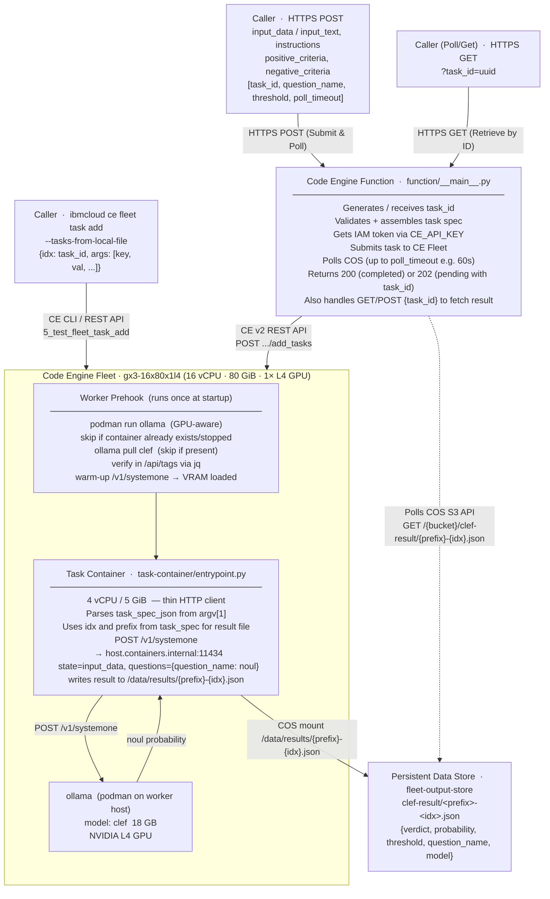

# clef-classification-fleet-functions

Generic **decision classification** using **IBM Code Engine Fleets** and a **Code Engine Function**.  
The [clef](https://ollama.com/library/clef) decision model runs inside [ollama](https://ollama.com),
started automatically on each fleet worker via a prehook. Pass any `input_data`, an `instructions`
question, and `positive`/`negative` criteria — clef returns a probability and a boolean verdict.

Built for any classification use case: spam detection, content moderation, ticket routing,
policy checks, document field extraction, and more.

All scripts use sane defaults and are configured entirely via **environment variables** (no CLI argument flags needed).

---

## Architecture



---

## Files

| File | Purpose |
|------|---------|
| `1_build_task_image` | Builds the fleet task container image from `task-container/` via Code Engine buildrun |
| `2_create_clef_fleet` | Creates the CE GPU fleet — starts ollama + clef via prehook |
| `3_deploy_function` | Deploys the Python function from `function/` with secrets, COS config, and fleet ID |
| `4_test_classify_fn` | Tests classification via Code Engine Function (synchronous polling or async result retrieval) |
| `5_test_fleet_task_add` | Submits classification tasks directly to the CE Fleet via CLI (`ibmcloud ce fleet task add`) |
| `task-container/Dockerfile` | Fleet task image definition — ubi-minimal + curl + python3 |
| `task-container/entrypoint.py` | Task entrypoint — executes clef classification and writes to `/data/results/<prefix>-<idx>.json` |
| `function/__main__.py` | CE Python function — handles plain text inputs, task submission, COS polling, and ID retrieval |

---

## Prerequisites

- IBM Cloud CLI with Code Engine plugin  
  `ibmcloud plugin install code-engine`
- A Code Engine project selected:  
  `ibmcloud ce project select --name <project>`
- Persistent data stores provisioned (e.g. via `init-fleet-sandbox`):  
  `ibmcloud ce pds create --name fleet-task-store ...`  
  `ibmcloud ce pds create --name fleet-output-store ...`
- Subnetpool `fleet-subnetpool` provisioned
- Container registry secret `ce-auto-icr-private-eu-de` (or set `FLEET_REGISTRY_SECRET`)
- An IBM Cloud API key with Code Engine Writer and COS access (set as `CE_API_KEY` or stored in `clef-fn-secrets`)
- Your IBM Container Registry namespace exported:
  `export ICR_NAMESPACE=<your-icr-namespace>`

---

## Step-by-step Setup & Testing

### 1 — Build the task container image

```bash
./1_build_task_image
```

*To override image settings, set environment variables before running (e.g. `FLEET_IMAGE=... ./1_build_task_image`).*

---

### 2 — Create the fleet

```bash
# Default: 1 worker (gx3-16x80x1l4), 1 task at a time, 4 vCPU / 5 GiB per task container
./2_create_clef_fleet

# Or scale out using env vars:
FLEET_MAX_SCALE=3 ./2_create_clef_fleet
```

Export the fleet ID printed by the script:

```bash
export FLEET_ID=<uuid-printed-by-script>
```

---

### 3 — Deploy the Code Engine function

```bash
# Set your API key if the secret doesn't exist yet
export CE_API_KEY="<your-ibmcloud-api-key>"

# Pass FLEET_ID as $1 or set via environment variable:
./3_deploy_function "${FLEET_ID}"
```

*(If `FLEET_ID` is not supplied as `$1` or exported in the environment, `3_deploy_function` attempts to auto-discover the latest clef fleet in the project.)*

---

### 4 — Test via Code Engine Function

```bash
# 1. Synchronous submit & poll (default timeout 60s):
./4_test_classify_fn

# 2. Asynchronous submit (no wait):
POLL_TIMEOUT=0 ./4_test_classify_fn

# 3. Retrieve result by task ID:
MODE=get TASK_ID="<task-id>" ./4_test_classify_fn
```

---

### 5 — Test directly via Fleet CLI (`task add`)

```bash
# Submit task directly to the fleet:
./5_test_fleet_task_add

# Custom text & question:
INPUT_TEXT="Please find attached the invoice for March." \
INSTRUCTIONS="Does this email contain an invoice?" \
POSITIVE_CRITERIA="The message is or contains an invoice." \
NEGATIVE_CRITERIA="The message is not an invoice." \
./5_test_fleet_task_add
```

---

## Usage

### Task spec fields (Function & Task)

| Field | Required | Description |
|-------|----------|-------------|
| `input_data` / `input_text` | ✅ | Plain text content to classify. |
| `instructions` | ✅ | The clef `noul` question — what to decide about the input. |
| `positive_criteria` | ✅ | Description of the TRUE outcome. |
| `negative_criteria` | ✅ | Description of the FALSE outcome. |
| `task_id` / `idx` | optional | Unique ID for the task (used to name the result file in COS `clef-result/<prefix>-<idx>.json`). Generated automatically if omitted. |
| `file_prefix` / `prefix` | optional | Output filename prefix. Default: `"result"`. |
| `question_name` | optional | Key name for the answer in the result JSON. Default: `"result"`. |
| `threshold` | optional | Float 0–1. Probability ≥ threshold → `verdict: true`. Default: `0.5`. |
| `poll_timeout` | optional | Max duration in seconds for the function to poll COS for results. Default: `60`. Set `0` for immediate async return. |

### Result JSON (`/data/results/<prefix>-<idx>.json`)

```json
{
  "verdict": true,
  "probability": 0.94,
  "threshold": 0.5,
  "question_name": "is_spam",
  "instructions": "Is this email spam?",
  "model": "clef",
  "raw_clef": { ... }
}
```

---

### Function HTTP API Examples

#### 1. Submit and wait for result (Sync)

```bash
curl -X POST https://<function-url> \
  -H "Content-Type: application/json" \
  -d '{
    "input_data":        "Congratulations! You have won $1,000,000. Click here to claim!",
    "instructions":      "Is this email spam or a phishing attempt?",
    "positive_criteria": "The message is spam, unsolicited commercial content, or a phishing attempt.",
    "negative_criteria": "The message is a legitimate, non-spam email.",
    "question_name":     "is_spam",
    "poll_timeout":      60
  }'
```

**Response if completed within timeout (HTTP 200 OK):**
```json
{
  "task_id": "a3f5b8c2-4d1e-...",
  "status": "completed",
  "result": {
    "verdict": true,
    "probability": 0.95,
    "threshold": 0.5,
    "question_name": "is_spam",
    "instructions": "Is this email spam or a phishing attempt?",
    "model": "clef"
  }
}
```

**Response if polling timed out (HTTP 202 Accepted):**
```json
{
  "message": "Classification task submitted and in progress",
  "task_id": "a3f5b8c2-4d1e-...",
  "status": "pending",
  "fleet_id": "1a1a1a1a-2b2b-...",
  "question_name": "is_spam",
  "poll_timeout_seconds": 60
}
```

#### 2. Retrieve result by task ID

```bash
curl -X GET "https://<function-url>?task_id=a3f5b8c2-4d1e-..."
```

- **HTTP 200 OK**: Returns the result JSON when ready.
- **HTTP 404 Not Found**: Returns `{"status": "pending_or_not_found"}` if the task is still processing.

---

### Batch task submission via CLI

```bash
cat > /tmp/clef-tasks.jsonl <<'EOF'
{"idx": "task-001", "args": ["input_data", "Buy cheap meds now!", "instructions", "Is this spam?", "positive_criteria", "It is spam.", "negative_criteria", "It is not spam.", "question_name", "is_spam"]}
{"idx": "task-002", "args": ["input_data", "Hi Alice, please review the report.", "instructions", "Is this spam?", "positive_criteria", "It is spam.", "negative_criteria", "It is not spam.", "question_name", "is_spam"]}
EOF

ibmcloud ce fleet task add \
  --fleet-id "${FLEET_ID}" \
  --batch-name "test-batch-1" \
  --tasks-from-local-file /tmp/clef-tasks.jsonl
```

Results will be stored in the COS bucket under `clef-result/result-task-001.json` and `clef-result/result-task-002.json`.

---

## Configuration Reference (Environment Variables)

### Setup & Execution Variables

| Variable | Default | Description |
|----------|---------|-------------|
| `ICR_NAMESPACE` | **required** | Your IBM Container Registry namespace (e.g. `my-org`) |
| `NAME_PREFIX` | `clef-classification` | Prefix for fleet and buildrun names |
| `REGION` | `eu-de` | IBM Cloud region |
| `FLEET_ID` | auto-discovered | Target fleet ID or name |
| `FLEET_TASKS_STATE_STORE` | `fleet-task-store` | Task state persistent data store |
| `FLEET_OUTPUT_STORE` | `fleet-output-store` | Results persistent data store |
| `FLEET_OUTPUT_COS_PATH` | `clef-result` | COS folder subpath for fleet mount |
| `FLEET_SUBNETPOOL` | `fleet-subnetpool` | Subnetpool name |
| `FLEET_IMAGE` | `private.de.icr.io/<ICR_NAMESPACE>/clef-classification-task:latest` | Task container image |
| `FLEET_REGISTRY_SECRET` | `ce-auto-icr-private-eu-de` | Registry pull secret |
| `FLEET_WORKER_PROFILE` | `gx3-16x80x1l4` | Worker VSI profile |
| `FLEET_MAX_SCALE` | `1` | Maximum number of worker nodes |
| `FLEET_SCALE_DOWN_DELAY` | `900` | Scale down delay in seconds (15 minutes) |
| `FLEET_CPU` | `4` | vCPUs per task container |
| `FLEET_MEMORY` | `5G` | Memory per task container |
| `FN_NAME` | `clef-classify-fn` | Code Engine Function name |
| `SECRET_NAME` | `clef-fn-secrets` | Secret holding `CE_API_KEY` |
| `CE_API_KEY` | `""` | IBM Cloud API key for IAM & COS |
| `COS_BUCKET` | `fleet-output-store` | Bucket where task results are stored |
| `COS_PREFIX` | `clef-result` | Folder in COS bucket for results |
| `FILE_PREFIX` | `result` | Filename prefix before `<idx>.json` |
| `COS_ENDPOINT` | `https://s3.direct.eu-de.cloud-object-storage.appdomain.cloud` | COS S3 endpoint URL |
| `POLL_TIMEOUT` | `60` | Maximum seconds to poll COS before returning 202 |

### `task-container/entrypoint.py` — task container environment variables

| Variable | Default | Description |
|----------|---------|-------------|
| `OLLAMA_HOST` | `http://host.containers.internal:11434` | ollama API URL (worker host) |
| `MODEL` | `clef` | ollama model name |
| `RESULTS_DIR` | `/data/results` | Mount path for result output |
| `CLEF_THRESHOLD` | `0.5` | Default probability threshold |
