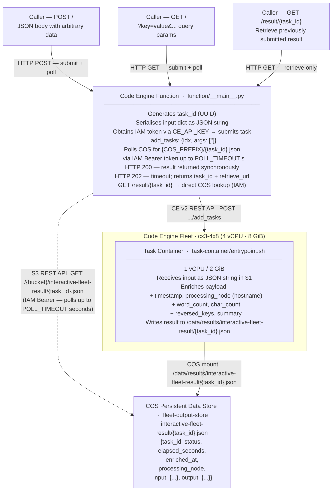

# interactive-fleets

A general-purpose **submit-and-poll** pattern for IBM Code Engine Fleets.
A Code Engine **Function** acts as a synchronous HTTP endpoint. It accepts any JSON data,
dispatches it as a fleet task, polls COS for the result, and returns the enriched output —
or a retrieval URL if the task is still running when the poll window closes.

This sample ships a simple **data enrichment** worker (adds timestamp, hostname,
word/character counts, and reversed key list) as the fleet task. Swap out the
enrichment logic in [`task-container/entrypoint.sh`](task-container/entrypoint.sh)
with any workload: ML inference, document processing, data transformation, etc.

---

## Architecture



---

## Files

| File | Purpose |
|------|---------|
| [`deploy`](deploy) | Single deploy script — builds image, creates fleet, creates secret, deploys function |
| [`task-container/Dockerfile`](task-container/Dockerfile) | Fleet task image — ubi-minimal + bash + jq |
| [`task-container/entrypoint.sh`](task-container/entrypoint.sh) | Enrichment worker — receives argv key-value pairs, writes `/data/results/interactive-fleet-result/{task_id}.json` |
| [`function/__main__.py`](function/__main__.py) | CE Function — routes requests, submits tasks, polls COS, returns results |

---

## Prerequisites

- IBM Cloud CLI with Code Engine plugin  
  ```bash
  ibmcloud plugin install code-engine
  ```
- A Code Engine project selected  
  ```bash
  ibmcloud ce project select --name <project>
  ```
- Persistent data stores provisioned (e.g. via `init-fleet-sandbox`):
  ```bash
  ibmcloud ce pds create --name fleet-task-store ...
  ibmcloud ce pds create --name fleet-output-store ...
  ```
- Subnetpool `fleet-subnetpool` provisioned
- Container registry secret `ce-auto-icr-private-eu-de` (or set `FLEET_REGISTRY_SECRET`)
- Your IBM Container Registry namespace:
  ```bash
  export ICR_NAMESPACE=<your-icr-namespace>
  ```
- An IBM Cloud API key with **Code Engine Writer** and **COS Reader** access:
  ```bash
  export CE_API_KEY=<your-api-key>
  ```

---

## Deployment

```bash
export ICR_NAMESPACE=<your-namespace>
export CE_API_KEY=<your-api-key>

./deploy
```

The script prints the function endpoint at the end. Copy it for the examples below.

```bash
export FN_URL=https://<function-name>.<subdomain>.<region>.codeengine.appdomain.cloud
```

### Deploy options

| Variable | Default | Description |
|---|---|---|
| `SKIP_BUILD=1` | — | Skip image build (reuse existing image) |
| `SKIP_FLEET=1` | — | Skip fleet creation; `FLEET_ID` must be set |
| `SKIP_SECRET=1` | — | Skip secret creation/update |
| `FLEET_MAX_SCALE` | `2` | Maximum fleet worker nodes |
| `POLL_TIMEOUT` | `30` | Seconds the function polls COS before returning 202 |

---

## Usage

### 1. Submit a task and wait for the result (synchronous)

The function submits the task to the fleet, polls COS for up to `POLL_TIMEOUT` seconds,
and returns the enriched result directly when it is ready.

**POST with a JSON body:**

```bash
curl -s -X POST "${FN_URL}" \
  -H "Content-Type: application/json" \
  -d '{
    "name":    "Alice",
    "city":    "Berlin",
    "message": "Hello from interactive-fleets"
  }' | jq .
```

**GET with query parameters:**

```bash
curl -s "${FN_URL}?name=Alice&city=Berlin&message=Hello+from+interactive-fleets" | jq .
```

**HTTP 200 — result available within poll window:**

```json
{
  "task_id": "a3f5b8c2-4d1e-4b5a-9c3f-1e2d3c4b5a6f",
  "status":  "completed",
  "result": {
    "task_id":         "a3f5b8c2-4d1e-4b5a-9c3f-1e2d3c4b5a6f",
    "status":          "completed",
    "elapsed_seconds": 0.0021,
    "enriched_at":     "2025-01-15T12:00:00.123456Z",
    "processing_node": "worker-abc123",
    "input": {
      "name":    "Alice",
      "city":    "Berlin",
      "message": "Hello from interactive-fleets"
    },
    "output": {
      "word_count":    5,
      "char_count":    29,
      "reversed_keys": ["message", "city", "name"],
      "summary":       "Enriched 3 field(s) from input."
    }
  }
}
```

---

### 2. Submit a task asynchronously (fire and forget)

Set `poll_timeout=0` to skip polling entirely and get the retrieval URL immediately.

```bash
curl -s -X POST "${FN_URL}" \
  -H "Content-Type: application/json" \
  -d '{
    "name":         "Bob",
    "city":         "London",
    "poll_timeout": 0
  }' | jq .
```

**HTTP 202 — task accepted, result not yet available:**

```json
{
  "message":              "Task submitted and is being processed",
  "task_id":              "b4e6c9d2-5e2f-4c6b-8d4e-2f3e4d5c6b7e",
  "status":               "pending",
  "fleet_id":             "1a2b3c4d-...",
  "poll_timeout_seconds": 0,
  "retrieve_url":         "https://<fn-url>/result/b4e6c9d2-5e2f-4c6b-8d4e-2f3e4d5c6b7e"
}
```

---

### 3. Retrieve a result by task ID

Use the `retrieve_url` from the 202 response, or construct it manually:

```bash
curl -s "${FN_URL}/result/b4e6c9d2-5e2f-4c6b-8d4e-2f3e4d5c6b7e" | jq .
```

**HTTP 200** — result is ready:

```json
{
  "task_id":         "b4e6c9d2-...",
  "status":          "completed",
  "elapsed_seconds": 0.0018,
  "enriched_at":     "2025-01-15T12:01:15.000000Z",
  "processing_node": "worker-def456",
  "input":  { "name": "Bob", "city": "London" },
  "output": {
    "word_count":    2,
    "char_count":    10,
    "reversed_keys": ["city", "name"],
    "summary":       "Enriched 2 field(s) from input."
  }
}
```

**HTTP 404** — task is still running or ID is invalid:

```json
{
  "task_id":      "b4e6c9d2-...",
  "status":       "pending_or_not_found",
  "retrieve_url": "https://<fn-url>/result/b4e6c9d2-..."
}
```

---

### 4. Provide a custom task ID

```bash
curl -s -X POST "${FN_URL}" \
  -H "Content-Type: application/json" \
  -d '{
    "task_id": "my-custom-task-001",
    "product": "widget",
    "quantity": "42"
  }' | jq .
```

The result will be stored at `interactive-fleet-result/my-custom-task-001.json` in the COS bucket.

---

## Result JSON schema

The fleet task writes the following structure to `interactive-fleet-result/{task_id}.json`:

```json
{
  "task_id":         "<uuid or custom id>",
  "status":          "completed",
  "elapsed_seconds": 0.0021,
  "enriched_at":     "ISO-8601 UTC timestamp",
  "processing_node": "hostname of the fleet worker",
  "input": {
    "...": "all key/value pairs from the original request (control keys stripped)"
  },
  "output": {
    "word_count":    42,
    "char_count":    210,
    "reversed_keys": ["key3", "key2", "key1"],
    "summary":       "Enriched N field(s) from input."
  }
}
```

---

## Configuration reference

### Function environment variables

| Variable | Default | Description |
|---|---|---|
| `FLEET_ID` | **required** | Target fleet UUID or name |
| `CE_API_KEY` | **required** (from `interactive-fleet-secrets`) | IBM Cloud API key — IAM token used for CE Fleet API **and** COS access |
| `COS_BUCKET` | `fleet-output-store` | COS bucket where results are stored |
| `COS_PREFIX` | `interactive-fleet-result` | Folder prefix inside the COS bucket |
| `COS_ENDPOINT` | `https://s3.direct.eu-de.cloud-object-storage.appdomain.cloud` | COS S3 endpoint |
| `POLL_TIMEOUT` | `30` | Max seconds to poll COS before returning HTTP 202 |
| `POLL_INTERVAL` | `2` | Seconds between COS poll attempts |

### Task container environment variables

| Variable | Default | Description |
|---|---|---|
| `RESULTS_DIR` | `/data/results` | Fleet COS mount root; script writes `interactive-fleet-result/<task_id>.json` inside it |

### Deploy script environment variables

| Variable | Default | Description |
|---|---|---|
| `ICR_NAMESPACE` | **required** | Your IBM Container Registry namespace |
| `CE_API_KEY` | **required** | IBM Cloud API key (Code Engine Writer + COS Reader — fleet API and COS) |
| `NAME_PREFIX` | `interactive-fleets` | Prefix for all created resource names |
| `FLEET_IMAGE` | `private.de.icr.io/<ICR_NAMESPACE>/interactive-fleets-task:latest` | Task image |
| `FLEET_REGISTRY_SECRET` | `ce-auto-icr-private-eu-de` | Registry pull secret |
| `FLEET_MAX_SCALE` | `2` | Maximum worker nodes |
| `FLEET_SCALE_DOWN_DELAY` | `300` | Idle seconds before scaling down (5 min) |
| `FLEET_CPU` | `1` | vCPUs per task container |
| `FLEET_MEMORY` | `2G` | Memory per task container |
| `FN_NAME` | `interactive-fleet-fn` | CE Function name |
| `SECRET_NAME` | `interactive-fleet-secrets` | Secret holding `CE_API_KEY` |
| `COS_PREFIX` | `interactive-fleet-result` | Folder prefix in COS bucket for results |
| `POLL_TIMEOUT` | `30` | Max poll seconds (function env var) |

---

## Customising the workload

The enrichment logic lives entirely in [`task-container/entrypoint.sh`](task-container/entrypoint.sh)
in the enrichment section (steps 3–6). Replace it with any processing you need:

- ML model inference
- External API calls
- File or document transformation
- Database writes

The contract the function and worker share:
1. The function submits one task per request with:
   ```json
   { "idx": "<task_id>", "args": ["<json-string-of-input>"] }
   ```
2. The worker receives the JSON string as `$1` (or `sys.argv[1]` for Python) and reads it directly — no key-value parsing needed.
3. The worker writes the result JSON to `{RESULTS_DIR}/interactive-fleet-result/{task_id}.json`.

After changing the worker, rebuild and redeploy with:

```bash
./deploy
# or, to skip fleet re-creation:
SKIP_FLEET=1 FLEET_ID=<existing-id> ./deploy
```
