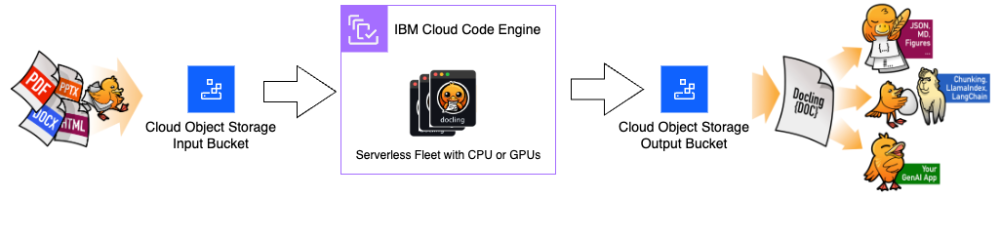
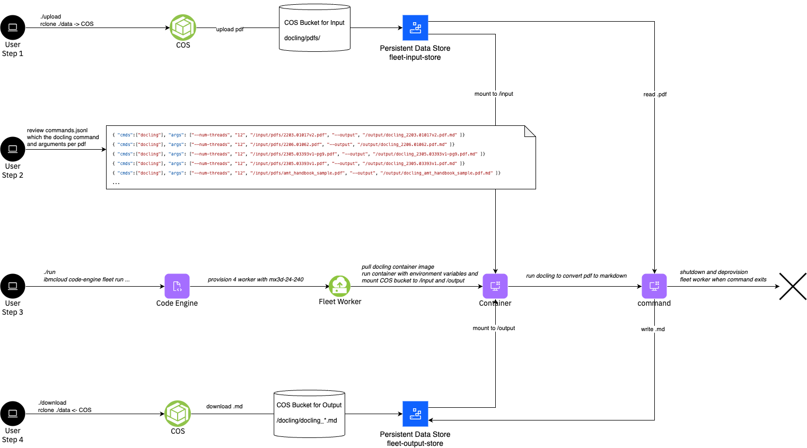

# Tutorial: Docling


This tutorial provides a comprehensive guide on using [Docling](https://docling-project.github.io/docling/) to convert PDFs into Markdown format using serverless fleets. It leverages cloud object storage for managing both the input PDFs and the resulting Markdown files. The process is streamlined using IBM’s Code Engine to build the Docling container, which is then pushed to a container registry. Users can run a serverless fleet, which autonomously spawns workers to run the Docling container for efficient, scalable conversion tasks.



Key steps covered in the Tutorial:
1. Upload the examples PDFs to COS
2. Run a fleet of workers that automatically runs the official docling container, ensuring scalability and efficiency.
4. Download the resulting markdown files from COS

This setup is ideal for automating document conversion workflows in a cost-effective, serverless environment.




Note: The tutorial assumes that you have created the fleet sandbox using the fully automated approach which creates the rclone environment as well as the upload/download scripts. If that's not the case, you would need to upload the PDFs and download the results using the COS CLI or other means.

The sandbox contains two Persistent Data Stores (PDS) that point to the input and output bucket

## Steps


### Step 1 - Upload

The 11 example PDFs are located in the `data/input/docling/pdfs` directory. Run the following commands in the root directory to list and upload the example PDFs to COS.
```
ls data/input/docling/pdfs
./upload
```

### Step 2 - Review the commands

Review the `commands.jsonl` which defines the tasks to run the docling command and arguments for each of the pdfs.
```
cd tutorials/docling
cat commands.jsonl
```

<a name="Output"></a>
<details>
  <summary>Output</summary>

```
➜  cat commands.jsonl
{ "cmds":["docling"], "args": ["--num-threads", "12", "/input/pdfs/2203.01017v2.pdf", "--output", "/output/docling_2203.01017v2.pdf.md" ]}
{ "cmds":["docling"], "args": ["--num-threads", "12", "/input/pdfs/2206.01062.pdf", "--output", "/output/docling_2206.01062.pdf.md" ]}
{ "cmds":["docling"], "args": ["--num-threads", "12", "/input/pdfs/2305.03393v1-pg9.pdf", "--output", "/output/docling_2305.03393v1-pg9.pdf.md" ]}
{ "cmds":["docling"], "args": ["--num-threads", "12", "/input/pdfs/2305.03393v1.pdf", "--output", "/output/docling_2305.03393v1.pdf.md" ]}
{ "cmds":["docling"], "args": ["--num-threads", "12", "/input/pdfs/amt_handbook_sample.pdf", "--output", "/output/docling_amt_handbook_sample.pdf.md" ]}
{ "cmds":["docling"], "args": ["--num-threads", "12", "/input/pdfs/code_and_formula.pdf", "--output", "/output/docling_code_and_formula.pdf.md" ]}
{ "cmds":["docling"], "args": ["--num-threads", "12", "/input/pdfs/picture_classification.pdf", "--output", "/output/docling_picture_classification.pdf.md" ]}
{ "cmds":["docling"], "args": ["--num-threads", "12", "/input/pdfs/redp5110_sampled.pdf", "--output", "/output/docling_redp5110_sampled.pdf.md" ]}
{ "cmds":["docling"], "args": ["--num-threads", "12", "/input/pdfs/right_to_left_01.pdf", "--output", "/output/docling_right_to_left_01.pdf.md" ]}
{ "cmds":["docling"], "args": ["--num-threads", "12", "/input/pdfs/right_to_left_02.pdf", "--output", "/output/docling_right_to_left_02.pdf.md" ]}
{ "cmds":["docling"], "args": ["--num-threads", "12", "/input/pdfs/right_to_left_03.pdf", "--output", "/output/docling_right_to_left_03.pdf.md" ]}
```
</details>
<br/>

### Step 3 - Run the Fleet

Now run the fleet to process the PDFs. In this tutorial we use the static array index with `--tasks-from-file commands.jsonl` to specify the tasks for the 11 pdfs. We give each task 12 vCPU, run docling with `--num-threads 12` and choose a mx3d-24x240 worker profile with 24 vCPU. Therefore we run 2 docling commands per worker at a time and utilize the full worker per pdf processing. We run `--max-scale 8` instances and workers in parallel. 

Launch the fleet with the following command in the `tutorials/docling` directory.
```
./run
```

<a name="Output"></a>
<details>
  <summary>Output</summary>

```
➜  docling ./run
ibmcloud code-engine fleet create --name fleet-3128b1c7-1
  --image quay.io/docling-project/docling-serve-cpu
  --registry-secret fleet-registry-secret
  --worker-profile mx3d-24x240
  --max-scale 8
  --tasks-from-local-file commands.jsonl
  --cpu 12
  --memory 120G
  --mount-data-store /input=fleet-input-store:/docling
  --mount-data-store /output=fleet-output-store:/docling
Successfully created fleet with name 'fleet-3128b1c7-1' and ID 'bd00d46e-4645-43b0-a892-d153455ac576'
Run 'ibmcloud ce fleet get --id bd00d46e-4645-43b0-a892-d153455ac576' to check the fleet status.
Run 'ibmcloud ce fleet worker list --fleet-id bd00d46e-4645-43b0-a892-d153455ac576' to retrieve a list of provisioned workers.
OK
```
</details>
<br/>

List the fleet details with the command printed in the output, e.g.

```
ibmcloud ce fleet get --id bd00d46e-4645-43b0-a892-d153455ac576
```

<a name="Output"></a>
<details>
  <summary>Output</summary>

```
➜  docling ibmcloud ce fleet get --id bd00d46e-4645-43b0-a892-d153455ac576
Getting fleet 'bd00d46e-4645-43b0-a892-d153455ac576'...
OK

Name:            fleet-3128b1c7-1
ID:              bd00d46e-4645-43b0-a892-d153455ac576
Status:          pending
Created:         89s
Project region:  br-sao
Project name:    fleetlab-user1--ce-project

Tasks status:
  Failed:     0
  Cancelled:  0
  Succeeded:  0
  Running:    0
  Pending:    11
  Total:      11

Code:
  Container image reference:  quay.io/docling-project/docling-serve-cpu
  Registry access secret:     fleet-registry-secret

Tasks specification:
  Task state store:           fleet-task-store
  Data store JSON reference:  fleet-task-store
  Data store object path:     /ce/bd499e5b-0d1f-4f0e-92ef-2acd4d01def4/fleet-input/02aa073d-a423-406e-b47a-0ab92641098a.jsonl

Resources and scaling:
  CPU per instance:          24
  Memory per instance:       240G
  Preferred worker profile:  mx3d-24x240
  Max number of instances:   4
  Max execution time:
  Max retries per task:      3

Network placement:
  Network reference 0:  7d1503cd-8d49-477e-81b8-a4b084b7b680
```
</details>
<br/>


Verify that the machines are starting
```
ibmcloud ce fleet worker list --fleet-id bd00d46e-4645-43b0-a892-d153455ac576
```
<a name="Output"></a>
<details>
  <summary>Output</summary>

```
➜  docling ibmcloud ce fleet worker list --fleet-id bd00d46e-4645-43b0-a892-d153455ac576
Listing serverless fleet workers...
OK

ID                                    Status   Profile      IP           Zone      Age
05c5f559-b567-4f81-9cd6-a74c145201d9  running  mx3d-24x240  10.250.0.12  br-sao-1  2m7s
63636826-3600-41f8-ac9f-78cc17a7a930  running  mx3d-24x240  10.250.0.9   br-sao-1  2m7s
9c39d1a9-3f25-49c5-ba27-e23dabaac695  running  mx3d-24x240  10.250.0.11  br-sao-1  2m7s
df27ff63-34dc-45b0-8f87-9c5f64aec388  running  mx3d-24x240  10.250.0.10  br-sao-1  2m7s
```
</details>
<br/>

Observe the tasks:

```
ibmcloud ce fleet task list --fleet-id bd00d46e-4645-43b0-a892-d153455ac576
```
<a name="Output"></a>
<details>
  <summary>Output</summary>

```
➜  docling ibmcloud ce fleet task list --fleet-id bd00d46e-4645-43b0-a892-d153455ac576
Listing serverless fleet tasks...
OK

Index                           ID                                    Status      Result code  Worker ID
000-00000-00000000000000000005  0d7403eb-060c-5574-95cb-84b3291e6651  pending     -            -
000-00000-00000000000000000008  118fe7d1-b9cc-5e1c-8540-0d826d5fc388  successful  0            fleet-bd00d46e-4645-43b0-a892-d153455ac576-2
000-00000-00000000000000000010  1ea768d5-5451-5c89-b03d-6bcc49ce9151  pending     -            -
000-00000-00000000000000000007  25fbad6f-f5d8-59ed-9c11-ab3b031d33dc  successful  0            fleet-bd00d46e-4645-43b0-a892-d153455ac576-3
000-00000-00000000000000000006  3d97d377-321f-5183-9704-ba82f77f62e0  pending     -            -
000-00000-00000000000000000002  8d408a5a-c765-5a86-8633-6d9f5a7c906c  successful  0            fleet-bd00d46e-4645-43b0-a892-d153455ac576-0
000-00000-00000000000000000004  94a37069-f911-5054-aa5a-c50f35ce9819  successful  0            fleet-bd00d46e-4645-43b0-a892-d153455ac576-4
000-00000-00000000000000000009  df4a9a37-32bd-554b-8000-cb3da5bbb2ae  running     -            fleet-bd00d46e-4645-43b0-a892-d153455ac576-3
000-00000-00000000000000000001  e8e9c81d-3e0e-54a6-a10f-491fb00a2f79  running     -            fleet-bd00d46e-4645-43b0-a892-d153455ac576-0
000-00000-00000000000000000003  f4e7e5cc-51dd-56cb-bbc8-149cf3aa4f57  running     -            fleet-bd00d46e-4645-43b0-a892-d153455ac576-4
000-00000-00000000000000000000  fcb64a66-f270-55fa-99fa-6695070bee4a  running     -            fleet-bd00d46e-4645-43b0-a892-d153455ac576-2

```
</details>
<br/>

Repeat the steps above to observe the fleet and wait until all tasks are successful. 

Finally, observe that the workers are stopped and deleted automatically.

```
ibmcloud ce fleet worker list --fleet-id bd00d46e-4645-43b0-a892-d153455ac576
```

<a name="Output"></a>
<details>
  <summary>Output</summary>

```
➜  docling ibmcloud ce fleet worker list --fleet-id bd00d46e-4645-43b0-a892-d153455ac576
Listing serverless fleet tasks...
OK

ID                                    Status   Profile      IP           Zone      Age
05c5f559-b567-4f81-9cd6-a74c145201d9  stopped  mx3d-24x240  10.250.0.12  br-sao-1  15m
63636826-3600-41f8-ac9f-78cc17a7a930  stopped  mx3d-24x240  10.250.0.9   br-sao-1  15m
9c39d1a9-3f25-49c5-ba27-e23dabaac695  stopped  mx3d-24x240  10.250.0.11  br-sao-1  15m
df27ff63-34dc-45b0-8f87-9c5f64aec388  stopped  mx3d-24x240  10.250.0.10  br-sao-1  15m
```
</details>
<br/>

#### Run with a Serverless GPU

Run `./run_gpu` to launch the docling commands on a GPU. This example, is bringing up a single `gx3-24x120x1l40s` and runs the 11 pdfs sequentially.


The GPUs are defined by setting the family and the number of GPUs per task, e.g. `--gpu GPU_FAMILY:NUMBER_OF_GPUS`, where the number of GPUs can be fractional for GPU families that support MIG. In our case we configure `--gpu l40s:1` with a `--max-scale 1` to get exactly one `gx3-24x120x1l40s`.


<a name="Output"></a>
<details>
  <summary>Output</summary>
```
./run_gpu
ibmcloud code-engine fleet create --name fleet-cc1f880d-1
  --image quay.io/docling-project/docling-serve
  --registry-secret fleet-registry-secret
  --max-scale 1
  --tasks-from-local-file commands.jsonl
  --gpu l40s:1
  --mount-data-store /input=fleet-input-store:/docling
  --mount-data-store /output=fleet-output-store:/docling
Successfully created fleet with name 'fleet-cc1f880d-1' and ID 'b824738b-3ffd-44cb-9044-db1f11b24076'
Run 'ibmcloud ce fleet get --id b824738b-3ffd-44cb-9044-db1f11b24076' to check the fleet status.
Run 'ibmcloud ce fleet worker list --fleet-id b824738b-3ffd-44cb-9044-db1f11b24076' to retrieve a list of provisioned workers.
OK
```
</details>
<br/>


### Step 4 - Download results

Download the results from the COS by running the following command in the root directory:
```
./download
```

You can find the results under
```
ls -l data/output/docling/docling_*
```