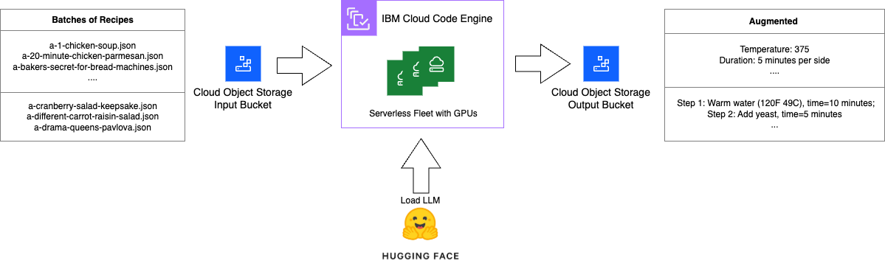
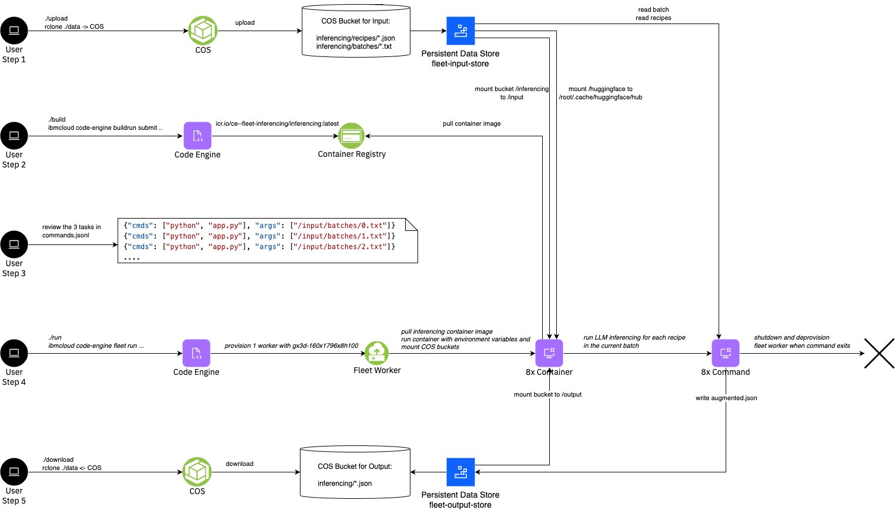

# Tutorial: Batch Inferencing with GPUs using vLLM and Granite 4

This tutorial provides a comprehensive guide on using Serverless GPUs to perform batch inferencing which illustrates a generally applicable pattern where AI helps to extract information out of a set of unstructed data. The tutorial uses [vLLM](https://docs.vllm.ai/en/latest/) with the [IBM Granite-4.0-Micro](https://huggingface.co/ibm-granite/granite-4.0-micro) model running on [Nvidia L40s](https://www.ibm.com/products/gpu-ai-accelerator/nvidia) and [Nvidia H100](https://www.ibm.com/products/gpu-ai-accelerator/nvidia). However, the tutorial can be easily adapted to use a different model and GPU family.



The concrete example extracts temperature and duration of a set of cookbook recipes (from [recipebook](https://github.com/dpapathanasiou/recipebook)) by using a vLLM. Such a cookbook recipe looks like:
```
{
    "directions": [
        "In a large pot over medium heat, cook chicken pieces in oil until browned on both sides.  Stir in onion and cook 2 minutes more.  Pour in water and chicken bouillon and bring to a boil.  Reduce heat and simmer 45 minutes.",
        "Stir in celery, carrots, garlic, salt and pepper.  Simmer until carrots are just tender.  Remove chicken pieces and pull the meat from the bone.  Stir the noodles into the pot and cook until tender, 10 minutes.  Return chicken meat to pot just before serving."
    ],
    "ingredients": [
        "2 tablespoons vegetable oil",
        "2 skinless chicken leg quarters",
        "1/2 cup chopped onion",
        "2 quarts water",
        "3 cubes  chicken bouillon, crumbled",
        "1 stalk celery, chopped",
        "3 carrots, chopped",
        "1 clove roasted garlic, minced",
        "salt and pepper to taste",
        "1 (12 ounce) package thin egg noodles"
    ],
    "language": "en-US",
    "source": "allrecipes.com",
    "tags": [],
    "title": "A-1 Chicken Soup",
    "url": "http://allrecipes.com/recipe/25651/a-1-chicken-soup/"
}
```

The example uses a simple prompt for performing the inferencing task which are formulated as follows (see [src/app.py](./src/app.py))
```
extract temperature and duration values for each step of the following recipe. Use the following format for each sentence of the recipe: temperature=..., duration=....
```

As a result it generates a json file that might look like:
```
step1: temperature=medium
step2: temperature=medium, duration=2 minutes
step3: temperature=boil
step4: temperature=simmer, duration=45 minutes
step7: duration=10 minutes
```

The tutorial consists of 8000 recipes which are devided into 8 batches each containing 1000 recipes. Defining the tasks as batches of 1000 recipes is improving the efficiency by reducing overhead of provisioning the GPU, pulling the container image and loading the LLM into the GPU. The tutorial provides two ways running the Serverless Fleet 
1. with 1 task processing 1 batch on a single worker with 1xL40s GPU
2. with 8 tasks processing 8 batches on a single worker with 8xH100 GPUs.


Key steps covered in the tutorial:
1. Upload the recipes and batches to COS
2. Build the container image
2. Run a fleet with Serverless GPUs
4. Download the resulting augmented json files from COS




> Note: The tutorial assumes that you have created the fleet sandbox using the fully automated method which creates the rclone environment for the upload/download scripts. If that's not the case, you would need to upload the recipes and batches, and download the results using the COS CLI or other means. In addition, the sandbox created a Code Engine managed registry secret for the private IBM Cloud Registry endpoint.

> Note: The tutorial uses the [IBM Granite-4.0-Micro](https://huggingface.co/ibm-granite/granite-4.0-micro) model which is downloaded from huggingface by vllm during the first run. Since `~/.cache/huggingface` in the container is mounted to the COS bucket, the model is being downloaded from COS for subsequent runs. (Tip: Advanced users might want to create a separate bucket acting as the model cache)

## Duration

The different phases of the use case take some time depending on the GPU family, the size of the container image and the size of the large language model. The following durations are expected.

| Phase | L40s |  H100 |
| ----- | ---------------- | ---------------- | 
| Building the container image (16GB) | 15 min | 15 min |
| | | |
| Initilization of fleet worker | 1 min | 10 min |
| Pulling the container image (16 GB) | 4 min | 4 min |
| Downloading the model from cache (6 GB) | 4min | 1 min |
| **Sum of overhead per worker** | **9 min** | **15 min** |
| | | |
| Inferencing of 1 batch with 1000 recipies  | 28s | 8s |
| Number of recipies per worker | 1000 | 8000 |
| **Inferencing per recipe and worker** | **0.028s** | **0.001s** |
| | | |


## Steps


### Step 1 - Upload

The recipes and batches are located in the `data/input/inferencing/` directory. Run the following commands in the root directory to list and upload the example PDFs to COS.

```
ls data/input/inferencing/recipes | wc -l
```

```
ls data/input/inferencing/batches
```

```
./upload
```

### Step 2 - Build the container image

If you're interested, review the code by looking at [src/app.py](./src/app.py).

Now, run the `build` script to build a container image using Code Engine Build Runs. Code Engine will push the container image to the container registry of the current region. It uses the registry secret created by the sandbox script. The build process takes about 15 minutes

```
cd tutorials/inferencing
```

```
./build
```


### Step 3 - Review the commands

Review the `commands.jsonl` and accordingly the `commands_h100.jsonl` which defines the tasks to run the python application for each of the batches. The commands assume that the `/input` directory is mounted from the `inferencing` folder of the input COS bucket.

```
cd tutorials/inferencing
```

```
cat commands.jsonl
```

<a name="Output"></a>
<details>
  <summary>Output</summary>

```
➜  cat commands.jsonl

{"cmds": ["python", "app.py"], "args": ["/input/batches/0.txt"]}

```
</details>
<br/>

### Step 4 - Run the Fleet

The fleet is created with `--tasks-from-file commands.jsonl` which will queue 1 tasks for the 1 batches. The example specifies `--gpu l40s:1` where each task requires a full Nvidia L40s GPU. The total number of concurrent tasks is limited to `--max-scale 1` so that only a single GPU is being provisioned. Code Engine will automatically detect the best matching worker profile `gx3-24x120x1l40s`. Launch the fleet with the following command in the `tutorials/inferencing` directory.

Export your Huggingface token to allow vLLM to download the model.

```
export HUGGINGFACEHUB_API_TOKEN=<your token>
```

```
./run
```

Use `./run_h100` to run all 8 batches from `commands_h100.jsonl` on machine with 8xH100 with a max-scale of 8. 

<a name="Output"></a>
<details>
  <summary>Output</summary>

```
➜  inferencing ./run
ibmcloud code-engine fleet create --name fleet-19f82e90-1
  --image private.de.icr.io/ce--fleet-inferencing-e7469696/inferencing
  --registry-secret ce-auto-icr-private-eu-de
  --max-scale 1
  --tasks-from-local-file commands.jsonl
  --tasks-state-store fleet-task-store
  --gpu l40s:1
  --cpu 24
  --memory 120G
  --env HUGGINGFACEHUB_API_TOKEN=REDACTED
  --env PYTORCH_CUDA_ALLOC_CONF=expandable_segments:True
  --env MODEL_NAME=ibm-granite/granite-4.0-micro
  --mount-data-store /root/.cache/huggingface=fleet-model-cache:/huggingface
  --mount-data-store /input=fleet-input-store:/inferencing
  --mount-data-store /output=fleet-output-store:/inferencing
Successfully created fleet with name 'fleet-19f82e90-1' and ID '52e336f4-aadc-45a9-b9cf-c57a57742a6b'
Run 'ibmcloud ce fleet get --id 52e336f4-aadc-45a9-b9cf-c57a57742a6b' to check the fleet status.
Run 'ibmcloud ce fleet worker list --fleet-id 52e336f4-aadc-45a9-b9cf-c57a57742a6b' to retrieve a list of provisioned workers.
Run 'ibmcloud ce fleet task list --fleet-id 52e336f4-aadc-45a9-b9cf-c57a57742a6b' to retrieve a list of tasks.
OK
```
</details>
<br/>

Show the fleet details
```
ibmcloud ce fleet get --id <fleet-id>
```
<a name="Output"></a>
<details>
  <summary>Output</summary>

```
➜  inferencing ibmcloud ce fleet get --id 52e336f4-aadc-45a9-b9cf-c57a57742a6b
Getting fleet '52e336f4-aadc-45a9-b9cf-c57a57742a6b'...
OK

Name:            fleet-19f82e90-1
ID:              52e336f4-aadc-45a9-b9cf-c57a57742a6b
Status:          pending
Created:         2025-11-14T14:11:36Z
Project region:  eu-de
Project name:    ce-fleet-sandbox--ce-project

Tasks status:
  Pending:     1
  Running:     0
  Failed:      0
  Canceled:    0
  Successful:  0
  Total:       1

Code:
  Container image reference:  private.de.icr.io/ce--fleet-inferencing-e7469696/inferencing
  Registry access secret:     ce-auto-icr-private-eu-de

Tasks specification:
  Task state store:           fleet-task-store
  Data store JSON reference:  fleet-task-store
  Data store object path:     /ce/fbcbaa32-3334-4be7-a883-28ed775ad4e4/fleet-input/d3d3978c-626b-4abb-b408-654d366e357e.jsonl

Resources and scaling:
  CPU per instance:         24
  Memory per instance:      120G
  Max number of instances:  1
  Max retries per task:     3

Network placement:
  Subnet CRN 0:  crn:v1:bluemix:public:is:eu-de-1:a/5c9ac920ab0bcaa7a02d29c1fae2c247::subnet:02b7-7f6de1bb-147b-40fc-bd3c-2303b88d4348
  Subnet CRN 1:  crn:v1:bluemix:public:is:eu-de-2:a/5c9ac920ab0bcaa7a02d29c1fae2c247::subnet:02c7-116ab077-5970-4ab0-ba3b-8cc11e8c50e3

Environment Variables:
  Type     Name                      Value
  Literal  HUGGINGFACEHUB_API_TOKEN  REDACTED
  Literal  PYTORCH_CUDA_ALLOC_CONF   expandable_segments:True
  Literal  MODEL_NAME                ibm-granite/granite-4.0-micro
```
</details>
<br/>


Verify that the machines are starting
```
ibmcloud ce beta fleet worker list --fleet-id <fleet-id>
```
<a name="Output"></a>
<details>
  <summary>Output</summary>

```
➜  inferencing ibmcloud ce fleet worker list --fleet-id 52e336f4-aadc-45a9-b9cf-c57a57742a6b
Listing serverless fleet workers...
OK

Name                                          ID                                    Status   Profile           IP           Zone     Version
fleet-52e336f4-aadc-45a9-b9cf-c57a57742a6b-0  2209cd48-2fba-407c-8265-5e1d7bfe8d5c  running  gx3-24x120x1l40s  10.243.0.21  eu-de-1  v1.0.66
```

</details>
<br/>

Observe the tasks:

```
ibmcloud ce fleet task list --fleet-id <fleet-id>
```
<a name="Output"></a>
<details>
  <summary>Output</summary>

```
➜  inferencing ibmcloud ce fleet task list --fleet-id 52e336f4-aadc-45a9-b9cf-c57a57742a6b
Listing serverless fleet tasks...
OK

Task index  ID                                    Status   Result code  Worker name
0           0b33230d-b950-5a72-8dab-04a403a24099  running               fleet-52e336f4-aadc-45a9-b9cf-c57a57742a6b-0
```

</details>
<br/>


### Application Logs

#### vLLM initilization

```
(EngineCore_DP0 pid=175) INFO 11-14 14:23:39 [core.py:77] Initializing a V1 LLM engine (v0.11.0) with config: model='ibm-granite/granite-4.0-micro', speculative_config=None, tokenizer='ibm-granite/granite-4.0-micro', skip_tokenizer_init=False, tokenizer_mode=auto, revision=None, tokenizer_revision=None, trust_remote_code=False, dtype=torch.bfloat16, max_seq_len=131072, download_dir=None, load_format=auto, tensor_parallel_size=1, pipeline_parallel_size=1, data_parallel_size=1, disable_custom_all_reduce=False, quantization=fp8, enforce_eager=False, kv_cache_dtype=auto, device_config=cuda, structured_outputs_config=StructuredOutputsConfig(backend='auto', disable_fallback=False, disable_any_whitespace=False, disable_additional_properties=False, reasoning_parser=''), observability_config=ObservabilityConfig(show_hidden_metrics_for_version=None, otlp_traces_endpoint=None, collect_detailed_traces=None), seed=0, served_model_name=ibm-granite/granite-4.0-micro, enable_prefix_caching=False, chunked_prefill_enabled=True, pooler_config=None, compilation_config={"level":3,"debug_dump_path":"","cache_dir":"","backend":"","custom_ops":[],"splitting_ops":["vllm.unified_attention","vllm.unified_attention_with_output","vllm.mamba_mixer2","vllm.mamba_mixer","vllm.short_conv","vllm.linear_attention","vllm.plamo2_mamba_mixer","vllm.gdn_attention","vllm.sparse_attn_indexer"],"use_inductor":true,"compile_sizes":[],"inductor_compile_config":{"enable_auto_functionalized_v2":false},"inductor_passes":{},"cudagraph_mode":[2,1],"use_cudagraph":true,"cudagraph_num_of_warmups":1,"cudagraph_capture_sizes":[512,504,496,488,480,472,464,456,448,440,432,424,416,408,400,392,384,376,368,360,352,344,336,328,320,312,304,296,288,280,272,264,256,248,240,232,224,216,208,200,192,184,176,168,160,152,144,136,128,120,112,104,96,88,80,72,64,56,48,40,32,24,16,8,4,2,1],"cudagraph_copy_inputs":false,"full_cuda_graph":false,"use_inductor_graph_partition":false,"pass_config":{},"max_capture_size":512,"local_cache_dir":null}
[Gloo] Rank 0 is connected to 0 peer ranks. Expected number of connected peer ranks is : 0
[Gloo] Rank 0 is connected to 0 peer ranks. Expected number of connected peer ranks is : 0
[Gloo] Rank 0 is connected to 0 peer ranks. Expected number of connected peer ranks is : 0
[Gloo] Rank 0 is connected to 0 peer ranks. Expected number of connected peer ranks is : 0
[Gloo] Rank 0 is connected to 0 peer ranks. Expected number of connected peer ranks is : 0
[Gloo] Rank 0 is connected to 0 peer ranks. Expected number of connected peer ranks is : 0
(EngineCore_DP0 pid=175) INFO 11-14 14:23:45 [parallel_state.py:1208] rank 0 in world size 1 is assigned as DP rank 0, PP rank 0, TP rank 0, EP rank 0
(EngineCore_DP0 pid=175) WARNING 11-14 14:23:45 [topk_topp_sampler.py:66] FlashInfer is not available. Falling back to the PyTorch-native implementation of top-p & top-k sampling. For the best performance, please install FlashInfer.
(EngineCore_DP0 pid=175) INFO 11-14 14:23:45 [gpu_model_runner.py:2602] Starting to load model ibm-granite/granite-4.0-micro...
(EngineCore_DP0 pid=175) INFO 11-14 14:23:45 [gpu_model_runner.py:2634] Loading model from scratch...
(EngineCore_DP0 pid=175) INFO 11-14 14:23:45 [cuda.py:366] Using Flash Attention backend on V1 engine.
(EngineCore_DP0 pid=175) INFO 11-14 14:23:46 [weight_utils.py:392] Using model weights format ['*.safetensors']
(EngineCore_DP0 pid=175) INFO 11-14 14:23:49 [weight_utils.py:413] Time spent downloading weights for ibm-granite/granite-4.0-micro: 2.179559 seconds
Loading safetensors checkpoint shards:   0% Completed | 0/2 [00:00<?, ?it/s]
Loading safetensors checkpoint shards:  50% Completed | 1/2 [00:23<00:23, 23.99s/it]
Loading safetensors checkpoint shards: 100% Completed | 2/2 [00:36<00:00, 17.15s/it]
Loading safetensors checkpoint shards: 100% Completed | 2/2 [00:36<00:00, 18.17s/it]
(EngineCore_DP0 pid=175)
(EngineCore_DP0 pid=175) INFO 11-14 14:24:27 [default_loader.py:267] Loading weights took 36.38 seconds
(EngineCore_DP0 pid=175) INFO 11-14 14:24:27 [gpu_model_runner.py:2653] Model loading took 3.4244 GiB and 41.673988 seconds
(EngineCore_DP0 pid=175) INFO 11-14 14:24:37 [backends.py:548] Using cache directory: /root/.cache/vllm/torch_compile_cache/4dcdd9d150/rank_0_0/backbone for vLLM's torch.compile
(EngineCore_DP0 pid=175) INFO 11-14 14:24:37 [backends.py:559] Dynamo bytecode transform time: 9.44 s
(EngineCore_DP0 pid=175) INFO 11-14 14:24:41 [backends.py:197] Cache the graph for dynamic shape for later use
(EngineCore_DP0 pid=175) INFO 11-14 14:25:13 [backends.py:218] Compiling a graph for dynamic shape takes 35.02 s
(EngineCore_DP0 pid=175) INFO 11-14 14:26:15 [monitor.py:34] torch.compile takes 44.45 s in total
(EngineCore_DP0 pid=175) INFO 11-14 14:26:16 [gpu_worker.py:298] Available KV cache memory: 35.34 GiB
(EngineCore_DP0 pid=175) INFO 11-14 14:26:16 [kv_cache_utils.py:1087] GPU KV cache size: 463,136 tokens
(EngineCore_DP0 pid=175) INFO 11-14 14:26:16 [kv_cache_utils.py:1091] Maximum concurrency for 131,072 tokens per request: 3.53x
Capturing CUDA graphs (mixed prefill-decode, PIECEWISE): 100%|██████████| 67/67 [00:02<00:00, 25.15it/s]
Capturing CUDA graphs (decode, FULL): 100%|██████████| 35/35 [00:01<00:00, 27.66it/s]
(EngineCore_DP0 pid=175) INFO 11-14 14:26:21 [gpu_model_runner.py:3480] Graph capturing finished in 5 secs, took 0.72 GiB
(EngineCore_DP0 pid=175) INFO 11-14 14:26:21 [core.py:210] init engine (profile, create kv cache, warmup model) took 113.49 seconds
INFO 11-14 14:26:48 [llm.py:306] Supported_tasks: ['generate']
Model initilization completed in 229.26 seconds
```

#### Inferencing

```
Adding requests: 100%|██████████| 999/999 [00:00<00:00, 2134.23it/s]
Processed prompts: 100%|██████████| 999/999 [00:26<00:00, 38.22it/s, est. speed input: 7094.70 toks/s, output: 5011.58 toks/s]
Batch inferencing completed in 26.61 seconds
Writing outputs completed in 1.01 seconds

```


### Step 4 - Download results

The application is writing the results in a single json file for each batch. The reason is, that a single write operation is much faster than writing many small results for each recipe in the batch.

Download the results from the COS by running the following command in the root directory:
```
./download
```

You can find the results under
```
ls -l data/output/inferencing/inferencing_*
```
